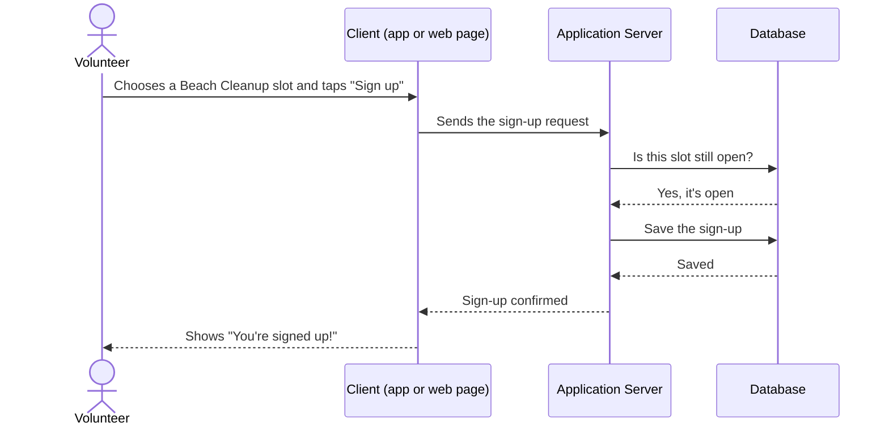

# Step 4: Design (The Software Architect Chat)

**Role:** Software Architect · **Prompt:** [c04](../prompts/c04-design-prompt.md) · **Templates:** d04-01 to d04-02

## Executive Summary

At the end of [Step 3: Requirements](b03-requirements.md), we know **what**
the product must do and **who** it is for. That answer is written down in
the **Product Requirements Document (PRD)**. Now the question changes from
*"What are we building?"* to *"How are we going to build it?"*

The answer is written down in a **Software Design Specification**, usually
just called the **Spec**. The person who writes it is the **Software
Architect**.

- **Inputs:** the signed-off PRD from Step 3, plus other inputs such as the
  budget, deadlines, rules the product must follow, and any technology the
  company already uses.
- **Output:** the **Spec**: how the pieces of the software fit together, how
  information moves between them, one **sequence diagram** for every use
  case in the PRD, and a **Security & Compliance** section.
- **Hand-off:** once the Spec is signed off, it goes to
  [Step 5: User Experience](b05-user-experience.md), and later to the
  DevOps Engineer, the SDET, and the Software Engineer, who all build from
  it.

---

## What Is a Software Architect?

A **Software Architect** is the person who plans how a piece of software
will be put together before anyone starts building it. They decide what the
main parts of the system are, how those parts talk to each other, where
information is stored, and how it is kept safe.

The architect does not usually write most of the program themselves.
Instead, they make the big decisions that are expensive to change later,
and write them down so everyone else can follow them.

## Blueprints: Why a Plan Makes a Better Building

Think back to the house example from
[What Is a Software Development Lifecycle Workflow?](a03-what-is-an-sdlc-workflow.md).
A skilled builder *could* start putting up walls with no plans at all. They
might even end up with something that looks like a house. But questions
come up every day: *How thick should this wall be? Where do the pipes go?
Will this beam hold the roof?* With no plans, the builder guesses, and each
guess is a chance for something to go wrong. Fixing a wall in the wrong
place after it's built costs far more than moving a line on paper.

A **building architect** solves this by drawing **blueprints**: detailed
plans showing where everything goes and how it connects. The builders still
use their own skills, but they no longer have to guess. The result is a
safer, sturdier, better building, finished with fewer surprises.

**In software, the Spec is the blueprint.** Programmers can write code
without a Spec, just as a builder can build without plans. But they do a
much better job when they have one to answer their questions: *Where is this
information saved? What happens if the internet connection drops? Who is
allowed to see this?* This matters even more when the "programmer" is an
AI. An AI with no Spec will fill in the gaps with its own guesses, which is
how the messy results known as "AI slop" happen (see
[Prompt Engineering](a06-prompt-engineering.md)).

---

## The PRD and the Spec: "What" Versus "How"

The PRD and the Spec work as a pair.

| | PRD (Step 3) | Spec (Step 4) |
|---|---|---|
| **Answers** | *What* will the product do, and *for whom*? | *How* will we build it? |
| **Written by** | Product Manager | Software Architect |
| **House comparison** | The homeowner's wish list | The architect's blueprints |
| **Example** | "A volunteer can sign up for a one-hour Beach Cleanup shift and get a confirmation." | "The sign-up is saved in a database, and a confirmation email is sent." |

The PRD is the Spec's most important input. Every part of the Spec should
trace back to a use case in the PRD. If the Architect designs something
that no use case asks for, it is probably something nobody needs.

**Other inputs** to the Spec include:

- **Constraints:** budget, deadlines, and laws or rules (such as privacy
  and copyright) listed in the PRD.
- **Quality requirements:** how fast, reliable, and accessible the product
  must be, and which devices it must run on.
- **Existing technology:** tools, services, or systems the company already
  uses and wants to keep.
- **Feasibility findings:** any technical risks discovered in
  [Step 2: Feasibility](b02-feasibility.md).

### When Design Sends the Project Back

Design is often the first time anyone looks closely at *how hard* each
part of the PRD will be to build, so it is also where surprises show up.
The Architect may **discover** that one use case needs an expensive outside
service, that another is far more complex than it sounded, or that the
whole product can't be finished by the deadline. Just as a building
architect might tell a homeowner that the third floor will double the cost,
the Software Architect doesn't quietly change the plan or build it anyway.
Instead, the Architect explains the problem and recommends a fix, and the
project **goes back up to the PRD step**, where the Product Manager and
stakeholders decide what to do. In this way, the Architect acts as the
project's **voice of reason**: the product team's job is to dream big about
what users might love, and the Architect's job is to say, kindly but
clearly, what that dream will really take to build. This isn't about
saying no to good ideas. It's about making sure everyone agrees on what's
practical before time and money are spent. Common fixes are to **split
the product into phases** (for example, a small Proof of Concept first,
then the easier use cases, then the harder ones), or to **remove or
postpone features** that add a lot of complexity for little value. The
revised PRD goes through **approval** (sign-off) again in the
[Tracking chat](b01-tracking.md), and only then is the Spec finished from
it. Going back a step can feel like losing ground, but it usually saves
time: a smaller, more focused first version reaches real users sooner (a
faster **time to market**), costs less to build and test, and teaches the
team what users actually want before the harder parts are built. Each
later phase then repeats the same steps in a smaller **iteration**,
building on what the earlier phase learned.

---

## Client and Server

Most modern software is split into two sides that talk to each other:

- **The client** is the part you see and touch: the app on your phone or
  the web page in your browser. It shows information and collects what you
  type or tap.
- **The server** is a computer somewhere else, often "in the cloud," that
  does the heavy work. It follows the business rules (the **application
  server**) and stores information safely in a **database**, which is like
  a very large, very organized filing cabinet.

A restaurant is a good comparison. You (the **user**) tell the waiter (the
**client**) what you want. The waiter takes the order to the kitchen (the
**application server**), which gets ingredients from the pantry (the
**database**), cooks the meal, and sends it back out through the waiter to
you. A big part of the Spec is describing exactly how the client and server
talk to each other: what messages they send, what each one is responsible
for, and what happens when something goes wrong.

## Sequence Diagrams: One for Every Use Case

To show those conversations clearly, the Architect draws a **UML Sequence
Diagram** (sometimes called a **transaction diagram**) for **every use case
in the PRD**. UML is the standard set of diagram types introduced in
[Step 3](b03-requirements.md).

A sequence diagram reads like a comic strip turned sideways. Each
participant (the user, the client, the application server, the database)
gets its own column. Arrows show messages passing between them, in order
from top to bottom. Following the arrows, you can trace the whole trip
information takes: from the **user**, to the **client**, to the
**application server**, to the **database**, and back again.

Here is a simple example for the use case *"Sign up for a shift"* from the
[sample project](../samples/README.md), a volunteer app for the made-up
BeautifulBeachPark:

Because there is one diagram per use case, anyone can check that every
promise in the PRD has a plan behind it. Later, the SDET in
[Step 7: Test Creation](b07-test-creation.md) uses these same diagrams to
decide what each test should check.

---

## Choosing What Kind of Application to Build

The Spec also decides **what type of application** we are creating. Two
products can do almost the same job but be built very differently. For
example:

- A **web app** runs in a browser. You visit a web address and use it,
  with nothing to install.
- A **mobile app** is downloaded from an app store (such as Apple's App
  Store or Google Play) and installed on a phone.

Each choice has trade-offs:

| | Web app | App-store app |
|---|---|---|
| **Getting started** | Just visit a link | Must find, download, and install |
| **Works on** | Almost any device with a browser | Usually needs separate versions for iPhone and Android |
| **Updates** | Everyone gets them instantly | Must pass app-store review; users must update |
| **Phone features** | Limited access to camera, GPS, and notifications | Full access to the phone's features |
| **Works offline** | Usually needs an internet connection | Can often work without one |
| **Cost to build** | Often lower: one version for everyone | Often higher: more versions to build and maintain |

Neither choice is always right. A quick tool people use once might be best
as a web app. A tool people use every day, with maps and offline use, might
be best as an app-store app. Weighing these trade-offs against the PRD's
users, use cases, budget, and constraints, and then choosing the best
approach, is one of the most important parts of the Architect's job. The
Spec records the decision **and the reasons for it**, so no one has to
guess later why it was made.

---

## The Software Architect Agent in Our Workflow

Like every step, Design runs in its **own new chat** (see
[What Is an AI-Assisted SDLC Workflow?](a07-what-is-an-ai-assisted-sdlc-workflow.md)).
The signed-off PRD is attached as its main input.

| Stage | What the Design chat does | What you do |
|---|---|---|
| **Review the PRD** | Summarizes it and lists gaps or open questions. | Answer questions or return to the PM. |
| **Choose the approach** | Compares options, such as web app vs. app-store app, with trade-offs. | Decide which approach to take. |
| **Design the system** | Describes the client, server, database, and how they connect. | Check that it makes sense for your product. |
| **Draw diagrams** | Draws one sequence diagram per use case, plus others if needed. | Confirm every use case is covered. |
| **Security & Compliance** | Researches privacy and copyright risks and how to handle them. | Review the risks and approve the plan. |
| **Assemble the Spec** | Fills in the Spec template. | Review it, then take it to the Tracking chat for sign-off. |

As always, the AI drafts and recommends, and **people decide**.

---

## Prompts, Templates, and Samples

**Prompts** (in `prompts/`):

- [`c04-design-prompt`](../prompts/c04-design-prompt.md): reviews the
  PRD, asks for what's missing, compares design approaches, designs the
  system, draws a sequence diagram per use case, writes the Security &
  Compliance section, and assembles the Spec

**Templates** (in `templates/`):

- [`d04-01-spec`](../templates/d04-01-spec.md): Software Design
  Specification (Spec)
- [`d04-02-design-options`](../templates/d04-02-design-options.md):
  side-by-side comparison of design approaches, such as web app vs.
  app-store app

**Samples** (in [`samples/BeautifulBeachParkVolunteers/docs/`](../samples/BeautifulBeachParkVolunteers/docs/)):

- [`d04-01-spec`](../samples/BeautifulBeachParkVolunteers/docs/d04-01-spec.md):
  the sample project's Spec, with a sequence diagram for each use case in
  the sample PRD, and the go-back that moved text-message reminders to
  Phase 2
- [`d04-02-design-options`](../samples/BeautifulBeachParkVolunteers/docs/d04-02-design-options.md):
  the sample project's comparison of a web app, an app-store app, and both

Additional [case studies](case-studies.md) may be added to this repo at a
future time.

---

**Learn more:**

- [Step 3: Requirements](b03-requirements.md): where the PRD comes from
- [Step 5: User Experience](b05-user-experience.md): the next step, which
  sketches the screens based on the PRD and Spec
- [Sequence diagram (Wikipedia)](https://en.wikipedia.org/wiki/Sequence_diagram):
  a plain introduction to sequence diagrams
