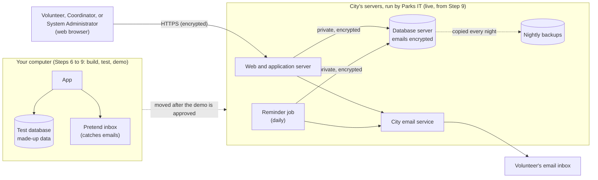

# Step 6: Initial Infrastructure (The DevOps Engineer Chat)

**Role:** DevOps Engineer · **Prompt:** [c06](../prompts/c06-initial-infrastructure-prompt.md) · **Templates:** d06-01 to d06-03

## Executive Summary

At the end of [Step 5: User Experience](b05-user-experience.md), we know
**what** the product must do (the PRD), **how** it will be built (the
Spec), and what it will **look like** (the UI/UX Document). But one big
question is still open: *Where will the software actually run?* Every app
needs real computers, storage, and network connections underneath it.
Deciding on those, and setting them up, is the job of Step 6.

The person who does it is the **DevOps Engineer**, and the main thing they
produce is the **System Infrastructure Document**. This step is called
**Initial Infrastructure** because it is only the *start* of the DevOps
Engineer's work: like the Scrum Master in [Step 1](b01-tracking.md), the
DevOps Engineer stays involved through every step that follows (see
[Initial Infrastructure, Then Ongoing DevOps](#initial-infrastructure-then-ongoing-devops)).

- **Inputs:** the signed-off PRD, Spec, and UI/UX Document, plus other
  inputs such as the budget, the expected number of users, and any
  computers or services the organization already has.
- **Output:** the **System Infrastructure Document** (where the software
  will go live, often the organization's existing servers, and the rules
  of those servers; the options that were considered; a cost analysis; a
  deployment diagram; and a security review), a **Cost Sign-Off Sheet**
  that the stakeholders must approve **before anything is set up**, plus a
  **local environment**: a free copy of the system on your own computer
  for building and testing.
- **Hand-off:** once the Cost Sign-Off Sheet and the System Infrastructure
  Document are signed off, the work
  goes to [Step 7: Test Creation](b07-test-creation.md) and
  [Step 8: Implementation](b08-implementation.md), whose tests and code
  run in the local environment and are written to fit the live servers.
  The DevOps Engineer keeps supporting those steps, and helps move the
  approved software to the live servers in
  [Step 9: Release](b09-release.md).

---

## Initial Infrastructure, Then Ongoing DevOps

Most steps in our workflow happen once, in order: a role does its work,
the deliverable is signed off, and the next step begins. Two roles are
different. The **Scrum Master** starts tracking in Step 1 and keeps going
until the project ends. The **DevOps Engineer** works in a similar way:
Step 6 is where their work *begins*, not where it ends.

In Step 6, the DevOps Engineer plans the **initial** infrastructure,
decides where the software will go live, and sets up the first piece of
it: the local environment where the software is built and tested. But infrastructure is never really "finished." As
the rest of the project unfolds, the DevOps Engineer keeps helping:

| Step | Ongoing DevOps involvement |
|---|---|
| **7. Test Creation** | Makes sure the **local test environment** works: a safe copy of the system on your own computer where tests can run without touching real users' data. |
| **8. Implementation** | Builds the **pipeline**: the automatic process that checks, tests, and packages each change the Software Engineer makes. Adjusts the infrastructure if the code needs something the plan missed. |
| **9. Release** | After the stakeholders approve the demo, works with the organization's IT staff to move the software onto the live ("production") servers, and keeps a way to quickly undo the release if something goes wrong. |
| **10. Maintenance** | Works with the SRE on monitoring, backups, security updates, and growing the system as more people use it. Watches the monthly costs against the cost analysis. |

Back to the restaurant: the DevOps Engineer doesn't just set up the
building and walk away. They're also there for the trial run before
opening night, on opening night itself, and every time a freezer breaks
or the restaurant needs more tables.

In our AI-assisted workflow, this means the Initial Infrastructure chat
produces the first System Infrastructure Document, and later steps can
bring DevOps questions back to it (or to a new DevOps chat with the
signed-off document attached). Any change to the infrastructure is
recorded in the System Infrastructure Document and signed off through the
[Tracking chat](b01-tracking.md), just like any other change.

---

## Local First, Live Later

This workflow builds everything on **your own computer first**, and moves
it to the live servers only after the stakeholders have seen it working and
approved it (see
[Where the Software Lives](a04-steps-roles-and-deliverables.md#where-the-software-lives-local-demo-live)).
That changes what Step 6 builds, but not what it plans:

| | In Step 6 | Later |
|---|---|---|
| **Local environment** (your computer) | **Set up now.** Free: the database, a pretend inbox that catches emails instead of sending them, and everything the tests need | Used in Steps 7 and 8, and for the stakeholder demo in Step 9 |
| **Live servers** | **Chosen and described now**: which servers, their rules, who runs them, and what going live will cost | Set up in Step 9, after the demo is approved |

Why decide on the live servers so early, if nothing goes there until
Step 9? Because their rules shape the code. If the city's servers run a
particular version of Python and a PostgreSQL database, the Software
Engineer in Step 8 must write code that runs there. Finding out in Step 9
that the servers don't allow something the code depends on means going
back to Step 8. And getting permission to use another team's servers can
take weeks, so it is worth asking early.

---

## What Is a DevOps Engineer?

The name **DevOps** joins two words: **Development** (the people who write
software) and **Operations** (the people who keep computers running).
In the past these were separate teams that often didn't talk to each
other. Programmers would finish their code and "throw it over the wall,"
and the operations team would struggle to make it run. A **DevOps
Engineer** works in the space between them, making sure the software and
the computers it runs on are planned together.

Back to our restaurant comparison. In [Step 4](b04-design.md), the
Architect designed how the kitchen works, and in
[Step 5](b05-user-experience.md), the Designer planned the dining room.
The DevOps Engineer finds the **building**: they decide whether to buy a
building or rent space, connect the electricity, water, and gas, install
the ovens and refrigerators, put locks on the doors, and work out what it
will all cost each month. Without that work, the best recipes and the
nicest dining room can't serve a single meal.

### What They Do

A DevOps Engineer's day-to-day work includes:

- **Choosing the infrastructure:** which computers, storage, and online
  services the product needs, and where they will live.
- **Setting it up:** creating the servers and databases and configuring
  them correctly.
- **Automating:** writing scripts so the setup can be repeated exactly,
  and so new versions of the software can be installed with the push of
  a button.
- **Securing it:** firewalls, passwords and keys, backups, and who is
  allowed to change what.
- **Watching it:** tools that alert the team when something is slow,
  broken, or running out of space.

---

## Infrastructure: The Pieces Underneath the App

The Spec described the parts of the software. The DevOps Engineer decides
what each part **runs on**. The most common pieces of infrastructure are:

| Piece | What it does | Restaurant comparison |
|---|---|---|
| **Web server** | Delivers the web pages and pictures to people's browsers | The front door and host stand |
| **Application server** | Runs the business rules, such as "is this slot still open?" | The kitchen |
| **Database** | Stores information safely and keeps it organized | The pantry and walk-in refrigerator |
| **Email service** | Sends messages to users, such as sign-in links and reminders | The delivery driver |
| **Network and security** | Connects the pieces and keeps strangers out | Hallways, doors, and locks |
| **Backups and monitoring** | Saves copies of data and warns when something goes wrong | The smoke alarm and the spare key |

Often the new feature doesn't need all-new infrastructure. Many
companies, city park departments, and nonprofits already have **web and
database servers**, often in the cloud, run by their own IT staff or a
hosting company. Then going live means adding the new app to those
servers, following their rules, instead of buying new hosting. Part of
the job is figuring out **what already exists, what can be reused, and
what must be added** for this feature, and **what the people who run the
existing servers require**: for example, which language versions they
support, how new software is installed, and who must approve it.

---

## Inputs, Role, and Outputs

**Inputs.** The DevOps Engineer starts from the documents already signed
off:

- **From the PRD:** how many **users** are expected, where they are, and
  the **quality requirements**, such as how fast the app must respond and
  how often it is allowed to be unavailable.
- **From the Spec:** the **type of application** (web app or app-store
  app), the client, application server, and database it describes, and
  the **Security & Compliance** section, which lists rules about privacy
  and where information may be stored.
- **From the UI/UX Document:** things that affect storage and speed, such
  as how many photos are shown and how large they are.
- **Other inputs:** the **budget**, the organization's **existing
  servers** and the contact who runs them, other accounts and equipment,
  and who will look after the system once it is running.

**The role.** The DevOps Engineer's work usually goes in this order:

1. **List what is needed:** every server, database, and service the Spec
   calls for.
2. **Find out what already exists:** the organization's servers, who runs
   them, and their rules.
3. **Compare options:** the existing servers first, then at least one
   other way to provide each piece (see the next section).
4. **Estimate costs:** what each option costs to set up and to run.
5. **Recommend and draw:** pick the best option and draw how it all
   connects, both on your computer and on the live servers.
6. **Get cost sign-off:** present the chosen option's costs on a Cost
   Sign-Off Sheet, and wait for the stakeholders to approve the spending.
7. **Set up the local environment:** only after cost sign-off, set up the
   free copy on your own computer, check that it works, and record exactly
   how it was done. The live servers wait for Step 9.

**Outputs.** Like UI/UX, this step produces **several documents**, and
some of them are for tools to use, not just for people to read:

| Document | What it contains | Used by |
|---|---|---|
| **System Infrastructure Document** | The main write-up: what is needed, the chosen setup and the reasons for it, the local environment, and the **live server requirements** (the rules the code must fit) | Everyone; signed off in the [Tracking chat](b01-tracking.md) |
| **Infrastructure Options** | A side-by-side comparison of the different ways to set things up | Stakeholders, to make the decision |
| **Cost Analysis** | Setup and monthly costs for each option | Stakeholders and whoever pays the bills |
| **Cost Sign-Off Sheet** | The chosen option's costs, the approved spending limit, and who approved it | Stakeholders; **must be approved before anything is set up** |
| **Deployment Diagram** | A picture of how the system is actually set up and connected | Engineers, testers, and future maintainers |
| **Security Review** | How the infrastructure protects data and who has access | The Architect, SDET, and stakeholders |
| **Setup scripts** ("Infrastructure as Code") | Files that tell the computers how to build the infrastructure automatically: the local environment now, and the live servers in Step 9 | **Tools:** they build the real setup |

**Infrastructure as Code** deserves a short explanation. Instead of
clicking through hundreds of settings by hand, the DevOps Engineer writes
the settings down in files. Running those files creates the servers and
databases exactly the same way every time. It is like a recipe card for
the building: if the kitchen ever has to be rebuilt, or a second
restaurant is opened, you follow the same card and get the same result.

---

## Comparing Options: Existing Servers, Cloud, or On-Premises

For each piece of infrastructure, there is usually more than one way to
provide it. The **first question** is whether the organization already has
servers that can be used. If it does, that is usually the cheapest and
simplest choice, and the main work is learning and following their rules.
If it doesn't, or they can't take the new app, the biggest choice is
**where** new computers will live:

- **On-premises** ("on-prem") means the organization **owns** the
  computers and keeps them in its own building, such as a server closet
  in the office.
- **Cloud** means the organization **rents** computers that live in a
  large provider's data center, such as Amazon Web Services (AWS),
  Microsoft Azure, or Google Cloud, and uses them over the internet.

There are also choices in between. A **managed service** is a cloud
option where the provider also does the maintenance, such as installing
updates and making backups. A **hybrid** setup keeps some pieces on-site
and puts others in the cloud.

| | Cloud | On-premises |
|---|---|---|
| **Cost to start** | Low: no equipment to buy | High: buy servers, storage, and networking |
| **Ongoing cost** | A monthly bill that grows with use | Electricity, repairs, and staff time |
| **Time to get started** | Minutes to hours | Days to weeks |
| **Growing** | Add capacity with a few clicks | Buy and install more equipment |
| **Maintenance** | Provider handles the hardware | Your team handles everything |
| **Control** | Less: you follow the provider's rules | Full control over every setting |
| **Data location** | In the provider's data centers (you can usually choose the region) | In your own building |

As with the Architect's web app versus app-store app choice, neither
answer is always right. A small group with no IT staff will usually be
best served by the cloud. A large organization that already owns a data
center, or one with strict rules saying data must stay on-site, might
choose on-premises. The DevOps Engineer compares the options for each
piece (web server, application server, and database) against the PRD's
users, the Spec's Security & Compliance rules, and the budget, and then
recommends one. The document records the decision **and the reasons for
it**.

## Cost Analysis

Stakeholders rarely choose between options on features alone. They want
to know **what each one will cost**. The DevOps Engineer prepares a
**cost analysis** that looks at two kinds of cost:

- **Up-front costs:** buying equipment, software licenses, and the time
  to set everything up.
- **Ongoing costs:** monthly cloud bills, electricity, internet,
  replacement parts, and the staff time to look after it all.

A good analysis also looks ahead, often over three years, because a
cheap start can become expensive later and an expensive start can pay for
itself. Here is a simplified example for the
[sample project](../samples/README.md), the volunteer app for the made-up
BeautifulBeachPark. The numbers are **made up for illustration only**;
a real analysis uses current prices from the providers:

| Option | Up-front | Per month | 3-year total |
|---|---|---|---|
| **A. The city's existing servers (run by Parks IT)** | $0 | $0 (servers and email service already paid for) | $0 + a few hours of Parks IT's time |
| **B. New managed cloud hosting** | $0 | $15 (hosting and email) | $540 |
| **C. A spare computer in the park office** | $0 | $5 (power) + volunteer time | $180 + maintenance |

In every option, the local environment on your own computer is free.

BeautifulBeachPark belongs to a city parks department whose IT team
already runs web and database servers, so the analysis recommends
**Option A**: no new bills, and the servers are already backed up and
watched by people whose job that is. The trade-off is that the app must
follow Parks IT's rules and wait for their approval. A park with no IT
department of its own would more likely choose Option B. The AI can draft
this kind of comparison quickly, but someone should always check the
prices against the providers' own price calculators, and the rules with
the people who run the servers, before sign-off.

### The Cost Sign-Off Sheet

The cost analysis compares options. The **Cost Sign-Off Sheet** turns the
chosen option into a promise: *this is what we expect to spend, this is
the most we're allowed to spend, and these are the people who agreed to
it.* It is a short, one-page document, and it creates an extra approval
point inside Step 6:

1. **Cost sign-off, before setting anything up.** The stakeholders
   approve the spending through the [Tracking chat](b01-tracking.md).
   Nothing that costs money, and nothing on another team's servers, is
   created until this is recorded.
2. **Final sign-off, before Step 7.** After the local environment is set
   up and checked, the finished System Infrastructure Document is
   approved, and only then does the project move on to Step 7.

This matters because Step 6 is the step that **commits money**. Every
earlier step only costs time. Even when going live costs nothing new, the
sheet still matters: it records that the stakeholders agreed to the plan,
and what would make it cost more. Here is what the sheet might look like
for BeautifulBeachPark (again, made-up numbers):

| Item | Value |
|---|---|
| **Option chosen** | A. The city's existing servers, run by Parks IT |
| **Up-front cost** | $0 |
| **Expected monthly cost** | $0 new spending (the servers and email service are already paid for) |
| **Approved monthly limit** | $0 new spending; any new cost needs a new sheet |
| **Paid from** | Not needed; Parks IT's existing budget |
| **Checked on** | 2026-10-05, with Parks IT |
| **Review again if** | Parks IT starts charging departments, or the app outgrows the shared servers |
| **Approved by / date** | Park Manager and Volunteer Program Manager, 2026-10-07 |

If real costs later go over the approved limit, for example because more
volunteers sign up than expected, the DevOps Engineer prepares an updated
sheet and it is signed off again before the extra spending continues.

---

## Deployment Diagrams: How the System Is Really Set Up

The Architect's **sequence diagrams** show the *conversations* between
the parts of the system. The DevOps Engineer draws a different kind of
picture, the **Deployment Diagram** (often called a "system diagram"),
which shows *where each part physically lives* and how the pieces are
connected. Every System Infrastructure Document includes one.

Here is a simple example for the BeautifulBeachPark app using Option A.
The same software runs in both places; only the settings change:

Anyone reading it can see at a glance what runs where, how information
travels, and which connections are protected. The SDET in Step 7 uses it
to plan tests, the Software Engineer in Step 8 uses it to know where the
code will run, and the SRE in [Step 10: Maintenance](b10-maintenance.md) uses it
when something goes wrong months later.

---

## The DevOps Engineer Agent in Our Workflow

Like every step, Initial Infrastructure runs in its **own new chat** (see
[What Is an AI-Assisted SDLC Workflow?](a07-what-is-an-ai-assisted-sdlc-workflow.md)).
The signed-off PRD, Spec, and UI/UX Document are attached as its inputs.

| Stage | What the Initial Infrastructure chat does | What you do |
|---|---|---|
| **Review inputs** | Summarizes the documents and lists the infrastructure they need. | Tell it what you already have: servers, who runs them, accounts, equipment. |
| **Learn the live servers' rules** | Drafts questions for the people who run the existing servers. | Ask them, and bring back their answers. |
| **Compare options** | Lays out the existing servers, cloud, on-premises, and other choices for each piece. | Ask questions; rule out options that don't fit. |
| **Estimate costs** | Builds a cost analysis for each option. | Check prices against the providers' calculators. |
| **Draw the diagram** | Draws the deployment diagram for the recommended setup. | Confirm it matches what you expect. |
| **Security review** | Checks access, encryption, and backups against the Spec. | Approve the plan. |
| **Cost sign-off** | Prepares the Cost Sign-Off Sheet for the recommended option. | Take it to the Tracking chat; the stakeholders approve the spending **before anything is set up**. |
| **Set up the local environment** | Writes the setup steps for your own computer. | Run them (or let Claude Code run them), and confirm everything works. |
| **Assemble the document** | Fills in the System Infrastructure Document, recording what was actually built. | Review it, then take it to the Tracking chat for sign-off before Step 7. |

As always, the AI drafts and recommends, and **people decide**. That is
especially true here, because this step commits real money and plans
changes to real computers on the internet.

---

## Things to Watch When AI Plays the DevOps Engineer

In the earlier steps, the AI only writes documents, so a mistake costs a
rewrite. Infrastructure is the first step where the AI's work can touch
**real accounts, real money, and real computers**, so a few extra
precautions apply:

| Watch for | Why it matters | What to do |
|---|---|---|
| **Access to accounts** | A chat can only plan. To build the setup, the AI needs a tool such as Claude Code, or a connection to the cloud provider, which means handing it the keys to an account that bills you. | Give it the fewest permissions it needs, practice in a separate test account first, and **never paste passwords or secret keys into a chat**. |
| **Out-of-date facts** | The AI's knowledge has a cutoff, and cloud prices, service names, and settings change often. It can quote them confidently and still be wrong. | Check every price with the provider's own calculator, and check versions and settings against the provider's current documentation. |
| **Actions that can't be undone** | The AI may mix up which server or database is which. Deleting data or turning off backups can't be reversed. | Use the setup tool's **preview** to see what will change before running it, and require a person's OK for anything that deletes. |
| **Surprise bills** | A person notices when something feels expensive. An AI doesn't. | Set a **spending limit or budget alert** in the cloud account on day one, matching the limit on the approved Cost Sign-Off Sheet. |
| **More than you need** | AI tends to suggest the setups large companies use. A small volunteer app doesn't need what a bank needs. | Ask for "the simplest setup that meets the PRD," and ask it to explain why each piece is needed. |
| **Other people's servers** | Existing servers belong to the organization's IT team, who answer for everything else running on them. | Never change anything on them without their OK. Ask for their rules in Step 6, because approvals can take weeks. |
| **No memory, no watching** | An AI chat forgets everything between sessions and does nothing unless asked. It won't notice the server going down at 2 a.m. | Record every change in the System Infrastructure Document, and name a **person** who owns the accounts, the bills, and the alerts. |

Above all, **people stay accountable.** If the infrastructure exposes
volunteers' email addresses, "the AI set it up" is not an answer anyone
will accept. That is why the security review and sign-off matter even more
in this step than in the ones before it.

---

## Prompts, Templates, and Samples

**Prompts** (in `prompts/`):

- [`c06-initial-infrastructure-prompt`](../prompts/c06-initial-infrastructure-prompt.md):
  plays the DevOps Engineer; reviews the PRD, Spec, and UI/UX Document,
  lists the infrastructure needed, compares options and costs, draws the
  deployment diagram, reviews security, prepares the Cost Sign-Off Sheet
  and stops for approval, then sets up the local environment, assembles the
  System Infrastructure Document, and handles requests from later steps

**Templates** (in `templates/`):

- [`d06-01-infrastructure`](../templates/d06-01-infrastructure.md): System
  Infrastructure Document, including the deployment diagram and security
  review
- [`d06-02-infrastructure-options`](../templates/d06-02-infrastructure-options.md):
  Infrastructure Options and Cost Analysis, such as existing servers vs. new cloud hosting
- [`d06-03-cost-sign-off`](../templates/d06-03-cost-sign-off.md): Cost
  Sign-Off Sheet, approved before anything is set up

**Samples** (in [`samples/BeautifulBeachParkVolunteers/docs/`](../samples/BeautifulBeachParkVolunteers/docs/)):

- [**d06-01**](../samples/BeautifulBeachParkVolunteers/docs/d06-01-infrastructure.md):
  the sample project's System Infrastructure Document, with a local
  environment set up and the move to the city's servers planned for Step 9
- [**d06-02**](../samples/BeautifulBeachParkVolunteers/docs/d06-02-infrastructure-options.md):
  the sample's comparison of the city's existing servers, new cloud
  hosting, and a spare computer in the park office
- [**d06-03**](../samples/BeautifulBeachParkVolunteers/docs/d06-03-cost-sign-off.md):
  the sample's approved Cost Sign-Off Sheet

The samples use a made-up city IT team and made-up prices.

Additional [case studies](case-studies.md) may be added to this repo at a
future time.

---

**Learn more:**

- [Step 5: User Experience](b05-user-experience.md): the previous step
- [Step 7: Test Creation](b07-test-creation.md): the next step
- [DevOps (Wikipedia)](https://en.wikipedia.org/wiki/DevOps): a plain
  introduction to DevOps
