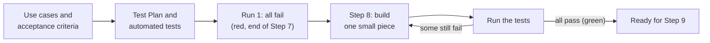

# Step 7: Test Creation (The SDET Chat)

**Role:** SDET (Software Development Engineer in Test) · **Prompt:** [c07](../prompts/c07-test-creation-prompt.md) · **Templates:** d07-01 to d07-02

## Executive Summary

At the end of [Step 6: Initial Infrastructure](b06-infrastructure.md), we
know **what** the product must do (the PRD), **how** it will be built (the
Spec), what it will **look like** (the UI/UX Document), and **where** it
will run (the System Infrastructure Document). Nothing has been built yet.
Before anything is, Step 7 writes down **exactly how we will check that it
works**.

This is the heart of **Test-Driven Development (TDD)**, described in
[What Is a Software Development Lifecycle Workflow?](a03-what-is-an-sdlc-workflow.md).
Remember the teacher who writes the answer key *before* the exam? Step 7
writes the answer key.

- **Inputs:** the signed-off PRD, Spec, UI/UX Document, and System
  Infrastructure Document, plus the **test environment** the DevOps
  Engineer set up in Step 6: the local environment on your own computer.
  The same tests run again on the live servers in Step 9.
- **Output:** the **Test Plan** (every test, linked to the use case it
  checks), the **automated tests** themselves, and a **Test Results Log**
  showing the first run, in which **every test fails**, as it should.
- **Hand-off:** once the Test Plan is signed off, the tests go to
  [Step 8: Implementation](b08-implementation.md), where the Software
  Engineer builds until every test passes.

---

## What Is an SDET?

An **SDET** (Software Development Engineer in Test) is a programmer whose
main job is **proving that software works**, and finding where it doesn't.
Older teams had "testers" who clicked through an app by hand after it was
built. An SDET instead writes **automated tests**: small programs that use
the software the way a person would, and report **pass** or **fail** in
seconds. They can be run thousands of times, for free, every time
something changes.

Back to the house from [a03](a03-what-is-an-sdlc-workflow.md): the SDET is
the **building inspector**, but one who writes the inspection checklist
*before* construction starts, and who has a machine that can re-inspect
the whole house in a minute, every time a nail is added.

### What They Do

- **Read the requirements** with a suspicious eye: "What happens if...?"
- **Design tests** for every use case: the normal path, and every way it
  could go wrong.
- **Write the automated tests** and the made-up **test data** they use.
- **Track results**: which tests pass, which fail, and why.
- **Guard the tests**: make sure no one quietly weakens a test just to make
  it pass.

---

## Inputs, Role, and Outputs

**Inputs.**

- **From the PRD:** the **use cases** and their **acceptance criteria**.
  These are the most important input: each criterion becomes at least one
  test.
- **From the Spec:** the **requests** between the client and server, the
  **sequence diagrams** (including their alternate flows), and the
  **Security & Compliance** section, such as "emails are never shown to
  coordinators."
- **From the UI/UX Document:** the **screens**, the exact **wording** of
  messages, and the **accessibility** rules.
- **From the System Infrastructure Document:** how to reach the **test
  environment**, a safe copy of the system that holds only made-up data.

**The role.** The SDET's work usually goes in this order:

1. **Map** every use case and acceptance criterion to the tests it needs.
2. **Define** each test in plain language: what it sets up, what it does,
   and what result counts as a pass.
3. **Prepare test data:** made-up usernames, tasks, and slots. Never real
   people's information.
4. **Write** the automated tests in the project's `tests/` folder.
5. **Run** them once, confirm they all fail for the right reason, and
   record the results.

**Outputs.**

| Document | What it contains | Used by |
|---|---|---|
| **Test Plan** (`d07-01`) | Every test definition, grouped by use case, with its type and expected result | Stakeholders (sign-off), Software Engineer |
| **Test Results Log** (`d07-02`) | The result of every test, run after run | Scrum Master, Software Engineer |
| **Automated tests** (`tests/`) | The test programs themselves | **Tools:** they check the code automatically |

---

## Why TDD Works So Well With AI

AI works best when it has a **clear goal**. Ask an AI to "build a volunteer
sign-up app" and it will build *something*, and then announce it's done,
whether or not it does what you needed. It has no way to know.

Tests change that. When the tests are written **before** implementation,
the Implementation step is no longer "build what you think we want." It
becomes "**make these 60 tests pass.**" The AI can run the tests itself,
see exactly which ones fail and why, fix that piece, and run them again.
The finish line is not a feeling; it is a number: *60 of 60 passing.*

It also protects you from **convincing mistakes**. AI can write code that
looks perfect and is quietly wrong, such as showing a volunteer's email on
the roster screen. A person might not notice. A test that checks "the
roster never contains an email address" will notice every single time.

---

## From Use Cases to Tests

Every test traces back to a use case, and every use case has tests. This
two-way link is called **traceability**. Take one use case from the
[sample project](../samples/README.md):

> **UC-3: Sign up for a slot.** Acceptance criterion: *"A volunteer can sign
> up for an open one-hour slot, and the slot then shows as filled."*

The SDET asks: *How would I prove that? And how could it go wrong?* That
one sentence becomes several tests, each of a different **type**.

### Types of Tests

| Type | What it checks | Example for UC-3 |
|---|---|---|
| **Happy path** | The normal flow works when everything goes right. | Volunteer signs up for an open slot; it shows as filled. |
| **Expected failure** | The system **refuses** things it should refuse, with a clear, polite message. | Signing up for a slot that is already filled shows "Sorry, this slot was just taken." |
| **Bounds checking** | What happens **at the edges** of what's allowed, where mistakes hide. | Signing up for the **last** open slot works; one more is refused. Two volunteers take the last slot at the same moment: exactly one succeeds. |
| **Monkey testing** | The system **survives nonsense**: random clicks, random typing, very long text. | A tool types 1,000 random characters into the username box and taps buttons at random. The app must never crash or show an email address. |

**Happy path** tests prove the product does its job. **Expected failure**
tests come from the use case's **alternate flows**; there are often more of
these than happy paths. **Bounds checking** matters because most bugs live
at edges: "up to 20 characters" must be tested at 20 (allowed) and 21
(refused), not just at 10. **Monkey testing** gets its name from the idea of
a monkey at a keyboard: no plan, just chaos. It finds problems no one
thought to write a test for.

---

## Test Definitions and Test Results

A **test definition** is the plain-language description of one test,
written in the Test Plan before any test code exists:

| ID | Use case | Type | Steps | Expected result |
|---|---|---|---|---|
| T-03-02 | UC-3 | Expected failure | Volunteer A fills the slot. Volunteer B tries to sign up for it. | B sees "Sorry, this slot was just taken." A is still signed up. |

The **ID** links the definition to its automated test and to its results.
Stakeholders can read the definitions and say "yes, that's what we meant"
without reading any code.

The **Test Results Log** records what happened each time the tests were
run: **Pass**, **Fail**, or **Blocked** (couldn't run at all, for example
because the test environment was down).

### Every Test Fails First, and That's the Point

At the end of Step 7, the SDET runs every test, and **every test fails**.
Nothing has been built yet, so there's nothing to pass. This first run,
often called **"red"**, proves two things: the tests really run, and they
aren't accidentally passing on nothing. (A test that passes before the
feature exists is a broken test.)

In [Step 8](b08-implementation.md), the Software Engineer (an AI chat or
Claude Code) builds one small piece, runs the tests, and repeats, adding a
new row to the Test Results Log each time. The fail count goes down run by
run until every test passes (**"green"**).

---

## Things to Watch When AI Plays the SDET

| Watch for | What to do |
|---|---|
| **Tests weakened to pass.** The Implementation AI may "fix" a failing test instead of the code. | The tests are **locked** after sign-off. Only the SDET chat may change one, and only with a recorded reason. |
| **Only happy paths.** AI tends to test that things work, not that they fail safely. | Check that every alternate flow and edge has a test. |
| **Tests that check nothing.** A test can run and pass without really checking the result. | Run 1 must be all red. Any test that passes on nothing is rewritten. |
| **Real data.** | Test data is always made up. Never copy real volunteers into the test environment. |

---

## Prompts, Templates, and Samples

**Prompts** (in `prompts/`):

- [`c07-test-creation-prompt`](../prompts/c07-test-creation-prompt.md):
  plays the SDET; maps use cases to tests, writes the test definitions and
  test data, writes the automated tests, runs them to confirm they all
  fail, and prepares the hand-off to Step 8

**Templates** (in `templates/`):

- [`d07-01-test-plan`](../templates/d07-01-test-plan.md): Test Plan,
  including the traceability table and every test definition
- [`d07-02-test-results`](../templates/d07-02-test-results.md): Test Results
  Log, started with the all-fail first run and continued in Step 8

**Samples** (in [`samples/BeautifulBeachParkVolunteers/docs/`](../samples/BeautifulBeachParkVolunteers/docs/)):

- [**d07-01**](../samples/BeautifulBeachParkVolunteers/docs/d07-01-test-plan.md):
  the sample project's Test Plan
- [**d07-02**](../samples/BeautifulBeachParkVolunteers/docs/d07-02-test-results.md):
  the sample's Test Results Log, from the all-fail first runs in Step 7
  to all 38 passing at the end of Step 8

Additional [case studies](case-studies.md) may be added to this repo at a
future time.

---

**Learn more:**

- [Step 6: Initial Infrastructure](b06-infrastructure.md): the previous step
- [Step 8: Implementation](b08-implementation.md): the next step
- [Test-driven development (Wikipedia)](https://en.wikipedia.org/wiki/Test-driven_development):
  a general introduction to TDD
- [Monkey testing (Wikipedia)](https://en.wikipedia.org/wiki/Monkey_testing):
  more about testing with random input
