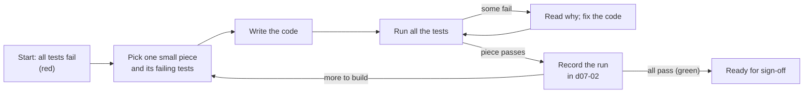

# Step 8: Implementation (The Software Engineer Chat)

**Role:** Software Engineer · **Prompt:** [c08](../prompts/c08-implementation-prompt.md) · **Templates:** d08-01 to d08-03

## Executive Summary

At the end of [Step 7: Test Creation](b07-test-creation.md), we know
**what** the product must do (the PRD), **how** it will be built (the
Spec), what it will **look like** (the UI/UX Document and Style Guide),
**where** it will run (the System Infrastructure Document), and **exactly
how we will check that it works** (the Test Plan and its automated tests).
Every one of those tests is failing, because nothing has been built yet.
Step 8 builds it.

- **Inputs:** every signed-off document from Steps 3 to 7, the **locked
  automated tests**, and the **build-and-test pipeline** the DevOps
  Engineer set up.
- **Output:** **working software** that passes every test, the
  **Implementation Record**, a **Developer Guide** that explains the code,
  and draft **Release Notes**.
- **Hand-off:** once every test passes and the stakeholders sign off, the
  software goes to [Step 9: Release](b09-release.md), where it is put in
  front of real users.

---

## What Is a Software Engineer?

A **Software Engineer**, often called a **programmer** or **developer**,
is the person who writes the instructions that make a computer do
something. Those instructions are called **code**, and they are written in
a **programming language**: a strict, exact language that a computer can
follow. A finished, organized collection of code is a **program** or an
**application** ("app").

Back to the house from [a03](a03-what-is-an-sdlc-workflow.md): the
Architect drew the blueprints, the Designer chose the colors and where the
light switches go, the DevOps Engineer prepared the land and the
utilities, and the SDET wrote the inspection checklist. The Software
Engineer is the **construction crew**. They are the ones who actually
build the house, and they are finished when it passes every inspection.

### What They Do

- **Read the plans** carefully: the PRD, the Spec, the UI/UX Document, and
  the tests.
- **Break the work into small pieces**, and decide the order to build them.
- **Write the code**, one small piece at a time.
- **Run the tests** after every piece, and fix whatever fails.
- **Review** the code for safety, speed, and cost, and have a person review
  it too.
- **Document** the code so the next person (or AI) can understand it.

---

## Inputs, Role, and Outputs

**Inputs.**

| Input | From | What the Software Engineer takes from it |
|---|---|---|
| PRD (`d03-01`) | Step 3 | The use cases: what each user needs to do |
| Spec (`d04-01`) | Step 4 | The components, the data, the requests, the technology, and the Security & Compliance rules |
| UI/UX Document and Style Guide (`d05-01`, `d05-02`) | Step 5 | Every screen, every message's exact wording, colors, fonts, and design files |
| System Infrastructure Document (`d06-01`) | Step 6 | The test environment and the build-and-test pipeline |
| Test Plan, Test Results Log, and tests (`d07-01`, `d07-02`, `tests/`) | Step 7 | **The finish line:** every test that must pass |

**The role.** The Software Engineer's work goes in a loop, described
below: build a small piece, run the tests, fix, repeat. Along the way they
never quietly change the plan. If the Spec is missing something, or a test
looks wrong, they send a request back through the
[Tracking chat](b01-tracking.md), just like every other step.

**Outputs.**

| Document | What it contains | Used by |
|---|---|---|
| **Working software** (`src/`) | The code itself | The tests; the Release Manager (Step 9) |
| **Implementation Record** (`d08-01`) | The build plan, progress, tools used, and any requests sent back | Stakeholders (sign-off), Scrum Master |
| **Developer Guide** (`d08-02`) | How the code is organized, and how to set it up, run it, test it, and change it | Step 10, and anyone who works on the code later |
| **Release Notes** (`d08-03`) | What this version does, in plain language, and any known problems | Users, stakeholders, the Release Manager |
| **Test Results Log** (`d07-02`, continued) | A new row for every test run | Scrum Master, SDET |

---

## Tests as Input: Building Until Everything Is Green

This is where **Test-Driven Development (TDD)** pays off. In
[Step 7](b07-test-creation.md), the SDET wrote the answer key before the
exam. In Step 8, the Software Engineer takes the exam, and can check the
answer key as often as they like.

The loop is often called **"red, green, refactor"**: make a failing test
pass (red to green), then tidy the code without breaking anything
(**refactor**), then move on.

This matters most when **AI does the programming**. Ask an AI to "build a
volunteer sign-up app" and it will build *something* and announce it's
done. Give it 38 failing tests and the instruction "make these pass" and
everything changes:

- **The goal is exact.** "Signing up for a full slot shows *Sorry, this
  slot was just taken*" leaves nothing to guess.
- **The AI can check itself.** A tool such as Claude Code can run the
  tests, read exactly which ones failed and why, and fix that piece,
  without a person spotting every mistake.
- **"Done" is a number, not a feeling.** The work is finished at *38 of 38
  passing*, and not before.
- **Old features stay fixed.** Every test runs every time, so building
  piece 9 can't silently break piece 2.

There is one firm rule: **the code changes to pass the tests, never the
other way round.** An AI under pressure may try to "fix" a failing test
instead of the code. The tests are **locked**; only the SDET chat may
change one, with a recorded reason.

---

## UI/UX as Input: Building What Users Actually Want

[Step 5: User Experience](b05-user-experience.md) explained that
programmers are usually not very good at user experience, and showed the
"programmer's sign-up screen": a blinking cursor asking for a task ID and a
date in MM/DD/YYYY format. Left on its own, a Software Engineer, human or
AI, tends to build exactly that: a screen that technically works, or a
generic-looking screen like every other AI-built app.

Giving the Software Engineer the **UI/UX Document**, the **Style Guide**,
and any **design files** (such as Figma files) changes the result. The
engineer builds the Beach Cleanup screen the Designer drew: the photo,
the "2 spots left," the big "Sign up" button, the park's own colors, and
the exact friendly wording. Because the SDET also turned that wording into
tests, the finished screen is *checked* against the design, not just
"inspired by" it. The product ends up looking like what the users and
stakeholders approved, not like the programmer's best guess.

---

## Why AI Is So Good at Programming

Of all the roles in this workflow, programming is one of the jobs AI does
best. There are several reasons.

**It has seen an enormous amount of code.** AI models learn from huge
amounts of text, and the internet is full of code: millions of open-source
projects, official documentation, tutorials, and question-and-answer sites
where programmers ask "why doesn't this work?" and others answer. Almost
any problem a programmer meets has been solved, explained, and argued
about online many times over, and the AI learned from those examples.

**Code is one of its native languages.** A person thinks in their own
language, such as English. To program, they must first *learn* a computer
language, then *translate* their idea ("only show slots with places left")
into that language's strict rules, and every translation is a chance for a
mistake. An AI learned programming languages the same way it learned
English, from examples, all at once. Python is as natural to it as plain
English, so it can move between your request and the code without the
slow, careful translation a person needs.

**It knows many languages and tools.** There are hundreds of programming
languages, and they differ in important ways:

| Difference | What it means | Examples |
|---|---|---|
| **Compiled ahead of time** | The code is translated into the computer's own instructions *before* it is run. It starts fast and runs fast. | C, C++, Rust, Go, Swift |
| **Translated on the spot** | The code is translated *while* it runs, by a program called an **interpreter** (or a "just-in-time" compiler). Quicker to write and change; often a little slower to run. | Python, JavaScript, Ruby |
| **Specialized for a task** | Built for one kind of work. | R and MATLAB (math and statistics), SQL (asking a database questions) |
| **Aimed at a target** | Languages and frameworks built for one kind of device. | Swift (iPhone apps), Kotlin (Android apps), React Native (one JavaScript codebase for both iPhone and Android) |

A person usually masters a few of these over a career. An AI already
knows most of them, which helps it follow the Architect's choice in the
Spec (Python for the sample project's server) instead of whatever it
happens to know best.

**It knows the best practices from the start.** Every problem can be
solved in many ways, and some ways are far better than others. Finding one
username among 500 by checking each name in turn works, but asking the
database to keep an **index** (like the index at the back of a book) is
much faster. In the cloud, where every second of computer time costs
money (see the [Cost Sign-Off Sheet](b06-infrastructure.md)), faster code
is also cheaper code. The sample Spec has examples: it sends a phone only
the slots that still have places left, and it takes the last place in a
single database step so two volunteers tapping at once can never over-fill
a slot. A seasoned programmer learns patterns like these through years of
trial and error, slow pages, and late-night fixes. An AI knows them from
the very first chat.

**But it still makes mistakes**, sometimes confident, convincing ones.
That is exactly why this workflow writes the tests first, and why a person
still reviews the code before it goes live.

---

## Things to Watch When AI Plays the Software Engineer

| Watch for | What to do |
|---|---|
| **Changing tests to pass.** | The tests are locked. Requests to change one go to the SDET chat. |
| **Building more than was asked.** AI likes to add "helpful" extras. | Build only what the PRD and Spec describe. Extras go to the Product Manager as requests. |
| **Ignoring the design.** | Every screen is built from the UI/UX Document and Style Guide, and checked against its mockup. |
| **Secrets in the code.** | Passwords and keys are never written into the code or pasted into a chat; they stay where d06-01 says. |
| **Unknown code libraries.** | Every library is listed in the Developer Guide with its license (Spec Section 11.2). |
| **No human review.** | A person reviews the code before Step 9, as the Spec's AI-Related Risks section requires. |

---

## Prompts, Templates, and Samples

**Prompts** (in `prompts/`):

- [`c08-implementation-prompt`](../prompts/c08-implementation-prompt.md):
  plays the Software Engineer; reviews every input, plans the build order,
  builds one small piece at a time until every test passes, builds screens
  from the UI/UX Document, reviews security and cost, writes the Developer
  Guide and Release Notes, and prepares the hand-off to Step 9

**Templates** (in `templates/`):

- [`d08-01-implementation-record`](../templates/d08-01-implementation-record.md):
  Implementation Record: build plan, progress, tools, reviews, and requests
  sent back
- [`d08-02-developer-guide`](../templates/d08-02-developer-guide.md):
  Developer Guide: how the code is organized and how to set it up, run,
  test, and change it
- [`d08-03-release-notes`](../templates/d08-03-release-notes.md): Release
  Notes: what this version does, in plain language

**Samples** (in [`samples/BeautifulBeachParkVolunteers/docs/`](../samples/BeautifulBeachParkVolunteers/docs/)):

- [**d08-01**](../samples/BeautifulBeachParkVolunteers/docs/d08-01-implementation-record.md):
  the sample project's Implementation Record, from 0 to 38 of 38 tests
  passing, including one request to change a test that was turned down
- [**d08-02**](../samples/BeautifulBeachParkVolunteers/docs/d08-02-developer-guide.md):
  the sample's Developer Guide
- [**d08-03**](../samples/BeautifulBeachParkVolunteers/docs/d08-03-release-notes.md):
  the sample's Release Notes for version 1.0

Additional [case studies](case-studies.md) may be added to this repo at a
future time.

---

**Learn more:**

- [Step 7: Test Creation](b07-test-creation.md): the previous step
- [Step 9: Release](b09-release.md): the next step
- [Step 5: User Experience](b05-user-experience.md): where the screens come from
- [Compiled vs. interpreted languages (Wikipedia: Interpreter)](https://en.wikipedia.org/wiki/Interpreter_(computing)):
  a general introduction
