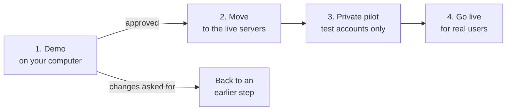
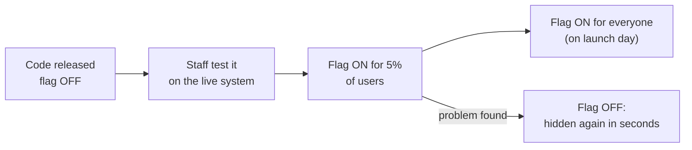

# Step 9: Release (The Release Manager Chat)

**Role:** Release Manager · **Prompt:** [c09](../prompts/c09-release-prompt.md) · **Templates:** d09-01 to d09-03

## Executive Summary

At the end of [Step 8: Implementation](b08-implementation.md), the software
works and every test passes, but only on **your own computer**, with
made-up data, used by a handful of people. No stakeholder has tried it,
and no real user has seen it. Step 9 takes it the rest of the way, in four
stages: a **demo** for the stakeholders, a **move** to the live servers, a
private **pilot**, and **going live**.

- **Inputs:** the working software, the signed-off documents from Steps 3
  to 8, the draft **Release Notes**, the **live server requirements**, and
  the organization's IT staff, who run the live servers.
- **Output:** the stakeholders' **demo approval**, the software moved to
  the live servers and then **live for real users**, a **Release Plan**, a
  **Release Readiness Review** (the go/no-go decision), finalized
  **Release Notes**, and a **Release Efficacy Document** describing how
  well the release went.
- **Hand-off:** once the release has been watched for an agreed period
  and the stakeholders sign off, the software goes to
  [Step 10: Maintenance](b10-maintenance.md).

---

## What Is a Release Manager?

A **release** is the moment a new version of software is made available to
its real users. A **Release Manager** is the person responsible for making
that moment go smoothly, and for deciding, with the stakeholders, whether
the software is truly ready.

Back to the house from [a03](a03-what-is-an-sdlc-workflow.md): the house
is built and has passed every inspection. The Release Manager plans
**move-in day**. They check that the water and power are connected to the
real supply (not the builder's temporary hookup), that the house can hold
a full housewarming party and not just one inspector, that everyone knows
the date, and what happens if a pipe bursts on the first night.

### What They Do

- **Show** the working software to the stakeholders in a demo, and record
  their approval or the changes they ask for.
- **Plan** the release: what goes live, when, how, and in what order.
- **Check readiness:** confirm every earlier sign-off, run the checks the
  automated tests couldn't, and test the system under real-world load.
- **Plan the way back:** decide in advance how to undo the release, and
  what would trigger it.
- **Recommend Go or No-Go**, following written rules, and record the
  stakeholders' decision.
- **Run release day** with the DevOps Engineer and the organization's IT
  staff, then **watch** the live system for problems.
- **Report** how well it went, and hand the live product to Step 10.

---

## Inputs, Role, and Outputs

**Inputs.**

| Input | From | What the Release Manager takes from it |
|---|---|---|
| PRD (`d03-01`) | Step 3 | Success measures, Must-have use cases, and the deadline |
| Spec (`d04-01`) | Step 4 | Quality requirements (speed, number of users) and Security & Compliance rules |
| System Infrastructure Document (`d06-01`) | Step 6 | The live servers and their requirements, who runs them, monitoring, backups, costs, and the spending limit |
| Test Plan and Test Results Log (`d07-01`, `d07-02`) | Step 7 | What was tested, and what was **left to check by hand** in Step 9 |
| Implementation Record, Developer Guide, Release Notes (`d08-01` to `d08-03`) | Step 8 | What was built, how to run it, and any known issues |

**The role.** The Release Manager doesn't write code or change tests. If
the release finds a problem, they send a request back through the
[Tracking chat](b01-tracking.md), just like every other step.

**Outputs.**

| Document | What it contains | Used by |
|---|---|---|
| **Release Plan** (`d09-01`) | The stakeholder demo and its approval, the hand-off to the live servers, the private pilot, the feature flags, the stress test, manual checks, the rollback plan, and the release-day schedule | DevOps Engineer, the IT staff, stakeholders |
| **Release Readiness Review** (`d09-02`) | The go/no-go rules, each checked, any pressures disclosed, and the decision | Stakeholders (sign-off), Scrum Master |
| **Release Notes** (`d08-03`, finalized) | The release date and final wording for users | Users, stakeholders |
| **Release Efficacy Document** (`d09-03`) | How well the release went: problems, rollbacks, results, lessons | Stakeholders, the SRE (Step 10) |

---

## Four Stages: Demo, Move, Pilot, Live

| Stage | Where | What happens | Ends with |
|---|---|---|---|
| **1. Stakeholder demo** | Your computer | The stakeholders try the working software themselves, with made-up data, following a short script of the main use cases. It costs nothing. | Their **demo approval**, recorded in the Tracking chat, or a list of changes |
| **2. Move to the live servers** | The organization's servers | The DevOps Engineer and the IT staff who run the servers install the approved software, following the Developer Guide and the live server requirements, and connect the real email service. Then the **same automated tests** are run there. | Every test passing on the live servers, and the IT staff's OK |
| **3. Private pilot** | The live servers | A few trusted people (staff, a couple of volunteers) use **test accounts** for a week or so. Nothing is announced. Stress testing and the checks the tests couldn't do (such as real emails arriving) happen here. | The Release Readiness Review: Go or No-Go |
| **4. Go live** | The live servers | The test accounts are removed and real users are invited. | The watch period, then the Release Efficacy Document |

**Why demo locally, before moving?** The stakeholders see exactly what was
built while changes are still free and easy. If they ask for changes, the
work goes back to the right step (often Step 5 or Step 8), and nothing has
been installed on anyone's servers yet. Many changes come from simply
seeing the real thing: a button that's hard to find, a word that confuses
people.

**Why does the IT team matter?** When the live servers belong to the
organization's IT team, they decide **how and when** new software goes on
them. They may want to review security first, install it themselves, or
schedule it for a quiet evening. The Release Plan includes their steps and
their approval, and the Release Manager plans around their timeline,
which often takes longer than anything else in this step.

---

## Feature Flags: Releasing Without Revealing

A **feature flag** is an on/off switch built into the software. The new
feature's code is **released** (copied to the live system), but it stays
**hidden** until someone flips the switch. Think of a light switch: the
wiring is installed and inspected, but the room stays dark until you're
ready.

Flags make it possible to:

- **Separate "deploy" from "launch."** Release the code quietly on
  Tuesday; turn it on during Saturday's announcement.
- **Test in the real world first**, with staff only, or a small share of
  users.
- **Turn a broken feature off in seconds**, without releasing a new
  version.

Flags have a cost: every flag adds code, and must be tested both on and
off. Remove each one once the feature is settled.

**Flags are for new features in an existing application.** Most of the
time, a brand-new application's first release doesn't use them, because
with the flag off there would be nothing left to show. Flags earn their
place later, when a new feature is added to software people already use:
the new feature can be turned on and off without affecting everything
else that already works.

---

## Stress Testing: Problems That Only Appear at Scale

The tests in Step 7 run one or two make-believe users at a time. Real life
is different: a newsletter goes out at 9:00 a.m. and 300 people tap the
link in the same minute. **Stress testing** (or **load testing**) uses
software to pretend to be hundreds or thousands of users at once, to find
the breaking point *before* real users do.

Problems that only show up at scale include:

| Problem | What happens |
|---|---|
| **Connection limits** | A small database plan accepts only so many connections at once; user 21 gets an error page |
| **Collisions** | Two people take "the last place" at the same instant, and both succeed |
| **Slow pages** | A page that takes 1 second for one user takes 15 seconds for 500 |
| **Outside limits** | The email service sends 100 messages a minute; 300 sign-in links pile up |
| **Surprise costs** | Cloud services charge per use; a busy day can break the budget |

The sample project's stress test found the first problem: at 150
pretend volunteers, 6 in every 100 saw an error. It took one setting to
fix, and would have ruined launch morning.

---

## Releasing and Rolling Back

**Rolling back** means undoing a release: returning to the last version
that worked. Common ways to release, from simplest to safest:

| Approach | How it works | Undo by |
|---|---|---|
| **All at once** | Replace the old version with the new one | Putting the old version back |
| **Feature flag** | Release with the flag off, then turn it on | Turning the flag off |
| **Gradual ("canary")** | Give the new version to 5% of users, then 25%, then everyone | Moving everyone back to the old version |
| **Side by side ("blue-green")** | Run the old and new versions together, and switch traffic between them | Switching back |

A **rollback strategy** is decided **before** release day, never during a
crisis:

- **Triggers:** exactly what would cause a rollback (for example, error
  pages for more than 2% of users for 10 minutes).
- **Who decides**, and who can do it at 7 a.m. on a Saturday.
- **Steps**, written down and **practiced** during the private pilot,
  agreed with whoever runs the live servers.
- **Data:** code is easy to undo; data is not. If the release changed the
  database, or users have already signed up, the plan must say what
  happens to that data.

Sometimes **rolling forward** (releasing a quick fix) is better than
rolling back. The plan says when.

---

## Small Website or Shared SDK: Very Different Releases

| | Small feature on one website | Large feature in an SDK |
|---|---|---|
| **What it is** | One page or form on one site | A **Software Development Kit**: a code library that many other products build into themselves |
| **Who is affected** | One site's visitors | Every product that uses it, and all their users |
| **Who releases** | One team, one button | Each product team chooses when to update |
| **Rollback** | Minutes | Weeks, or impossible: you can't undo code already inside someone else's app or on millions of phones |
| **Testing** | One site | Every supported product, version, and device |
| **Planning** | A short checklist | Version numbers, advance warnings, support for old versions, a schedule for retiring features |

The workflow's steps are the same for both; the size of the Release Plan
is not. Scale it to the risk.

---

## The Pressure on a Release Manager

A human Release Manager is often the last person who can say "not yet,"
and the pressure to say "go" can be enormous:

- **Deadlines**, with jobs, bonuses, or a contract attached.
- **Marketing campaigns** and events already paid for and announced.
- **Being first to market** before a competitor.
- **Sunk cost:** "We've come this far."
- **Rank:** a senior leader who wants it out.
- **Normalizing:** "It's only a small issue," repeated until a serious
  problem looks small.

Under this pressure, people quietly redefine "ready." Known problems get
moved to "fix after launch," a failed check is rerun until it passes once,
and the rollback plan is never practiced.

### How an AI Release Manager With Rules Helps

In this workflow, the Release Manager chat follows **hard-stop rules**
written into its prompt and the Readiness Review template **before**
anyone feels the pressure, for example: *every test passes; the stress
test passes; the rollback has been practiced; no known issue affects a
Must-have use case.*

- **It isn't afraid** of a manager, a lost bonus, or an awkward meeting.
- **The rules are written in advance**, when everyone is calm.
- **It checks every rule, every time**, and shows its evidence.
- **It names the pressure:** the Readiness Review records the deadlines
  and campaigns, so everyone sees them influencing the decision.
- **It can't be talked into "Go."** A hard stop can only be passed by the
  stakeholders recording a **risk acceptance**: who accepted which risk,
  and the workaround.

AI isn't perfect here. It can still be persuaded by a clever argument or
given wrong information, and it doesn't know the business as people do.
So **the AI recommends, and the stakeholders decide**, but now they decide
with the facts, and their names, on the record.

---

## Prompts, Templates, and Samples

**Prompt** (in `prompts/`):

- [`c09-release-prompt`](../prompts/c09-release-prompt.md): plays the
  Release Manager; runs the stakeholder demo, plans the move to the live
  servers with the IT staff, the private pilot, the flags, the stress
  test, and the rollback, applies the hard-stop rules, runs release day
  with the DevOps Engineer, and reports on how it went

**Templates** (in `templates/`):

- [`d09-01-release-plan`](../templates/d09-01-release-plan.md): Release
  Plan: demo, move to the live servers, pilot, flags, stress test, manual
  checks, rollback, schedule
- [`d09-02-release-readiness-review`](../templates/d09-02-release-readiness-review.md):
  Release Readiness Review: hard-stop rules, pressures, risk acceptances,
  and the go/no-go decision
- [`d09-03-release-efficacy`](../templates/d09-03-release-efficacy.md):
  Release Efficacy Document: how well the release went, and the hand-off
  to Step 10

**Samples** (in [`samples/BeautifulBeachParkVolunteers/docs/`](../samples/BeautifulBeachParkVolunteers/docs/)):

- [**d09-01**](../samples/BeautifulBeachParkVolunteers/docs/d09-01-release-plan.md):
  the sample's Release Plan, including the stakeholder demo, the move to
  the city's servers with Parks IT, and the stress test that failed and
  how it was fixed
- [**d09-02**](../samples/BeautifulBeachParkVolunteers/docs/d09-02-release-readiness-review.md):
  the sample's Readiness Review, including a No-Go under newsletter
  pressure
- [**d09-03**](../samples/BeautifulBeachParkVolunteers/docs/d09-03-release-efficacy.md):
  the sample's Release Efficacy Document after two weeks live

Additional [case studies](case-studies.md) may be added to this repo at a
future time.

---

**Learn more:**

- [Step 8: Implementation](b08-implementation.md): the previous step
- [Step 10: Maintenance](b10-maintenance.md): the next step
- [Step 6: Initial Infrastructure](b06-infrastructure.md): where the live servers, their requirements, monitoring, and costs are planned
- [Feature toggle (Wikipedia)](https://en.wikipedia.org/wiki/Feature_toggle):
  a general introduction
