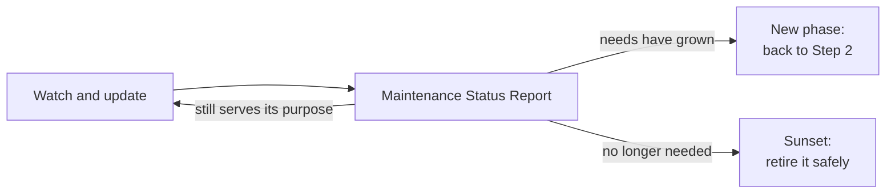

# Step 10: Maintenance (The SRE Chat)

**Role:** SRE (Site Reliability Engineer) / Maintenance Engineer · **Prompt:** [c10](../prompts/c10-maintenance-prompt.md) · **Templates:** d10-01 to d10-03

## Executive Summary

At the end of [Step 9: Release](b09-release.md), the software is live and
real people depend on it. Most people think that's the finish line. It
isn't: software that is left alone slowly stops working. Step 10 keeps it
healthy for as long as it is needed.

- **Inputs:** the live software, the **Release Efficacy Document**
  (`d09-03`) with its open problems, the **System Infrastructure Document**
  (`d06-01`) with its monitoring, the **Developer Guide** (`d08-02`), and
  the PRD's success measures (`d03-01`).
- **Output:** a **Maintenance Log**, a regular **Maintenance Status Report**,
  and, at the end, a **Next Phase or Sunset Recommendation**.
- **Hand-off:** this step repeats until a status report shows the product
  no longer serves its purpose. Then it either starts a **new phase**
  (back to [Step 2: Feasibility](b02-feasibility.md)) or is **sunset**
  (retired).

---

## What Is a Site Reliability Engineer?

A **Site Reliability Engineer (SRE)** keeps live software **reliable**:
available when people need it, fast enough, safe, and affordable. Where the
Release Manager plans move-in day, the SRE is the **building
superintendent** for the house from [a03](a03-what-is-an-sdlc-workflow.md):
checking the furnace, fixing leaks before they ruin the floor, and telling
the owners when the roof is near the end of its life.

### What They Do

- **Watch** the live system: logs, dashboards, and alerts.
- **Keep the parts current**: apply updates safely, through the tests.
- **Respond** to problems, find the cause, and stop them happening again.
- **Plan for growth** before the system reaches its limits.
- **Report** regularly, with recommendations the stakeholders can act on.

---

## Software Entropy: Why Software Rusts

**Entropy** is the natural drift from order to disorder. **Software
entropy** is the way working software slowly breaks, even though **nobody
changed its code**. It "rusts" because the world around it keeps changing.

Think about your **cell phone**. Every few weeks the phone's **operating
system** (the base software, such as iOS or Android) offers an update.
Soon afterward, many of your apps ask to update too, because the new
operating system changed something they depend on. Skip enough updates
and an app stops opening, or the app store says it's no longer supported.

Every application is built the same way, from pieces made by other
people, and each piece has its own update schedule:

| Piece it depends on | Phone example | What can happen |
|---|---|---|
| **Operating system** | iOS or Android update | Old features removed; the app must change to keep running |
| **Third-party libraries** (code borrowed from others) | An app's built-in map or payment piece | Security fixes that must be installed; new versions that work differently |
| **Programming language** | The language the app was written in | Old versions stop getting security fixes on a published date |
| **Database** | Where the app keeps your data | The provider retires old versions and upgrades you, ready or not |
| **AI model** | A chatbot or photo feature | Models are retired; a newer one answers differently |
| **Outside services and browsers** | Email, maps, Chrome, Safari | Services change how they connect; browsers stop allowing old tricks |

Each update is small. But they pile up, and **pieces depend on each
other**: updating the language may force a library update, which changes
how the app behaves. Waiting makes it worse: one update a month is easy;
thirty at once is a project. That's why the SRE keeps a list of every
piece, its version, and its **end-of-support date**, and updates on a
steady rhythm, always running the full test suite from
[Step 7](b07-test-creation.md) before anything reaches real users.

---

## Problems That Only Appear When You Succeed

As [Step 9](b09-release.md#stress-testing-problems-that-only-appear-at-scale)
showed, some problems only appear at **scale**. Success causes them: a
news story, a big event, or steady growth pushes the number of users past
a **tipping point**, where a limit that never mattered suddenly does
(database connections, email limits, storage, or the monthly bill). The
SRE watches the trend lines and raises the alarm **before** the tipping
point, while there's still time to plan.

---

## Watching and Reporting

| Tool | What it is | Like |
|---|---|---|
| **Logs** | A diary the software writes as it runs: every page, error, and email | A ship's logbook |
| **Dashboards** | Charts of the key numbers: users, errors, speed, costs | A car's dashboard |
| **Alerts** | Automatic warnings when a number crosses a line | A smoke detector |
| **Health checks** | Small automatic tests run against the live system | A daily walk-through |

The SRE reads these, finds the patterns, and writes a regular **Maintenance
Status Report** (monthly is typical) in plain language: how healthy the
product is, what rusted, what was fixed, what's coming, and what they
**recommend**. Fixes follow the same path as every other step: a test
first from the SDET, a fix from the Software Engineer, a release with the
Release Manager, and a sign-off through the [Tracking chat](b01-tracking.md).

---

## The End of the Loop: New Phase or Sunset

Maintenance continues until a status report shows the product **no longer
serves the need it was built for**. Then there are two paths:

- **New phase:** the needs have grown, or the old design can't keep up.
  The SRE recommends returning to Step 2 with a new one-pager.
- **Sunset:** the need has gone, a better tool exists, or maintenance costs
  more than the product is worth. A **sunset** is a planned retirement:
  users are warned, their data is returned or deleted, and every paid
  service is turned off, so the bills stop.

As always, **the AI recommends, and the stakeholders decide.**

---

## Prompts, Templates, and Samples

**Prompt** (in `prompts/`):

- [`c10-maintenance-prompt`](../prompts/c10-maintenance-prompt.md): plays the SRE;
  watches the live system, keeps every piece current through the tests,
  responds to problems, writes the status reports, and recommends a new
  phase or a sunset

**Templates** (in `templates/`):

- [`d10-01-maintenance-log`](../templates/d10-01-maintenance-log.md):
  Maintenance Log: parts list with end-of-support dates, updates,
  incidents, and requests sent back
- [`d10-02-maintenance-status-report`](../templates/d10-02-maintenance-status-report.md):
  Maintenance Status Report: health, rust, scale, costs, success measures, and
  recommendations
- [`d10-03-next-phase-or-sunset`](../templates/d10-03-next-phase-or-sunset.md):
  Next Phase or Sunset Recommendation: the evidence, the options, and the
  plan for a new phase or a safe retirement

**Samples** (in [`samples/BeautifulBeachParkVolunteers/docs/`](../samples/BeautifulBeachParkVolunteers/docs/)):

- [**d10-01**](../samples/BeautifulBeachParkVolunteers/docs/d10-01-maintenance-log.md):
  the sample's first three months of maintenance, including a language
  end-of-support date and an email-service change
- [**d10-02**](../samples/BeautifulBeachParkVolunteers/docs/d10-02-maintenance-status-report.md):
  the three-month status report, warning of a tipping point before summer
- [**d10-03**](../samples/BeautifulBeachParkVolunteers/docs/d10-03-next-phase-or-sunset.md):
  the recommendation to start Phase 2

Additional [case studies](case-studies.md) may be added to this repo at a
future time.

---

**Learn more:**

- [Step 9: Release](b09-release.md): the previous step
- [Step 2: Feasibility](b02-feasibility.md): where a new phase begins
- [Step 6: Initial Infrastructure](b06-infrastructure.md): where monitoring and costs are set up
- [Software rot (Wikipedia)](https://en.wikipedia.org/wiki/Software_rot):
  a general introduction
