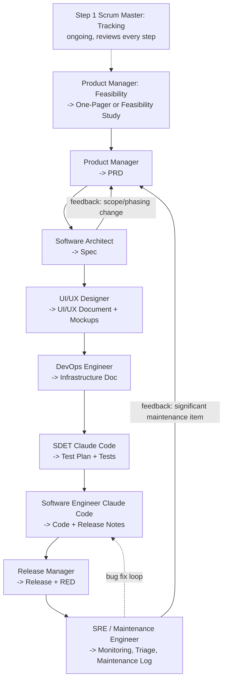

# RC_Park_Tour: An AI-Chained Waterfall SDLC Case Study

**Status:** Planning phase — project has not yet started implementation.
**Document owner (this chat's role):** Educator/Researcher & Scrum Master
**Purpose:** This document defines and tracks an experimental software development process in which a standard waterfall Software Development Life Cycle (SDLC) is executed by a sequence of AI chat sessions, each playing a distinct role. Each role produces a deliverable that becomes the primary input to the next role. RC_Park_Tour is the pilot project used to validate the process.

---

## 1. Why AI-Assisted SDLC, Not Vibe Coding

"Vibe coding" — prompting an AI to build something with no requirements document, no design review, no test discipline, and no defined handoffs — skips every steering mechanism this process relies on. Without a PRD to hold scope, a Spec to hold design intent, or tests to hold correctness, the AI has nothing to check its own output against from one step to the next. The result is commonly known as **AI slop**: code that runs, more or less, but is inconsistent, hard to extend, has undiagnosed edge cases, and often reflects functionality nobody actually asked for.

An AI-assisted SDLC replaces that with exactly the steering vibe coding lacks: each role's deliverable becomes an explicit, checkable constraint on the next role's output, and the Scrum Master's phase sign-off gate (Section 8) ensures nothing moves forward unreviewed. The bet behind this case study is straightforward — an application built this way is tighter, better managed, and more maintainable than one built by unconstrained prompting, and that difference is a real competitive advantage against sloppier, vibe-coded competitors in the marketplace.

---

## 2. Motivation

Large language model chat sessions perform best when given a focused role, a bounded context, and a clear deliverable. Traditional waterfall SDLC phases map naturally onto this constraint: each phase has a well-defined owner, a well-defined output artifact, and a well-defined handoff to the next phase.

This case study documents an attempt to formalize that mapping — using a *separate AI chat instance per SDLC role* — and to record, as the process unfolds, what works, what breaks down, and what has to be adapted. RC_Park_Tour is the vehicle for testing the process, not the primary subject of the document; the process itself is.

## 3. Methodology: Role-Chained AI Development

The core pattern:

1. A new chat is started and given a **role** (e.g., "You are the Product Manager for this project").
2. The role's chat is given the prior phase's deliverable(s) as input (except for the first role, which starts from raw project intent).
3. The role works — researching, designing, writing, coding, or testing — until it produces its **deliverable document(s)** (or, in later phases, code and test artifacts).
4. The deliverable is committed to the project's Git repository and handed to the next role's chat as its starting input.
5. Where a downstream role discovers that an upstream deliverable is wrong or incomplete, a **feedback loop** sends a revision request back to the upstream role's chat (or a fresh chat continuing that role), and the affected deliverables are updated before proceeding.
6. This chat — playing **Educator/Researcher** and **Scrum Master** simultaneously — tracks overall progress, records what happened at each phase, and writes up the case study for the project's public documentation. It does not produce SDLC deliverables itself; it produces the meta-narrative and progress tracking around them.

## 4. Roles and Deliverables

| # | Role | Chat Type | Input | Deliverable(s) | Feeds Into |
|---|------|-----------|-------|-----------------|------------|
| 1 | Educator/Researcher & Scrum Master | this chat | Every other step's deliverables | Case study document (this file); progress tracking | Public GitHub documentation |
| 2 | Product Manager (Feasibility) | claude.ai chat | Project intent | One-Pager Project Summary (lightweight) *or* Feasibility Study incl. Voice-of-Customer interviews (for larger/complex projects) | Product Manager (Requirements) |
| 3 | Product Manager | claude.ai chat | Project intent + Feasibility deliverable | Product Requirements Document (PRD): users, use cases, UML Use Case Diagrams | Software Architect |
| 4 | Software Architect | claude.ai chat | PRD | Software Design Specification (Spec) incl. Security & Compliance section (copyright/data-retrieval research): overall design, use-case coverage, UML sequence/transaction diagrams per use case | UI/UX Designer |
| 5 | UI/UX Designer | claude.ai chat | PRD + Spec | UI/UX Document: mockups, plus attached design files (e.g., Figma) where the format supports import into coding tools | DevOps Engineer |
| 6 | DevOps Engineer | claude.ai chat | PRD + Spec + UI/UX Document | System Infrastructure Document incl. Security & Compliance review (IP-loss/bad-actor protections): hardware/cloud definition, UML system diagram; implements and configures the infrastructure | SDET |
| 7 | SDET | Claude Code | Spec + Infrastructure Document | Test Plan Document + test suite (TDD) | Software Engineer |
| 8 | Software Engineer | Claude Code | Spec + Infrastructure Document + UI/UX Document + tests | Working code, in-repo documentation, Release Notes Document (iterates until all tests pass) | Release Manager |
| 9 | Release Manager | claude.ai chat | Code, Release Notes, live system | Production release; initial post-release monitoring; Release Efficacy Document (RED) | SRE / Maintenance Engineer |
| 10 | SRE / Maintenance Engineer | claude.ai chat (ongoing/recurring) | RED, live system | Ongoing monitoring, bug triage, and maintenance upgrades (e.g., OS/dependency updates); periodic Maintenance Log | Product Manager (next phase or close-out) |

### 4.1 Educator/Researcher & Scrum Master (this chat): Step 1, Tracking

Step 1 initializes tracking, then stays open for the rest of the project while the other steps run one after another. This chat combines two roles that don't need their own dedicated chat sessions:

- **Educator/Researcher:** writes up the process and its outcomes as documentation intended for the project's public GitHub repository (this document).
- **Scrum Master:** tracks where the project currently stands, what phase is active, and what feedback loops are open. Its deliverable is the tracking document (Section 9) rather than one of the product documents. This includes the **phase sign-off gate**: for each deliverable produced by a role chat, the Scrum Master reviews it, brokers approval from any relevant stakeholders, and logs the phase as done before the next role's chat begins.

### 4.2 Product Manager — Feasibility

A short, separate chat, still played by the Product Manager role, run before requirements gathering begins. Its scope scales with project size:

- **Lightweight projects:** a **one-pager project summary** — problem statement, target users, rough scope, and a go/no-go judgment.
- **Larger or more complex projects:** a full **feasibility study**, which may include interviews with prospective clients/users to capture Voice of the Customer (VoC) before use cases are locked down.

Either deliverable feeds into the Product Manager's next chat, which produces the PRD.

### 4.3 Product Manager

Produces the **PRD**: identifies the target users and their use cases, and diagrams them with UML Use Case Diagrams. This is the root artifact — every later phase traces back to it.

### 4.4 Software Architect

Consumes the PRD and produces the **Spec**: the overall system design and, critically, an explicit mapping showing how each use case in the PRD is satisfied by the design, typically illustrated with UML sequence/transaction diagrams per use case.

This is the first likely **feedback point**. For example, the Architect may recommend phased delivery — a Proof of Concept phase, followed by a phase covering an easier use case, followed by a phase covering a more advanced use case — which requires revising the PRD's scope and priorities before the Spec is finalized.

**Security & Compliance section (required):** in an AI-assisted SDLC, security and compliance carry more weight than in a traditional one — AI tooling makes it easy to introduce confidentiality leaks or copyright infringement without anyone noticing. The Spec must include a dedicated Security & Compliance section covering, at minimum, research into possible copyright issues around any data retrieval the system performs (e.g., scraped, licensed, or AI-generated content) and how confidentiality of any sensitive data is preserved by the design.

### 4.5 UI/UX Designer

Run directly after the Architect, before infrastructure work begins. Consumes the PRD and Spec and produces a **UI/UX Document**: mockups of the user-facing experience, plus attached design files where useful. If those attached files are in a format the downstream coding tools can import (e.g., Figma), they can be pulled directly into implementation tooling (such as an IDE like MS Visual Studio), shortening the gap between design intent and code.

### 4.6 DevOps Engineer

Consumes the PRD, Spec, and UI/UX Document and produces the **System Infrastructure Document**: the concrete hardware/cloud definition, typically with a UML system diagram, followed by actually provisioning and configuring that infrastructure.

**Security & Compliance review (required):** as part of this phase, the DevOps Engineer conducts a Security & Compliance review of the infrastructure itself, with particular attention to protecting against IP loss from bad actors attacking the system (e.g., unauthorized data exfiltration, access control gaps, insecure storage or transport of proprietary content).

### 4.7 SDET (Test-Driven Development)

Run as a **Claude Code** session rather than a claude.ai chat, since it needs to create and execute a real test suite against a real environment. Consumes the Spec and Infrastructure Document and produces a **Test Plan Document** plus the tests themselves, written before implementation (TDD) so that "correct" is defined by passing tests rather than by post-hoc judgment.

**Why TDD, and not code-then-test:** in informal comparisons across three approaches to AI-driven implementation — (1) TDD, where tests are written first and the AI implements against them, (2) traditional code-then-test, where the AI writes code first and tests are added afterward, and (3) unconstrained AI output with no test discipline at all ("AI slop") — TDD produced the most consistent, reliable results of the three. Readers of this case study are encouraged to run the same three-way comparison themselves on their own project rather than take this as settled; results may vary by model, task complexity, and domain.

### 4.8 Software Engineer

Also a **Claude Code** session. Consumes the Spec, Infrastructure Document, UI/UX Document, and test suite, and iterates on implementation until all tests pass. Final deliverables: working code and documentation committed to the Git repo, plus a **Release Notes Document**.

### 4.9 Release Manager

Releases the product to production and performs initial post-release monitoring — watching for success, failure, or the need to roll back, with particular attention to behavior at scale with real users. Produces the **Release Efficacy Document (RED)**. This role's scope ends once the release is judged stable; ongoing monitoring, bug triage, and maintenance pass to the SRE / Maintenance Engineer.

### 4.10 SRE / Maintenance Engineer

Unlike every prior role, this is not a one-shot deliverable — it's a **continuous/reactive** role that runs for the lifetime of the release, picking up where the Release Manager's initial monitoring leaves off. It owns:

- **Ongoing production monitoring:** watching system health, performance, and usage past the initial release window.
- **Post-release bug triage:** receiving bug reports, assessing severity, and routing them for a fix (which may loop back to a fresh Software Engineer chat for implementation).
- **Maintenance upgrades:** handling changes forced by the outside world rather than by product requirements — OS updates, dependency/library upgrades, platform deprecations, and similar environment drift.

Because this role is recurring rather than a single handoff, its output is best tracked as a periodic **Maintenance Log** rather than a single terminal document. When a maintenance item is significant enough to affect scope (a major OS upgrade forcing an architecture change, for example), it is escalated back to the Product Manager to decide whether it triggers a new phase.

## 5. UML Diagram Guide

Not every UML diagram type earns its place on every project — some add real clarity, others are overhead that nobody reads. To avoid both under- and over-documenting, diagrams are split into **Required** (always produced) and **Situational** (produced only when a stated trigger condition applies). The owning role makes the situational call at the time it writes its deliverable, and records the decision — which diagrams were included or skipped, and why — in a short "Diagrams Included" note at the top of that deliverable, so the choice is visible rather than silent.

| Diagram | Owning Role | Status | Include when… | Skip when… |
|---|---|---|---|---|
| Use Case Diagram | Product Manager | **Required** | Always — defines the scope everything else traces back to | — |
| Sequence / Transaction Diagram | Software Architect | **Required** | Always — one per use case, ties the Spec back to the PRD | — |
| Deployment Diagram ("system diagram") | DevOps Engineer | **Required** | Always — infrastructure topology is the core of the Infrastructure Document | — |
| Class Diagram | Software Architect | Situational | The domain has a non-trivial data model — several entities with real relationships | The domain is flat/trivial — one entity, or simple CRUD with nothing interesting to relate |
| Component Diagram | Software Architect | Situational | The system has multiple services/modules with non-obvious interfaces between them | The system is a single module/monolith with no internal boundaries worth drawing |
| Activity Diagram | Software Architect or PM | Situational | A use case has real branching or decision logic (multiple paths, conditions) | The use case is a single linear happy path already covered by its sequence diagram |
| State Machine Diagram | Software Architect | Situational | An entity has meaningful states that change its behavior (e.g., a booking: requested → confirmed → completed → cancelled) | Entities are stateless or have only trivial, behavior-irrelevant states |

## 6. Process Flow

## 7. Feedback Loops

- **Architect → Product Manager:** design constraints or phasing decisions (e.g., PoC → easy use case → advanced use case) require revising the PRD, with corresponding updates cascading into the Spec.
- **SRE / Maintenance Engineer → Product Manager:** a maintenance item significant enough to affect scope (e.g., a major OS upgrade forcing an architecture change) is escalated back to the Product Manager, who determines whether the project is complete or should move into a next phase — restarting the cycle.
- **SRE / Maintenance Engineer → Software Engineer:** routine triaged bugs loop back to a fresh Software Engineer chat for implementation, without necessarily involving the Product Manager.

## 8. Phase Sign-Off Gate

Between every phase, the Scrum Master (this chat) performs three steps before the next role's chat is started:

1. **Review** the deliverable produced by the completed phase.
2. **Broker approval** from any relevant stakeholders.
3. **Log the phase as done** in the progress tracker (Section 9).

No phase is considered complete, and no downstream chat is started with its input, until this gate has been passed.

## 9. RC_Park_Tour Progress Tracker

| Step | Role | Deliverable | Status | Notes |
|-------|------|-------------|--------|-------|
| 1 | Scrum Master (Tracking) | Tracking document | In progress | Ongoing: started first and updated after every other step |
| 2 | Product Manager (Feasibility) | One-Pager or Feasibility Study | Not started | — |
| 3 | Product Manager | PRD | Not started | — |
| 4 | Software Architect | Spec | Not started | — |
| 5 | UI/UX Designer | UI/UX Document + Mockups | Not started | — |
| 6 | DevOps Engineer | Infrastructure Document | Not started | — |
| 7 | SDET | Test Plan + Tests | Not started | — |
| 8 | Software Engineer | Code + Release Notes | Not started | — |
| 9 | Release Manager | Release + RED | Not started | — |
| 10 | SRE / Maintenance Engineer | Maintenance Log (recurring) | Not started | Ongoing once active — not a single terminal deliverable |

*This table will be updated as each step's chat completes its deliverable.*

## 10. Observations & Lessons Learned

*(To be filled in as the process unfolds — this is a living section of the case study.)*

## 11. Glossary of Acronyms

| Acronym | Meaning |
|---|---|
| AI | Artificial Intelligence |
| SDLC | Software Development Life Cycle |
| PRD | Product Requirements Document |
| UML | Unified Modeling Language |
| PoC | Proof of Concept |
| VoC | Voice of the Customer |
| UI/UX | User Interface / User Experience |
| DevOps | Development + Operations (combined role/discipline) |
| SDET | Software Development Engineer in Test |
| TDD | Test-Driven Development |
| RED | Release Efficacy Document |
| SRE | Site Reliability Engineer |
| OS | Operating System |
| IP | Intellectual Property |
| IDE | Integrated Development Environment (e.g., MS Visual Studio) |
| CRUD | Create, Read, Update, Delete |

## 12. Appendix: Deliverable Checklist

- [ ] One-Pager Project Summary *or* Feasibility Study (with Voice-of-Customer interviews, if warranted)
- [ ] PRD (with UML Use Case Diagrams)
- [ ] Software Design Specification (with per-use-case UML sequence/transaction diagrams)
  - [ ] Security & Compliance section: copyright/data-retrieval research
  - [ ] Diagrams Included note (which situational UML diagrams were used or skipped, and why — see Section 4)
  - [ ] Class Diagram *(situational — see Section 4)*
  - [ ] Component Diagram *(situational — see Section 4)*
  - [ ] Activity Diagram *(situational — see Section 4)*
  - [ ] State Machine Diagram *(situational — see Section 4)*
- [ ] UI/UX Document (mockups + design files, e.g., Figma, importable into coding tools where format supports it)
- [ ] System Infrastructure Document (with UML system diagram)
  - [ ] Security & Compliance review: IP-loss / bad-actor protections
- [ ] Test Plan Document + test suite
- [ ] Working code + in-repo documentation
- [ ] Release Notes Document
- [ ] Release Efficacy Document (RED)
- [ ] Maintenance Log (recurring — monitoring, bug triage, OS/dependency upgrades)
