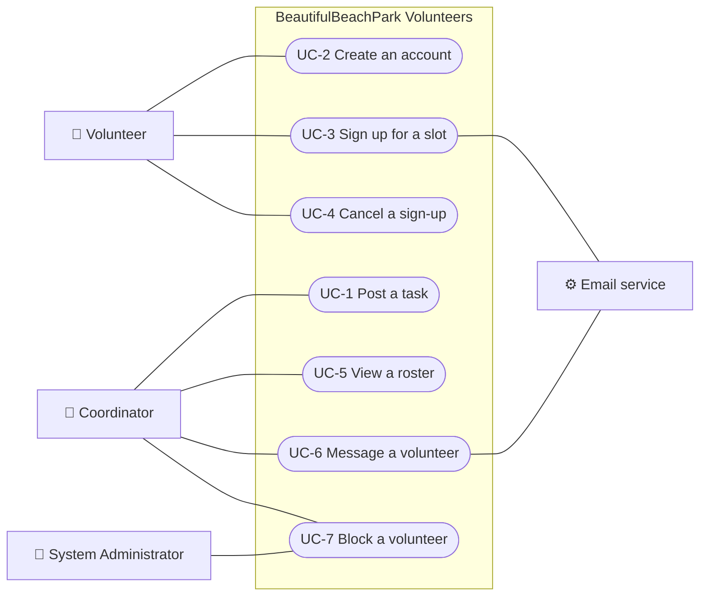

# BeautifulBeachPark Volunteers: Product Requirements Document (PRD)

**Document:** d03-01 · **Step:** 3, Requirements · **Version:** 1.1
· **Last updated:** 2026-09-18 · **Status:** Approved
· **Owner:** Product Manager (Requirements chat)

**Diagrams included:** UML Use Case Diagram (required).
No situational diagrams.

> **Sample document.** BeautifulBeachPark, its people, and its tasks are
> made up. Version 1.1 shows the go-back from Design: text-message
> reminders moved to Phase 2 (see the Change Log).

## 1. Overview

| Item | Details |
|---|---|
| Product | BeautifulBeachPark Volunteers |
| Problem | Coordinators fill volunteer slots through email chains and a paper sheet, causing double-bookings, empty slots, and shared email addresses. |
| Proposed solution | A web app where coordinators post one-hour slots and volunteers sign up with just a username. |
| Source documents | d02-01 one-pager v1.0, 2026-09-03 |
| Go decision | D2, 2026-09-04 |
| Conditions from stakeholders | Keep monthly costs small; no real names collected |

## 2. Goals and Success Measures

| Goal | How success is measured | Target |
|---|---|---|
| Fill slots without email chains | Share of slots filled through the app | 80% within 3 months of launch |
| Save coordinators' time | Coordinator hours per week spent scheduling | Half of today's |
| Protect volunteers' privacy | Emails shown to other volunteers or coordinators | Zero |

## 3. Users

| Actor | Type | Who they are | What they want to get done | What could get in their way |
|---|---|---|---|---|
| Volunteer | Primary | Local residents of all ages, mostly on phones | Find a task and sign up quickly | Small screens outdoors; not wanting to share personal details |
| Coordinator | Primary | Park staff and lead volunteers; there can be several | Post tasks, see who's coming, reach volunteers | Juggling many tasks at once |
| System Administrator | Secondary | One park office staff member | Keep the app running; undo blocks | Little technical training |
| Email service | External system | Sends sign-in links, reminders, and relayed messages | — | — |

## 4. Use Case Diagram

## 5. Use Cases

### UC-1: Post a task

| Item | Details |
|---|---|
| Actor(s) | Coordinator |
| Goal | A task with one-hour slots is open for sign-ups |
| Priority | Must have |
| Phase | 1 |
| Starts when | Coordinator chooses "Post a task" |
| Before it starts | Coordinator is signed in |

**Main flow:**

1. Coordinator enters a title (up to 60 characters), a description, a
   date, and one or more one-hour slots.
2. Coordinator sets how many volunteers each slot needs.
3. System saves the task and shows its slots to volunteers.

**Alternate flows:**

- **2a. A slot is not exactly one hour:** System refuses and explains.
- **2b. Volunteers per slot is outside the allowed range:** System refuses
  and explains.

**Acceptance criteria:**

- [ ] Every slot is exactly one hour long.
- [ ] Each slot needs from 1 to 20 volunteers.
- [ ] Only coordinators can post tasks.
- [ ] A saved task appears in volunteers' open-slot list straight away.

### UC-2: Create an account

| Item | Details |
|---|---|
| Actor(s) | Volunteer |
| Goal | Volunteer has an account and can sign in |
| Priority | Must have |
| Phase | 1 |
| Starts when | Volunteer chooses "Create an account" |
| Before it starts | Nothing |

**Main flow:**

1. Volunteer enters a username and an email address.
2. System shows the privacy notice.
3. Volunteer confirms; system creates the account.

**Alternate flows:**

- **3a. Username already taken:** System asks for another.
- **3b. Email is on the block list:** System refuses without saying why.

**Acceptance criteria:**

- [ ] Only a username and email are asked for; never a real name.
- [ ] Usernames are 3 to 20 letters, numbers, or underscores.
- [ ] The privacy notice is shown before the account is created.
- [ ] An email on the block list can't be used, even written differently
  (for example, with dots or a "+" tag).

### UC-3: Sign up for a slot

| Item | Details |
|---|---|
| Actor(s) | Volunteer; Email service |
| Goal | Volunteer is signed up and will be reminded |
| Priority | Must have |
| Phase | 1 |
| Starts when | Volunteer chooses an open slot |
| Before it starts | Volunteer is signed in |

**Main flow:**

1. Volunteer browses open slots, with the places left in each.
2. Volunteer chooses a slot and confirms.
3. System saves the sign-up and confirms it.
4. The day before, the system emails a reminder.

**Alternate flows:**

- **2a. The slot filled up first:** System says so.
- **2b. Volunteer is already signed up for this slot:** System says so.
- **2c. Volunteer is blocked:** System refuses.

**Acceptance criteria:**

- [ ] Open slots show how many places are left.
- [ ] After a sign-up, places left drops by one; at zero the slot shows
  "Full."
- [ ] A slot is never over-filled, even when two volunteers sign up at the
  same moment.
- [ ] Blocked volunteers can't sign up.
- [ ] A reminder email is sent the day before the slot.

### UC-4: Cancel a sign-up

| Item | Details |
|---|---|
| Actor(s) | Volunteer |
| Goal | The volunteer's place is free for someone else |
| Priority | Must have |
| Phase | 1 |
| Starts when | Volunteer opens "My sign-ups" and chooses "Cancel" |
| Before it starts | Volunteer is signed in and signed up |

**Main flow:**

1. Volunteer chooses a sign-up and confirms the cancellation.
2. System removes it and reopens the place.

**Alternate flows:**

- **2a. The slot has already started:** System refuses.

**Acceptance criteria:**

- [ ] Cancelling reopens one place in the slot.
- [ ] Volunteers can cancel only their own sign-ups.
- [ ] A slot can't be canceled after it starts.

### UC-5: View a roster

| Item | Details |
|---|---|
| Actor(s) | Coordinator |
| Goal | Coordinator knows who is coming |
| Priority | Must have |
| Phase | 1 |
| Starts when | Coordinator opens a slot |
| Before it starts | Coordinator is signed in |

**Main flow:**

1. Coordinator opens a slot.
2. System lists the usernames signed up.

**Alternate flows:**

- **2a. No one has signed up:** System says so.

**Acceptance criteria:**

- [ ] The roster shows usernames only, never emails.
- [ ] An empty roster says so plainly.

### UC-6: Message a volunteer

| Item | Details |
|---|---|
| Actor(s) | Coordinator; Email service |
| Goal | The volunteer receives the coordinator's message |
| Priority | Should have |
| Phase | 1 |
| Starts when | Coordinator chooses "Message" next to a username on a roster |
| Before it starts | Coordinator is signed in |

**Main flow:**

1. Coordinator writes a message.
2. System relays it to the volunteer by email.

**Alternate flows:**

- **1a. The message is too long:** System refuses and explains.

**Acceptance criteria:**

- [ ] The message arrives by email, and neither side sees the other's
  email address.
- [ ] Messages can be up to 500 characters.

### UC-7: Block a volunteer

| Item | Details |
|---|---|
| Actor(s) | Coordinator; System Administrator |
| Goal | A volunteer who caused problems can't sign up again |
| Priority | Must have |
| Phase | 1 |
| Starts when | Coordinator chooses "Block" next to a username |
| Before it starts | Coordinator is signed in |

**Main flow:**

1. Coordinator chooses "Block" and confirms.
2. System adds the volunteer's hidden email to the block list.

**Alternate flows:**

- **1a. The System Administrator undoes a block:** the volunteer can sign
  up again.

**Acceptance criteria:**

- [ ] A blocked volunteer can't sign up for slots.
- [ ] A new account can't be made with the blocked email, even written
  differently.
- [ ] The coordinator never sees the email.
- [ ] Only the System Administrator can undo a block.

## 6. Quality Requirements

| Area | Requirement |
|---|---|
| Speed | Pages load in under 2 seconds on a phone |
| Reliability | Available 99% of the time, including weekends, when most shifts happen |
| Accessibility | WCAG 2.1 AA |
| Devices and browsers | Current phone and desktop browsers |
| Languages | English only in Phase 1 |
| Privacy and data | Only a username and email are collected. Emails are never shown to volunteers or coordinators. |

## 7. Constraints

- Small budget: monthly running costs must stay low (stakeholders, D2).
- No IT staff at the park (park office).
- Up to 500 volunteers in the first year (coordinators' estimate).
- Volunteer rewards, if ever added, must follow local volunteer laws.

## 8. Scope and Phases

**In scope:** UC-1 to UC-7

**Out of scope:**

- Text-message reminders: moved to Phase 2 (each text costs money; D4)
- Recurring weekly tasks, waitlists, and skills matching
- Volunteer hour reports
- Real identities for background checks, waivers, or emergency contacts
- A token economy (for example, tickets per hour of work). Your own app
  could add one if it follows local volunteer laws.

| Phase | Use cases | Goal of the phase |
|---|---|---|
| 1 | UC-1 to UC-7, email reminders | Replace the paper sheet |
| 2 | Text-message reminders | Reach volunteers who don't check email |

## 9. Assumptions

- Volunteers have an email address; confirm with the coordinators.

## 10. Open Questions

- None

## 11. Change Log

| Version | Date | Change | Reason | Approved by |
|---|---|---|---|---|
| 1.0 | 2026-09-11 | First version | — | Park Manager |
| 1.1 | 2026-09-18 | Text-message reminders moved from Phase 1 to Phase 2; UC-3 reminder is email only | Sent back from Design: a texting service costs money per message (D4) | Park Manager |
