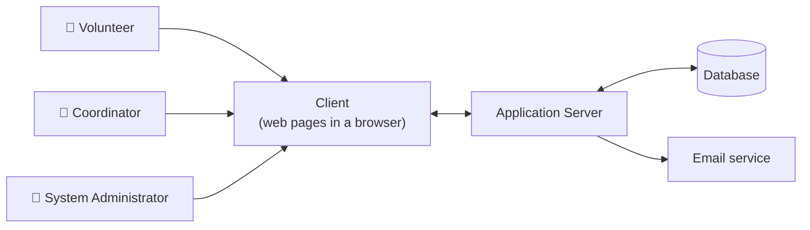
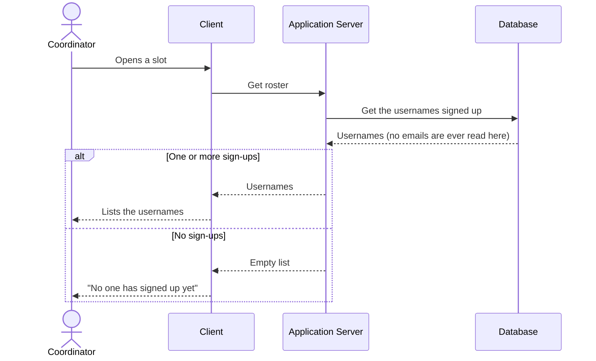
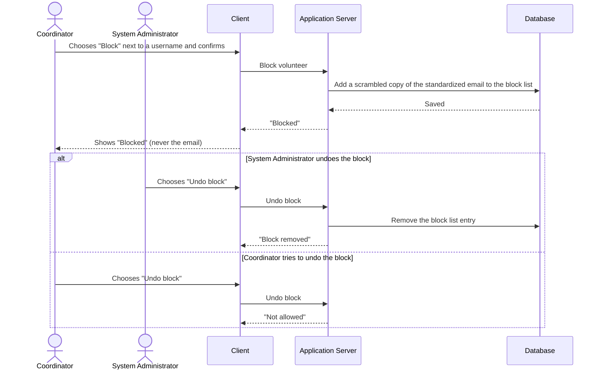
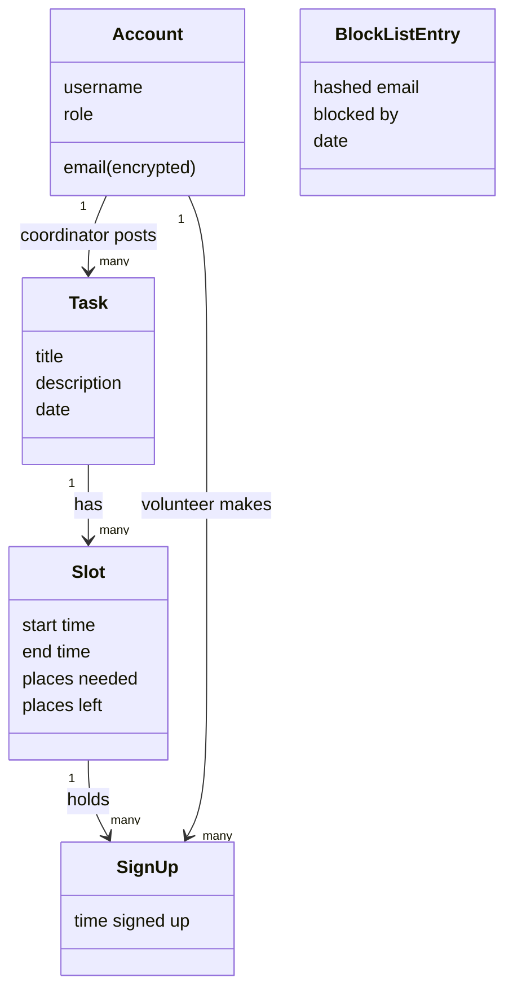

# BeautifulBeachPark Volunteers: Software Design Specification (Spec)

**Document:** d04-01 · **Step:** 4, Design · **Version:** 1.1
· **Last updated:** 2026-09-30 · **Status:** Approved
· **Owner:** Software Architect (Design chat)

**Diagrams included:** System Overview; UML Sequence Diagram for every use
case (required). Class Diagram, because the data has several related
entities (accounts, tasks, slots, sign-ups, and the block list).

> **Sample document.** BeautifulBeachPark and its people are made up. This
> Spec shows the go-back to Requirements (Section 16): text-message
> reminders were moved to Phase 2 before the Spec was finished.

## 1. Overview

| Item | Details |
|---|---|
| Product | BeautifulBeachPark Volunteers |
| Source PRD | d03-01 v1.1, 2026-09-18 |
| PRD sign-off | D5, 2026-09-18 (after the D4 go-back) |
| Phase covered | Phase 1: UC-1 to UC-7, email reminders |
| Application type | Web app |
| Design in one sentence | A web app whose server saves tasks, slots, and sign-ups in a database, keeps every email address hidden, and sends sign-in links, reminders, and messages through an email service. |

## 2. Inputs

| Input | Source | Notes |
|---|---|---|
| Product Requirements Document | d03-01 v1.1 | Main input: UC-1 to UC-7 |
| Constraints | PRD Section 7 | Small budget; no IT staff; up to 500 volunteers |
| Quality requirements | PRD Section 6 | Under 2 seconds on a phone; 99% available; WCAG 2.1 AA |
| Existing technology | Park office | None; the app is new, and will be linked from the park's website |
| Feasibility findings | d02-01 v1.0 | Blocking without real names is hard; some older volunteers may prefer paper |
| Other | d04-02 v1.0 | Design options comparison: web app chosen |

## 3. Design Approach

**Chosen approach:** A web app that works in current phone and desktop
browsers.

**Options considered:**

| Option | Main advantage | Main drawback | Chosen? |
|---|---|---|---|
| Web app | Nothing to install; one version for everyone | No phone notifications | Yes |
| App-store app | Phone notifications and offline use | Two versions; higher cost and maintenance | No |
| Both | Best reach | Highest cost | No |

**Why:** Volunteers are mostly on phones and won't want to install an app
for a one-hour task. No use case needs offline use or phone features, and
one version fits the small budget and a park with no IT staff. See d04-02.

## 4. System Overview



## 5. Components

| Component | What it is responsible for | Type of technology | Use cases it serves |
|---|---|---|---|
| Client | Shows slots, rosters, and forms; never receives an email address | Web pages (HTML, CSS, JavaScript) | UC-1 to UC-7 |
| Application server | Checks every rule: one-hour slots, places left, who may do what, the block list | Python web service (e.g., Flask) | UC-1 to UC-7 |
| Reminder job | Once a day, emails volunteers whose slot is tomorrow | Scheduled task on the application server | UC-3 |
| Database | Stores accounts, tasks, slots, sign-ups, and the block list | Relational database (e.g., PostgreSQL) | UC-1 to UC-7 |
| Email service | Sends sign-in links, reminders, and relayed messages | Email-sending service (exact service chosen in Step 6) | UC-2, UC-3, UC-6 |

## 6. Data

| Item (entity) | What it holds | Personal information? | Kept for how long | Use cases |
|---|---|---|---|---|
| Account | Username (3 to 20 letters, numbers, or underscores), role, email (encrypted) | Yes: email | Until the account is deleted | UC-2 to UC-7 |
| Task | Title (up to 60 characters), description, date, posted by | No | 12 months after its date | UC-1 |
| Slot | Task, start time, end time (exactly one hour later), places needed (1 to 20), places left | No | With its task | UC-1, UC-3, UC-4, UC-5 |
| Sign-up | Slot, username, time signed up | No | With its slot | UC-3, UC-4, UC-5 |
| Block list entry | Scrambled (hashed) copy of the standardized email, blocked by, date | Yes, but scrambled | Until the System Administrator removes it | UC-2, UC-3, UC-7 |

**Standardized email:** before checking the block list, the server writes
the email in lowercase and removes dots and any "+" tag before the "@," so
`j.o.h.n+beach@example.test` matches `john@example.test`.

## 7. Client–Server Interface

| Request | From → To | Sends | Returns when it works | Returns when it fails | Use cases |
|---|---|---|---|---|---|
| Send sign-in link | Client → Server | Email | "Check your email" (always, so no one can test which emails exist) | — | All (sign-in) |
| Sign in | Client → Server | Link from the email | Signed in | "This link has expired" | All (sign-in) |
| Create account | Client → Server | Username, email, privacy notice accepted | Account created | "That username is taken"; "We couldn't create this account" | UC-2 |
| Post task | Client → Server | Title, description, date, slots, places per slot | Task saved | "Each slot must be one hour"; "Each slot needs 1 to 20 volunteers"; "Not allowed" | UC-1 |
| List open slots | Client → Server | Date (optional) | Slots, with places left | "No open slots" | UC-3 |
| Sign up | Client → Server | Slot | "You're signed up!" | "Sorry, this slot was just taken"; "You're already signed up for this slot"; "Not allowed" | UC-3 |
| List my sign-ups | Client → Server | — | The volunteer's own sign-ups | — | UC-4 |
| Cancel sign-up | Client → Server | Sign-up | Canceled | "This slot has already started"; "Not allowed" | UC-4 |
| Get roster | Client → Server | Slot | Usernames only | "No one has signed up yet" | UC-5 |
| List my tasks | Client → Server | — | The coordinator's tasks, with every slot (full or not) and places filled | "Not allowed" | UC-1, UC-5 |
| Message volunteer | Client → Server | Username, message | "Message sent" | "Messages can be up to 500 characters" | UC-6 |
| Block volunteer | Client → Server | Username | "Blocked" | "Not allowed" | UC-7 |
| Undo block | Client → Server | Username | "Block removed" | "Not allowed" | UC-7 |
| List blocked volunteers | Client → Server | — | Usernames (or "account deleted"), blocked by, and date; never emails | "Not allowed" | UC-7 |
| Send email | Server → Email service | To, subject, text | Accepted | Retried later | UC-2, UC-3, UC-6 |

## 8. Use Case Coverage

| Use case (PRD) | Priority | Sequence diagram | Components involved | Requests used |
|---|---|---|---|---|
| UC-1: Post a task | Must have | Section 9, UC-1 | Client, Server, Database | Post task |
| UC-2: Create an account | Must have | Section 9, UC-2 | Client, Server, Database, Email service | Create account, Send sign-in link, Sign in |
| UC-3: Sign up for a slot | Must have | Section 9, UC-3 | Client, Server, Reminder job, Database, Email service | List open slots, Sign up, Send email |
| UC-4: Cancel a sign-up | Must have | Section 9, UC-4 | Client, Server, Database | List my sign-ups, Cancel sign-up |
| UC-5: View a roster | Must have | Section 9, UC-5 | Client, Server, Database | List my tasks, Get roster |
| UC-6: Message a volunteer | Should have | Section 9, UC-6 | Client, Server, Database, Email service | Message volunteer, Send email |
| UC-7: Block a volunteer | Must have | Section 9, UC-7 | Client, Server, Database | Block volunteer, List blocked volunteers, Undo block |

Every component and request is used by at least one use case.

## 9. Sequence Diagrams

### UC-1: Post a task

```mermaid
sequenceDiagram
    actor K as Coordinator
    participant C as Client
    participant S as Application Server
    participant DB as Database
    K->>C: Enters title, date, slots, and places per slot
    C->>S: Post task
    S->>S: Is this a coordinator? Is every slot one hour, with 1 to 20 places?
    alt Everything checks out
        S->>DB: Save task and slots
        DB-->>S: Saved
        S-->>C: Task saved
        C-->>K: Shows the new task
    else A slot is not one hour
        S-->>C: "Each slot must be one hour"
        C-->>K: Shows the message; nothing saved
    end
```

### UC-2: Create an account

```mermaid
sequenceDiagram
    actor V as Volunteer
    participant C as Client
    participant S as Application Server
    participant DB as Database
    participant E as Email service
    V->>C: Enters a username and email; accepts the privacy notice
    C->>S: Create account
    S->>DB: Is the username taken? Is the standardized email on the block list?
    DB-->>S: Answers
    alt Username free, email not blocked
        S->>DB: Save account (email encrypted)
        S->>E: Send sign-in link
        S-->>C: Account created
        C-->>V: "Check your email to sign in"
    else Username taken
        S-->>C: "That username is taken"
        C-->>V: Asks for another username
    else Email is blocked
        S-->>C: "We couldn't create this account"
        C-->>V: Shows the message, without saying why
    end
```

### UC-3: Sign up for a slot

```mermaid
sequenceDiagram
    actor V as Volunteer
    participant C as Client
    participant S as Application Server
    participant DB as Database
    participant E as Email service
    V->>C: Opens the open-slot list
    C->>S: List open slots
    S->>DB: Get slots with places left
    DB-->>S: Slots
    S-->>C: Slots, with places left
    V->>C: Chooses a slot and confirms
    C->>S: Sign up
    S->>DB: Is this volunteer blocked or already signed up?
    S->>DB: Take one place, only if one is left (one sign-up at a time)
    alt A place was taken for this volunteer
        DB-->>S: Saved; places left goes down by one
        S-->>C: "You're signed up!"
        C-->>V: Shows the confirmation
    else Last place was just taken by someone else
        DB-->>S: No places left
        S-->>C: "Sorry, this slot was just taken"
        C-->>V: Shows the message
    end
    Note over S,E: Every day, the reminder job finds tomorrow's sign-ups
    S->>E: Send reminder email to each volunteer
```

**Notes:** "Take one place, only if one is left" happens in a single
database step, so two volunteers tapping at the same moment can never
over-fill a slot, as UC-3's third acceptance criterion requires.

### UC-4: Cancel a sign-up

```mermaid
sequenceDiagram
    actor V as Volunteer
    participant C as Client
    participant S as Application Server
    participant DB as Database
    V->>C: Opens "My sign-ups" and chooses "Cancel"
    C->>S: Cancel sign-up
    S->>DB: Is this the volunteer's own sign-up? Has the slot started?
    DB-->>S: Answers
    alt Own sign-up, slot not started
        S->>DB: Remove sign-up; places left goes up by one
        S-->>C: Canceled
        C-->>V: Shows the place as freed
    else Slot has already started
        S-->>C: "This slot has already started"
        C-->>V: Shows the message
    end
```

### UC-5: View a roster



### UC-6: Message a volunteer

```mermaid
sequenceDiagram
    actor K as Coordinator
    participant C as Client
    participant S as Application Server
    participant DB as Database
    participant E as Email service
    K->>C: Chooses "Message" next to a username and writes a message
    C->>S: Message volunteer
    alt 500 characters or fewer
        S->>DB: Look up the volunteer's hidden email
        DB-->>S: Email (stays on the server)
        S->>E: Send the message from the park's no-reply address
        S-->>C: "Message sent"
        C-->>K: Shows the confirmation
    else Longer than 500 characters
        S-->>C: "Messages can be up to 500 characters"
        C-->>K: Shows the message; nothing sent
    end
```

### UC-7: Block a volunteer



## 10. Quality Requirements: How They Are Met

| Area | PRD requirement | How the design meets it |
|---|---|---|
| Speed | Under 2 seconds on a phone | Small, simple pages; only slots with places left are sent |
| Reliability | Available 99% of the time | Nightly database backups, and hosting that restarts the app if it stops (exact setup in Step 6) |
| Accessibility | WCAG 2.1 AA | Client built to WCAG 2.1 AA; screen detail in Step 5 |
| Devices and browsers | Current phone and desktop browsers | Web app; one version for every device |
| Languages | English only in Phase 1 | All wording kept in one place, so other languages can be added later |
| Privacy and data | Username and email only; emails never shown | See Section 11 |

## 11. Security & Compliance

### 11.1 Protecting Information

| Information | Who may see or change it | How it is protected |
|---|---|---|
| Volunteer email | The application server only; the System Administrator through the database | Stored encrypted; never sent to the client; sent only to the email service |
| Block list | Coordinators add; only the System Administrator removes | Scrambled (hashed) copy only, so it is kept even if the account is deleted |
| Sign-ups and rosters | Volunteers see their own; coordinators see usernames | Server checks the role on every request |
| Everything | — | HTTPS (encrypted connections) only; plain HTTP is turned off |

**Sign-in and permissions:** Everyone signs in with a one-time link sent to
their email, so there are no passwords to lose or steal. Volunteers can
sign up for and cancel only their own slots. Coordinators can post tasks,
view rosters, message volunteers, and block them. Only the System
Administrator can undo a block.

### 11.2 Copyright and Data Sources

| Content or data | Source | May we use it? | Conditions |
|---|---|---|---|
| Task titles and descriptions | Written by park coordinators | Yes | The park owns them |
| Open-source code libraries | Public package sites | Yes | Follow each license; keep a list in `src/` |
| Code and text written by AI | The workflow's AI chats | Yes | Reviewed by a person before it goes live |

### 11.3 Laws and Rules

| Law, rule, or policy | What it requires | How the design complies |
|---|---|---|
| Privacy laws where the park is located | Say what is collected and why; protect it | Privacy notice in UC-2; only username and email collected; emails encrypted |
| Rules for sending email | Only send emails people expect | Only sign-in links, reminders, and coordinator messages are sent |
| Local volunteer laws | Apply if rewards are ever added | No rewards or token economy in this product |

*The Architect is not a lawyer. The park office checked these rows on
2026-09-22.*

### 11.4 AI-Related Risks

- Only made-up sample data is ever pasted into AI chats; real emails never
  are.
- AI-written code is checked by automated tests, and by a person, before
  release.

## 12. Situational Diagrams

**Class Diagram** (how the data items relate):



## 13. Design Decisions

| ID | Decision | Options considered | Reason | Date |
|---|---|---|---|---|
| DD-1 | Build a web app | Web app, app-store app, both | Nothing to install; fits the budget (d04-02) | 2026-09-14 |
| DD-2 | Email-only reminders in Phase 1 | Email and text, email only | Texts cost money per message; PRD changed (D4, D5) | 2026-09-16 |
| DD-3 | Sign in with a one-time email link | Passwords, email link | No passwords to forget or protect | 2026-09-19 |
| DD-4 | Keep emails encrypted, and a hashed copy for the block list | Plain email, encrypted email | Emails never seen; blocks still work after deletion | 2026-09-19 |
| DD-5 | Take the last place in a single database step | Check then save, single step | A slot can never be over-filled | 2026-09-22 |

## 14. Risks

| Risk | Likelihood | Impact | What we'll do about it |
|---|---|---|---|
| Email service is down | Low | Medium | Retry later; sign-ups are still saved |
| Reminder emails land in spam | Medium | Medium | Send from the park's own address; the DevOps Engineer sets this up |
| Some older volunteers won't use the app | Medium | Low | Coordinators can keep the paper sheet for a while |

## 15. Assumptions and Open Questions

**Assumptions:**

- Volunteers have an email address (from the PRD).
- Volunteers don't need to reply to coordinator messages by email in
  Phase 1; replies go to a no-reply address. Coordinators confirmed on
  2026-09-22.

**Open questions:**

- None

## 16. Requests Sent Back to the PRD

| Request | Reason | PRD version that answered it |
|---|---|---|
| Move text-message reminders to Phase 2; keep email reminders in Phase 1 | A texting service charges for every message, which the small budget doesn't cover (I1, D4) | d03-01 v1.1 |

## 17. Change Log

| Version | Date | Change | Reason | Approved by |
|---|---|---|---|---|
| 1.0 | 2026-09-25 | First version | — | Park Manager |
| 1.1 | 2026-09-30 | Added the "List my tasks" and "List blocked volunteers" requests | Requested by the UI/UX Designer (d05-01 Section 16): screens S-6 and S-10 had no request to use | Park Manager (with D7) |
