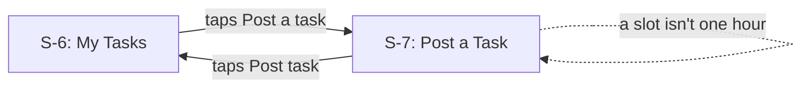
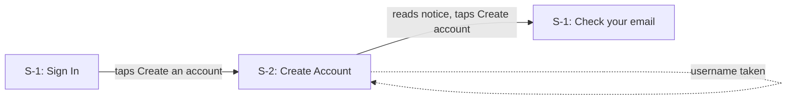
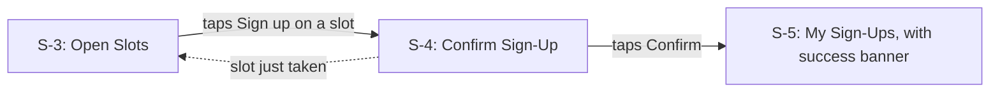
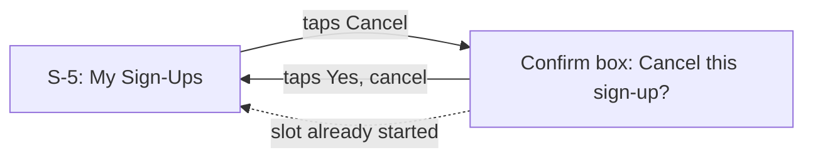
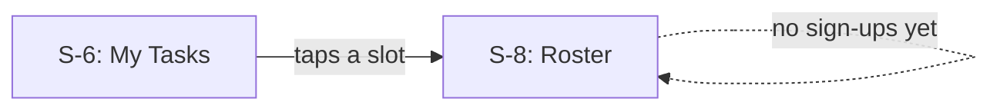
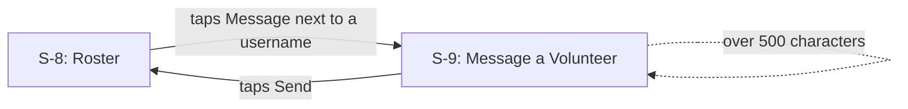
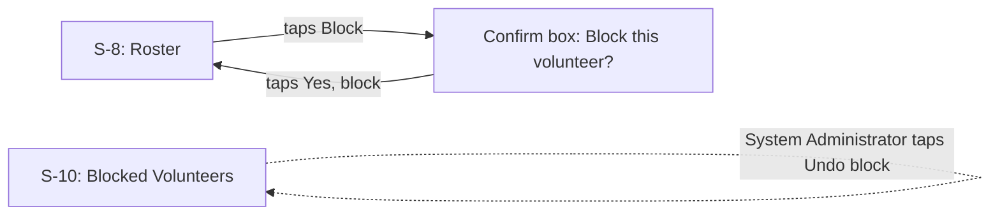

# BeautifulBeachPark Volunteers: UI/UX Document

**Document:** d05-01 · **Step:** 5, User Experience · **Version:** 1.1
· **Last updated:** 2026-10-13 · **Status:** Approved
· **Owner:** UI/UX Designer (User Experience chat)

**Screens included:** 10 screens covering 7 use cases. User flow for every
use case (required); wireframe and mockup for every screen (required).

> **Sample document.** BeautifulBeachPark, its website, and its people are
> made up, and every username is invented. Section 16 shows two requests
> sent back to the Architect while the screens were being mapped.

## 1. Overview

| Item | Details |
|---|---|
| Product | BeautifulBeachPark Volunteers |
| Source PRD | d03-01 v1.1, 2026-09-18 |
| Source Spec | d04-01 v1.1, 2026-09-30 (v1.0 plus the two requests in Section 16) |
| Spec sign-off | D6, 2026-09-25; v1.1 additions approved with D7, 2026-09-30 |
| Phase covered | Phase 1: UC-1 to UC-7 |
| Application type | Web app used on phones and desktops (Spec Section 3) |
| Style source | The park's pretend website and screenshots; see d05-02 v1.0 |
| Design in one sentence | A calm, beach-colored web app where a volunteer can find an open slot and sign up in three taps, and nobody ever sees anyone's email. |

## 2. Inputs

| Input | Source | Notes |
|---|---|---|
| Product Requirements Document | d03-01 v1.1 | Users, UC-1 to UC-7, WCAG 2.1 AA, privacy |
| Software Design Specification | d04-01 v1.1 | Web app; requests in Section 7; privacy rules in Section 11 |
| Style Guide | d05-02 v1.0 | Colors, fonts, components, voice |
| Existing website or brand | Pretend website screenshots | From the Volunteer Program Manager; owned by the park |
| Other | Coordinators, 2026-09-27 | Asked for a whole day's slots on one desktop screen |

## 3. Design Goals

| Goal | Why (from the PRD) |
|---|---|
| Sign up in three taps or fewer | Volunteers are mostly on phones and want to sign up quickly (Section 3) |
| Never show another person's email | Privacy requirement and success measure: zero emails shown (Sections 2 and 6) |
| Readable outdoors | Volunteers use small screens outdoors (Section 3) |
| Every action spelled out in words | WCAG 2.1 AA, and volunteers of all ages (Sections 3 and 6) |

## 4. Users and Their Situations

| Actor | Device and setting | What they know already | Design response |
|---|---|---|---|
| Volunteer | Phone, often outdoors | Familiar with phone apps; may be new to the park | 18 px text, high contrast, full-width 48 px buttons |
| Coordinator | Desktop in the park office, sometimes a phone | Knows every task; juggles many at once | One screen showing all their tasks and slots, with places filled |
| System Administrator | Desktop in the park office | Little technical training | One plain list of blocked usernames with "Undo block" |

## 5. Screen Inventory

| Screen | Name | Purpose | Seen by | Use cases | Requests it uses |
|---|---|---|---|---|---|
| S-1 | Sign In | Get a one-time sign-in link | Everyone | All (sign-in) | Send sign-in link, Sign in |
| S-2 | Create Account | Choose a username; read the privacy notice | Volunteer | UC-2 | Create account |
| S-3 | Open Slots | Browse tasks and open one-hour slots | Volunteer | UC-3 | List open slots |
| S-4 | Confirm Sign-Up | Check the slot and confirm | Volunteer | UC-3 | Sign up |
| S-5 | My Sign-Ups | See and cancel your own sign-ups | Volunteer | UC-3, UC-4 | List my sign-ups, Cancel sign-up |
| S-6 | My Tasks | See your tasks and every slot, full or not | Coordinator | UC-1, UC-5 | List my tasks |
| S-7 | Post a Task | Create a task with one-hour slots | Coordinator | UC-1 | Post task |
| S-8 | Roster | See who's coming; message or block | Coordinator | UC-5, UC-6, UC-7 | Get roster, Block volunteer |
| S-9 | Message a Volunteer | Write a message to one volunteer | Coordinator | UC-6 | Message volunteer |
| S-10 | Blocked Volunteers | See and undo blocks | System Administrator | UC-7 | List blocked volunteers, Undo block |

## 6. User Flows

### UC-1: Post a task



**Steps:** 2 taps, plus filling in the form.

### UC-2: Create an account



**Steps:** 2 taps, plus a username and email.

### UC-3: Sign up for a slot



**Steps:** 2 taps from Open Slots (3 including opening it).

### UC-4: Cancel a sign-up



**Steps:** 2 taps.

### UC-5: View a roster



**Steps:** 1 tap.

### UC-6: Message a volunteer



**Steps:** 2 taps, plus the message.

### UC-7: Block a volunteer



**Steps:** 2 taps to block; 1 tap for the System Administrator to undo.

## 7. Wireframes

### S-1: Sign In

```text
┌─────────────────────────────┐
│ BeautifulBeachPark          │
│ Volunteer sign-in           │
│ Email  [_________________]  │
│ [   Send me a sign-in link ]│
│ New here? Create an account │
└─────────────────────────────┘
```

**Notes:** No passwords, so there's nothing to forget (Spec DD-3).

### S-2: Create Account

```text
┌─────────────────────────────┐
│ Create an account           │
│ Username [_______________]  │
│ Email    [_______________]  │
│ ┌ Your privacy ───────────┐ │
│ │ (privacy notice text)   │ │
│ └─────────────────────────┘ │
│ [ ] I've read this          │
│ [     Create account      ] │
└─────────────────────────────┘
```

**Notes:** Only two fields; no name field anywhere. The notice is shown
before the button can be used.

### S-3: Open Slots

```text
┌─────────────────────────────┐
│ Open slots | My sign-ups    │
│ Sat, Oct 12                 │
│ ┌ Beach Cleanup ──────────┐ │
│ │ 9–10   2 places left    │ │
│ │              [Sign up]  │ │
│ │ 10–11  Full             │ │
│ └─────────────────────────┘ │
│ ┌ Pulling Weeds ──────────┐ │
│ │ 9–10   4 places left    │ │
│ └─────────────────────────┘ │
└─────────────────────────────┘
```

**Notes:** A list by day, soonest first, rather than a calendar grid
(UX-1).

### S-4: Confirm Sign-Up

```text
┌─────────────────────────────┐
│ Sign up for this slot?      │
│ Beach Cleanup               │
│ Saturday, Oct 12, 9 to 10   │
│ You'll appear as: SandyHelps│
│ [         Confirm         ] │
│ [          Back           ] │
└─────────────────────────────┘
```

**Notes:** Shows the username others will see, as a privacy reminder.

### S-5: My Sign-Ups

```text
┌─────────────────────────────┐
│ Done: You're signed up!     │
│ My sign-ups                 │
│ ┌─────────────────────────┐ │
│ │ Beach Cleanup           │ │
│ │ Sat, Oct 12, 9–10       │ │
│ │               [Cancel]  │ │
│ └─────────────────────────┘ │
└─────────────────────────────┘
```

### S-6: My Tasks (desktop)

```text
┌──────────────────────────────────────────┐
│ My tasks                  [ Post a task ]│
│ Sat, Oct 12                              │
│ Beach Cleanup   9–10  3 of 5  [ Roster ] │
│                10–11  5 of 5  [ Roster ] │
│ Driftwood       1–2   0 of 4  [ Roster ] │
└──────────────────────────────────────────┘
```

**Notes:** Full slots are shown too, so a coordinator can always reach a
roster (Section 16, request 1).

### S-7: Post a Task

```text
┌─────────────────────────────┐
│ Post a task                 │
│ Title       [____________]  │
│ Description [____________]  │
│ Date        [____________]  │
│ Slots: start [9:00 ▾] → 10:00│
│        [ + Add another slot ]│
│ Places per slot [ 5 ] (1–20)│
│ [        Post task        ] │
└─────────────────────────────┘
```

**Notes:** The coordinator picks only a start time; the end is always one
hour later, so a slot can't be the wrong length.

### S-8: Roster

```text
┌─────────────────────────────┐
│ Beach Cleanup, Oct 12, 9–10 │
│ 3 of 5 places filled        │
│ SandyHelps  [Message][Block]│
│ BigHeartedGuy [Message][Block]│
│ ShellSeeker [Message][Block]│
└─────────────────────────────┘
```

### S-9: Message a Volunteer

```text
┌─────────────────────────────┐
│ Message BigHeartedGuy       │
│ [________________________]  │
│ [________________________]  │
│ 0 of 500 characters         │
│ [          Send           ] │
└─────────────────────────────┘
```

### S-10: Blocked Volunteers (desktop)

```text
┌──────────────────────────────────────────┐
│ Blocked volunteers                        │
│ RudeRider    by CoastCoord  2026-09-12   │
│                            [ Undo block ]│
│ (account deleted) by CoastCoord 2026-08-30│
└──────────────────────────────────────────┘
```

**Notes:** Usernames only. A block whose account was deleted shows
"(account deleted)" and can't be undone from here.

## 8. Mockups

Each mockup is a web page in `assets/mockups/` that opens in any browser.
The pages share one stylesheet, `mockups.css`, built from the design
tokens.

| Screen | Mockup file | Loading | Empty | Error | Notes |
|---|---|---|---|---|---|
| S-1: Sign In | [`s-1-sign-in.html`](../assets/mockups/s-1-sign-in.html) | Button reads "Working…" | — | "This link has expired. We've sent a new one." | Shows the "Check your email" state too |
| S-2: Create Account | [`s-2-create-account.html`](../assets/mockups/s-2-create-account.html) | Button reads "Working…" | — | "That username is taken" under the field | |
| S-3: Open Slots | [`s-3-open-slots.html`](../assets/mockups/s-3-open-slots.html) | "Loading open slots…" | "No open slots this week. Check back soon!" | "We couldn't load slots. Please try again." | |
| S-4: Confirm Sign-Up | [`s-4-confirm-sign-up.html`](../assets/mockups/s-4-confirm-sign-up.html) | Button reads "Working…" | — | Returns to S-3 with the "just taken" banner | |
| S-5: My Sign-Ups | [`s-5-my-sign-ups.html`](../assets/mockups/s-5-my-sign-ups.html) | "Loading your sign-ups…" | "You haven't signed up for anything yet." | "This slot has already started…" | Shows the success banner |
| S-6: My Tasks | [`s-6-my-tasks.html`](../assets/mockups/s-6-my-tasks.html) | "Loading your tasks…" | "You haven't posted any tasks yet." | "We couldn't load your tasks. Please try again." | Desktop layout |
| S-7: Post a Task | [`s-7-post-a-task.html`](../assets/mockups/s-7-post-a-task.html) | Button reads "Working…" | — | "Each slot needs 1 to 20 volunteers" under the field | |
| S-8: Roster | [`s-8-roster.html`](../assets/mockups/s-8-roster.html) | "Loading the roster…" | "No one has signed up yet." | "We couldn't load the roster. Please try again." | Shows the block confirm box |
| S-9: Message a Volunteer | [`s-9-message.html`](../assets/mockups/s-9-message.html) | Button reads "Sending…" | — | "Messages can be up to 500 characters." | |
| S-10: Blocked Volunteers | [`s-10-blocked-volunteers.html`](../assets/mockups/s-10-blocked-volunteers.html) | "Loading…" | "No one is blocked." | "We couldn't undo this block. Please try again." | Desktop layout |

## 9. Messages and Wording

Server messages from Spec Section 7 are used word for word at the start of
each message, so tests can match them exactly.

| Where | Situation | Exact wording |
|---|---|---|
| S-1 | Link sent (always, even for unknown emails) | "Check your email. If you have an account, we've sent you a sign-in link." |
| S-1 | Link expired | "This link has expired. We've sent a new one." |
| S-2 | Privacy notice | "We only ask for a username and an email address. Other volunteers and coordinators see only your username, never your email. The park's System Administrator can see your email to keep the app running. We use it only for sign-in links, reminders, and messages from coordinators." |
| S-2 | Username taken | "That username is taken. Please try another." |
| S-2 | Username breaks the rules | "Usernames are 3 to 20 letters, numbers, or underscores." |
| S-2 | Email blocked (reason not given) | "We couldn't create this account. Please contact the park office." |
| S-5 | Signed up | "You're signed up! We'll email you a reminder the day before." |
| S-3 | Last place taken first | "Sorry, this slot was just taken. Here are other open times." |
| S-3 | Already signed up | "You're already signed up for this slot." |
| S-5 | Slot started | "This slot has already started, so it can't be canceled." |
| S-7 | Slot not one hour | "Each slot must be one hour." |
| S-7 | Places out of range | "Each slot needs 1 to 20 volunteers." |
| S-7 | Title too long | "Titles can be up to 60 characters." |
| S-8 | Empty roster | "No one has signed up yet." |
| S-8 | Block confirm box | "Block BigHeartedGuy? They won't be able to sign up for any slots. Only the System Administrator can undo this." |
| S-8 | Blocked | "Blocked." |
| S-9 | Sent | "Message sent." |
| S-9 | Too long | "Messages can be up to 500 characters." |
| S-10 | Block undone | "Block removed." |
| Any | Not allowed | "Not allowed. Please contact the park office if you think this is wrong." |

## 10. Accessibility

| Area | Requirement | How the design meets it |
|---|---|---|
| Color contrast | WCAG 2.1 AA: at least 4.5 to 1 for normal text | Every text color measured in d05-02; lowest is 4.9 to 1 |
| Screen readers | Every button and field has a text label | Buttons name the slot, e.g. "Sign up for Beach Cleanup, 9 to 10" |
| Touch targets | Buttons at least 44 by 44 pixels | All buttons 48 px tall |
| Keyboard use | Every action works without a mouse | Normal links, buttons, and fields only; confirm boxes trap focus until closed |
| Text size | Still usable at 200% text size | Single-column layout on phones; no fixed heights |
| Color alone | Status never shown by color alone | "Full," "Done:," and "Problem:" are written out |

## 11. Privacy on Screen

| Information | Shown to | Never shown to | Screens |
|---|---|---|---|
| Username | Everyone who can see the slot or roster | — | S-4, S-5, S-8, S-9, S-10 |
| Your own email | Only on S-1 and S-2, as you type it | Other volunteers, coordinators, the System Administrator's screens | S-1, S-2 |
| Anyone else's email | Nobody | Everyone | None |
| Who is signed up for a slot | Coordinators | Volunteers (they see only places left) | S-8 |
| Block list | System Administrator (usernames only) | Volunteers, coordinators | S-10 |

## 12. Design Files

| File | Format | Made with | Contains | How to use it |
|---|---|---|---|---|
| [`assets/mockups/`](../assets/mockups/) | HTML pages and `mockups.css` | Claude | One page per screen | Open in a browser; match the layout, spacing, and wording |
| [`assets/design-tokens.json`](../assets/design-tokens.json) | JSON | Claude, from d05-02 | Colors, fonts, spacing, rounding | Import into the code as the single source of style values |

The park doesn't use Figma, so no Figma files were made.

## 13. Use Case Coverage

| Use case (PRD) | Priority | User flow | Screens | Acceptance criteria shown on screen |
|---|---|---|---|---|
| UC-1: Post a task | Must have | Section 6, UC-1 | S-6, S-7 | One-hour slots (end time set automatically); 1 to 20 places |
| UC-2: Create an account | Must have | Section 6, UC-2 | S-1, S-2 | Username and email only; privacy notice before creating |
| UC-3: Sign up for a slot | Must have | Section 6, UC-3 | S-3, S-4, S-5 | Places left shown; "Full" at zero |
| UC-4: Cancel a sign-up | Must have | Section 6, UC-4 | S-5 | Only your own sign-ups are listed |
| UC-5: View a roster | Must have | Section 6, UC-5 | S-6, S-8 | Usernames only; empty roster says so |
| UC-6: Message a volunteer | Should have | Section 6, UC-6 | S-8, S-9 | 500-character counter |
| UC-7: Block a volunteer | Must have | Section 6, UC-7 | S-8, S-10 | Email never shown; only the System Administrator can undo |

Every screen serves at least one use case.

## 14. Design Decisions

| ID | Decision | Options considered | Reason | Date |
|---|---|---|---|---|
| UX-1 | Show slots as a list by day, soonest first | List, calendar grid | A grid is hard to read on a phone | 2026-09-27 |
| UX-2 | Confirm screen before signing up | Sign up in one tap, confirm first | Prevents accidental sign-ups and shows the username others will see | 2026-09-27 |
| UX-3 | Coordinators pick only a start time | Start and end times | A slot can never be the wrong length | 2026-09-28 |
| UX-4 | Block and cancel always ask to confirm | Act immediately, confirm first | Both are hard to undo | 2026-09-28 |
| UX-5 | Darken the website's turquoise for buttons | Turquoise, Ocean | Turquoise fails contrast with white text (d05-02) | 2026-09-29 |

## 15. Assumptions and Open Questions

**Assumptions:**

- Volunteers can read English (PRD Section 6, Phase 1).
- Most coordinator work happens on a desktop; confirmed by coordinators on
  2026-09-27.

**Open questions:**

- None

## 16. Requests Sent Back

| Request | Sent to | Reason | Version that answered it |
|---|---|---|---|
| 1. Add a "List my tasks" request that returns every slot, including full ones | Architect: Spec | S-6 needs it for UC-5: "List open slots" leaves out full slots, so a coordinator couldn't reach a full slot's roster | d04-01 v1.1 |
| 2. Add a "List blocked volunteers" request for the System Administrator | Architect: Spec | S-10 needs it for UC-7: "Undo block" exists, but nothing lists who is blocked | d04-01 v1.1 |

## 17. Change Log

| Version | Date | Change | Reason | Approved by |
|---|---|---|---|---|
| 1.0 | 2026-10-01 | First version | — | Park Manager (D8, 2026-10-02) |
| 1.1 | 2026-10-13 | Added two messages to Section 9: username breaks the rules; title too long | Requested by the SDET (d07-01 Section 12, requests 1 and 2): the tests need exact wording | Park Manager |
