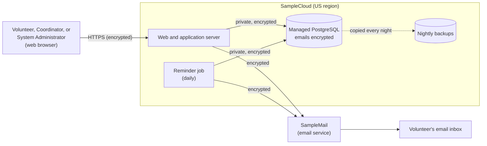

# BeautifulBeachPark Volunteers: System Infrastructure Document

**Document:** d06-01 · **Step:** 6, Initial Infrastructure · **Version:** 1.3
· **Last updated:** 2027-01-20 · **Status:** Approved
· **Owner:** DevOps Engineer (Initial Infrastructure chat)

**Diagrams included:** Deployment Diagram (required).

> **Sample document.** BeautifulBeachPark, its people, "SampleCloud," and
> "SampleMail" are made up, and **every price is made up for
> illustration**.

## 1. Overview

| Item | Details |
|---|---|
| Product | BeautifulBeachPark Volunteers |
| Source PRD | d03-01 v1.1, 2026-09-18 |
| Source Spec | d04-01 v1.1, 2026-09-30 |
| Source UI/UX Document | d05-01 v1.0, 2026-10-01 |
| UI/UX sign-off | D8, 2026-10-02 |
| Phase covered | Phase 1: UC-1 to UC-7, email reminders |
| Option chosen | A: Cloud, managed services (d06-02 v1.0) |
| Cost sign-off | d06-03 v1.0, D9, 2026-10-07 |
| Setup in one sentence | A small managed Python app, daily reminder job, and encrypted database at SampleCloud, sending email through SampleMail, with nightly backups and a budget alert. |

## 2. Inputs

| Input | Source | Notes |
|---|---|---|
| Product Requirements Document | d03-01 v1.1 | Up to 500 volunteers; 99% available; under 2 seconds on a phone; small budget; no IT staff |
| Software Design Specification | d04-01 v1.1 | Components in Section 5; nightly backups and restarts (Section 10); Security & Compliance (Section 11); email service left to Step 6 |
| UI/UX Document | d05-01 v1.0 | 10 simple text screens; no uploaded photos; mockups in `assets/mockups/` |
| Infrastructure Options and Cost Analysis | d06-02 v1.0 | Option A chosen |
| Cost Sign-Off Sheet | d06-03 v1.0 | $60 monthly limit, alert at $50 |
| Existing infrastructure | Park's current website host | Keeps the park website, which links to the app |

## 3. Infrastructure Needs

| Piece | What it is for | Spec component | Reuse or new |
|---|---|---|---|
| Web and application server | Delivers the pages and checks every rule | Client, Application server | New |
| Scheduled task | Runs the reminder job once a day | Reminder job | New |
| Database | Stores accounts, tasks, slots, sign-ups, and the block list | Database | New |
| Email-sending service | Sends sign-in links, reminders, and relayed messages | Email service | New |
| Backups | Nightly copies of the database | Spec Section 10, Reliability | New |

## 4. Environments

| Environment | Used for | Used by | Data it holds | When it is needed |
|---|---|---|---|---|
| Test | Running the tests safely | SDET, Software Engineer | Made-up usernames and `example.test` emails only. Emails go to a test inbox the tests can read, never to real inboxes (added in v1.1). The reminder job can also be run by hand. | Step 7 (built) |
| Production | The live app | Volunteers, Coordinators, System Administrator | Real usernames and emails | Step 9 (built 2027-01-12) |

## 5. Chosen Setup

| Piece | Provider or product | Location | Size or plan | Managed by |
|---|---|---|---|---|
| Web and application server | SampleCloud managed Python app hosting | US region | Smallest plan; restarts the app if it stops | SampleCloud |
| Scheduled task | SampleCloud scheduler | US region | Once a day, 6 p.m. park time | SampleCloud |
| Database | SampleCloud managed PostgreSQL | US region | Smallest plan, encryption on | SampleCloud |
| Email-sending service | SampleMail | US | Small plan, up to 2,000 emails a month; sends from the park's own address | SampleMail |
| Backups | SampleCloud database backups | US region | Nightly, kept 30 days | SampleCloud |

**Why this setup:** The park has no IT staff, and managed services include
the restarts, updates, encryption, and nightly backups the Spec asks for.
See d06-02 for the full comparison.

## 6. Deployment Diagram

**How to read it:** Everyone reaches the app over an encrypted
connection. Only the app and the reminder job can reach the database, and
emails leave it only on their way to SampleMail, never to a browser.

## 7. Network and Access

### 7.1 Connections

| From | To | How | Encrypted? |
|---|---|---|---|
| User's browser | App server | HTTPS over the internet; plain HTTP turned off | Yes |
| App server and reminder job | Database | SampleCloud private network | Yes |
| App server and reminder job | SampleMail | SampleMail's sending service | Yes |

### 7.2 Who Can Change the Infrastructure

| Person, role, or tool | Access to | Permission level | Why they need it |
|---|---|---|---|
| Volunteer Program Manager | SampleCloud and SampleMail accounts, and billing | Full | Account owner; receives bills and alerts |
| Board treasurer | SampleCloud and SampleMail accounts, and billing | Full | Second account owner (added 2027-01-07, Issue I2) |
| System Administrator | Production database (from Step 9) | Read only | Spec 11.1: may see emails to keep the app running |
| Claude Code (DevOps chat) | Test environment only | Create and change; no delete | Runs the setup scripts after review |

**Where secrets are kept:** The database password, the encryption key,
and the SampleMail key are in SampleCloud's secret store. Never in the
code, the documents, or a chat.

## 8. Security Review

| Spec requirement (Section 11) | How the infrastructure supports it | Checked by | Result |
|---|---|---|---|
| 11.1 Volunteer emails stored encrypted | Database encryption on; the app's own encryption key kept in the secret store | DevOps chat | Pass |
| 11.1 Emails never sent to the client | Only the app server and reminder job reach the database | DevOps chat | Pass (screens tested in Step 7) |
| 11.1 Block list kept as a scrambled copy | Stored in the encrypted database with everything else | DevOps chat | Pass |
| 11.1 HTTPS only; plain HTTP turned off | HTTPS forced in the hosting settings | DevOps chat | Pass |
| 11.3 Only send emails people expect | Emails sent from the park's own address, with the sender checks that keep them out of spam | DevOps chat | Pass |
| 11.4 Only made-up data in AI chats | Test environment holds only made-up usernames and `example.test` emails | DevOps chat | Pass |

**Backups and recovery:** Nightly, kept 30 days. A restore to the test
environment was tested on 2026-10-08.

**Updates:** Installed automatically by SampleCloud and SampleMail.

## 9. Monitoring and Alerts

| What is watched | Warn when | Who is warned | How |
|---|---|---|---|
| App is reachable | Down for 5 minutes | Volunteer Program Manager | Email and text |
| Reminder job | Didn't run on its day | Volunteer Program Manager | Email |
| Emails delivered | More than 5% bounce or are marked as spam | Volunteer Program Manager | Email |
| Monthly spending | Reaches $50 | Volunteer Program Manager | Email |
| Database storage | 80% full | Volunteer Program Manager | Email |

## 10. Costs

| Item | Amount | Source |
|---|---|---|
| Expected monthly cost | $40 | d06-03 Section 2 |
| Approved monthly limit | $60 | d06-03 Section 3 |
| Budget alert set at | $50 | Confirmed in SampleCloud billing on 2026-10-08 |
| First actual monthly cost | Not yet known | — |

## 11. Setup Record

| Item | Details |
|---|---|
| Setup scripts | `src/infrastructure/` |
| Preview reviewed | Volunteer Program Manager, 2026-10-08 |
| Built on | 2026-10-08, by Claude Code after review (test environment) |
| How it was checked | Opened the test app; sent a sign-in link to an `example.test` address; ran the reminder job once by hand; confirmed a backup ran |
| How to rebuild | Run the scripts in `src/infrastructure/`, reviewing the preview first |

## 12. Ongoing DevOps Support

| Step | Planned support | Status |
|---|---|---|
| 7. Test Creation | Test environment with made-up data, and a test inbox | Done |
| 8. Implementation | Automatic build-and-test pipeline | Planned |
| 9. Release | Production environment, a second account owner, and a way to undo a release | Done (d09-01) |
| 10. Maintenance | Monthly cost review against the $60 limit | Planned |

**Requests from later steps:**

| Date | From step | Request | Outcome | Version |
|---|---|---|---|---|
| 2026-10-12 | 7 Test Creation | A way for tests to read emails sent to `example.test` addresses (d07-01 Section 12, request 3) | Done: test environment's emails go to SampleMail's test inbox; no extra cost | 1.1 |
| 2027-01-14 | 9 Release | Share database connections instead of opening one per request (d09-01 Section 14, request 1) | Done: the app shares a pool of 15 connections; no extra cost | 1.2 |
| 2027-01-20 | 9 Release | Add the email sender records the provider asked for (d09-01 Section 14, request 2) | Done: records added at the park's website host; reminders now reach the inbox | 1.3 |

## 13. Infrastructure Decisions

| ID | Decision | Options considered | Reason | Date |
|---|---|---|---|---|
| INF-1 | Use managed cloud services | Cloud managed, cloud self-managed, on-premises | No IT staff; see d06-02 | 2026-10-06 |
| INF-2 | Use SampleMail, sending from the park's own address | Several email services | The Spec left this to Step 6; the park's own address helps keep reminders out of spam (Spec Section 14) | 2026-10-06 |
| INF-3 | Build production in Step 9, not now | Now, Step 9 | Avoids paying for an unused system | 2026-10-08 |

## 14. Risks

| Risk | Likelihood | Impact | What we will do |
|---|---|---|---|
| Account owner leaves the park | Medium | High | Second account owner added 2027-01-07 (Issue I2, resolved) |
| Reminder emails land in spam | Medium | Medium | Send from the park's own address; watch the bounce and spam alert |
| Phase 2 text reminders raise costs | Low (Phase 1) | Medium | New Cost Sign-Off Sheet before Phase 2 |

## 15. Assumptions and Open Questions

**Assumptions:**

- No more than 500 volunteers and about 2,000 emails a month in the first
  year; confirm with the coordinators after Step 9.

**Open questions:**

- None. (The second account owner was named on 2027-01-07.)

## 16. Requests Sent Back

None.

## 17. Change Log

| Version | Date | Change | Reason | Approved by |
|---|---|---|---|---|
| 1.0 | 2026-10-09 | First version | — | Park Manager (D10, 2026-10-09) |
| 1.1 | 2026-10-13 | Test environment sends email to a test inbox | Requested by the SDET (Step 7) | Park Manager |
| 1.2 | 2027-01-15 | App shares a pool of database connections | Stress test Run 1 failed (Step 9) | Park Manager |
| 1.3 | 2027-01-20 | Email sender records added; second account owner | Manual check MC-1 failed (Step 9); Issue I2 | Park Manager |
