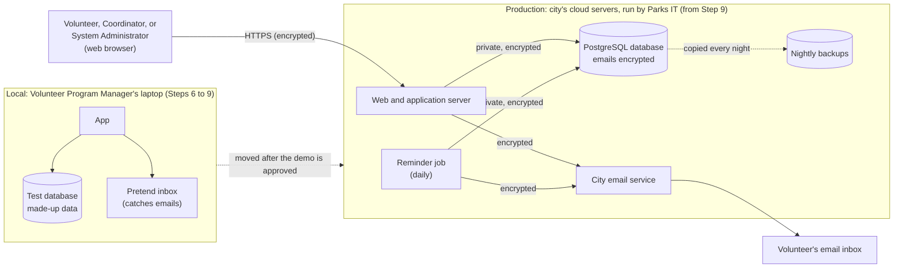

# BeautifulBeachPark Volunteers: System Infrastructure Document

**Document:** d06-01 · **Step:** 6, Initial Infrastructure · **Version:** 1.3
· **Last updated:** 2027-01-20 · **Status:** Approved
· **Owner:** DevOps Engineer (Initial Infrastructure chat)

**Diagrams included:** Deployment Diagram (required).

> **Sample document.** BeautifulBeachPark, its city, its people, and Parks
> IT are made up, and **every price is made up for illustration**. This
> document shows the workflow's "local first, live later" path: the app is
> built and demonstrated on a laptop, then moved to servers the city's IT
> team already runs.

## 1. Overview

| Item | Details |
|---|---|
| Product | BeautifulBeachPark Volunteers |
| Source PRD | d03-01 v1.1, 2026-09-18 |
| Source Spec | d04-01 v1.1, 2026-09-30 |
| Source UI/UX Document | d05-01 v1.0, 2026-10-01 |
| UI/UX sign-off | D8, 2026-10-02 |
| Phase covered | Phase 1: UC-1 to UC-7, email reminders |
| Option chosen | A: The city's existing servers (d06-02 v1.0) |
| Cost sign-off | d06-03 v1.0, D9, 2026-10-07 |
| Setup in one sentence | Built, tested, and demonstrated on a local environment on the Volunteer Program Manager's laptop, then moved to the web, database, and email servers Parks IT already runs for the city parks department. |

## 2. Inputs

| Input | Source | Notes |
|---|---|---|
| Product Requirements Document | d03-01 v1.1 | Up to 500 volunteers; 99% available; under 2 seconds on a phone; small budget; no IT staff of the park's own |
| Software Design Specification | d04-01 v1.1 | Components in Section 5; nightly backups and restarts (Section 10); Security & Compliance (Section 11); email service left to Step 6 |
| UI/UX Document | d05-01 v1.0 | 10 simple text screens; no uploaded photos; mockups in `assets/mockups/` |
| Infrastructure Options and Cost Analysis | d06-02 v1.0 | Option A chosen |
| Cost Sign-Off Sheet | d06-03 v1.0 | $0 new spending |
| Existing infrastructure | Parks IT, the city parks department's IT team | Cloud web and database servers, nightly backups, monitoring, and the city email service, already running for the department's other websites |
| Live servers' rules | Parks IT, by email, 2026-10-03 | Copied into Section 5.1 |

## 3. Infrastructure Needs

| Piece | What it is for | Spec component | Reuse or new |
|---|---|---|---|
| Web and application server | Delivers the pages and checks every rule | Client, Application server | Reuse Parks IT's app server; the app itself is new |
| Scheduled task | Runs the reminder job once a day | Reminder job | Reuse Parks IT's scheduler |
| Database | Stores accounts, tasks, slots, sign-ups, and the block list | Database | New database on Parks IT's existing database server |
| Email-sending service | Sends sign-in links, reminders, and relayed messages | Email service | Reuse the city email service |
| Backups | Nightly copies of the database | Spec Section 10, Reliability | Reuse Parks IT's nightly backups |

## 4. Environments

| Environment | Where | Used for | Used by | Data it holds | When it is needed |
|---|---|---|---|---|---|
| Local | Volunteer Program Manager's laptop (or any computer with the project) | Building, running the tests, and the stakeholder demo | SDET, Software Engineer, stakeholders | Made-up usernames and `example.test` emails only. Emails are caught by a pretend inbox the tests can read, never sent (added in v1.1). The reminder job can be run by hand. | Set up in Step 6; used in Steps 7 to 9 |
| Production | Parks IT's servers | The live app | Volunteers, Coordinators, System Administrator | Real usernames and emails | Step 9, after the demo is approved (set up 2027-01-12) |

## 5. Chosen Setup

| Piece | Provider or product | Location | Size or plan | Managed by |
|---|---|---|---|---|
| Web and application server | Parks IT's app server, behind their web server | City's cloud servers, US region | Shared server; restarted automatically if the app stops | Parks IT |
| Scheduled task | Parks IT's scheduler | Same | Once a day, 6 p.m. park time | Parks IT |
| Database | A new database on Parks IT's PostgreSQL server | Same | Shared server, encryption on | Parks IT |
| Email-sending service | City email service | City | Within Parks IT's limit of 3,000 emails a month per app; sends from the app's no-reply address | Parks IT |
| Backups | Parks IT's database backups | City's cloud servers | Nightly, kept 30 days | Parks IT |

**Why this setup:** The park has no IT staff of its own, and Parks IT
already provides the restarts, updates, encryption, and nightly backups
the Spec asks for, at no new cost. See d06-02 for the full comparison.

### 5.1 Live Server Requirements

The code written in Step 8 must fit these rules, so moving it in Step 9
needs only settings, not rewriting.

| Requirement | Value | Confirmed by |
|---|---|---|
| Language and version | Python 3.12 | Parks IT, 2026-10-03 |
| Database type and version | PostgreSQL 16, one database per app | Parks IT, 2026-10-03 |
| Database connections | At most 20 at once per app | Parks IT, 2026-10-03 |
| How software is installed and started | Parks IT installs a tagged version from the park's Git repository, following the Developer Guide; started as a service | Parks IT, 2026-10-03 |
| How settings and secrets are given to the app | Environment variables; secrets from Parks IT's secret store | Parks IT, 2026-10-03 |
| How email is sent | City email service, from `no-reply` at the app's web address | Parks IT, 2026-10-03 |
| Scheduled jobs | Parks IT's scheduler runs a command once a day | Parks IT, 2026-10-03 |
| Web address and HTTPS | A `volunteers.` address under the park's website; Parks IT provides the certificate | Parks IT, 2026-10-03 |
| Approval before going live | Parks IT security review, about 2 weeks; changes installed on Tuesday evenings | Parks IT, 2026-10-03 |

## 6. Deployment Diagram

**How to read it:** The same app runs in both places; only its settings
change. On the laptop, nothing leaves the computer: emails land in a
pretend inbox. On Parks IT's servers, everyone reaches the app over an
encrypted connection, only the app and the reminder job can reach the
database, and emails leave it only on their way to the city email
service, never to a browser.

## 7. Network and Access

### 7.1 Connections

| From | To | How | Encrypted? |
|---|---|---|---|
| User's browser | App server | HTTPS over the internet; plain HTTP turned off | Yes |
| App server and reminder job | Database | Parks IT's private network | Yes |
| App server and reminder job | City email service | Parks IT's private network | Yes |

### 7.2 Who Can Change the Infrastructure

| Person, role, or tool | Access to | Permission level | Why they need it |
|---|---|---|---|
| Parks IT | Production servers, database, email, backups | Full | Runs the city's servers; installs each version |
| Volunteer Program Manager | Requests changes from Parks IT; the local environment | Requests only; full on the laptop | The park's contact for Parks IT |
| Board treasurer | Requests changes from Parks IT | Requests only | Second contact (added 2027-01-07, Issue I2) |
| System Administrator | Production database (from Step 9) | Read only | Spec 11.1: may see emails to keep the app running |
| Claude Code (DevOps chat) | Local environment only | Create and change; no delete | Runs the setup scripts after review |

**Where secrets are kept:** On the laptop, in a local settings file that
Git ignores, holding made-up values only. In production, the database
password, the encryption key, and the email service key are in Parks IT's
secret store. Never in the code, the documents, or a chat.

## 8. Security Review

| Spec requirement (Section 11) | How the infrastructure supports it | Checked by | Result |
|---|---|---|---|
| 11.1 Volunteer emails stored encrypted | Database encryption on; the app's own encryption key kept in the secret store | DevOps chat; Parks IT security review | Pass |
| 11.1 Emails never sent to the client | Only the app server and reminder job reach the database | DevOps chat | Pass (screens tested in Step 7) |
| 11.1 Block list kept as a scrambled copy | Stored in the encrypted database with everything else | DevOps chat | Pass |
| 11.1 HTTPS only; plain HTTP turned off | HTTPS forced on Parks IT's web server | Parks IT | Pass |
| 11.3 Only send emails people expect | Emails sent from the app's own no-reply address through the city email service, with the sender checks that keep them out of spam | Parks IT | Pass (after v1.3) |
| 11.4 Only made-up data in AI chats | The local environment holds only made-up usernames and `example.test` emails; Claude Code never reaches production | DevOps chat | Pass |

**Backups and recovery:** Parks IT's nightly backups, kept 30 days. A
restore to a spare database was tested by Parks IT on 2027-01-13.

**Updates:** Installed by Parks IT on the servers. The app's own libraries
are updated by the park through Step 10 (d10-01).

## 9. Monitoring and Alerts

| What is watched | Warn when | Who is warned | How |
|---|---|---|---|
| App is reachable | Down for 5 minutes | Parks IT on-call, then the Volunteer Program Manager | Parks IT's monitoring; email and text |
| Reminder job | Didn't run on its day | Volunteer Program Manager | Email from Parks IT's scheduler |
| Emails delivered | More than 5% bounce or are marked as spam | Volunteer Program Manager | Email from Parks IT |
| Emails per month | Reaches 2,500 of the 3,000 limit | Volunteer Program Manager | Email from Parks IT |
| Database storage | 80% full | Parks IT | Their monitoring |

## 10. Costs

| Item | Amount | Source |
|---|---|---|
| Expected monthly cost | $0 new spending | d06-03 Section 2 |
| Approved monthly limit | $0 new spending | d06-03 Section 3 |
| Budget alert set at | Not needed: no new spending | d06-03 Section 3 |
| First actual monthly cost | $0 (no charge from Parks IT, January 2027) | Parks IT |

## 11. Setup Record

| Item | Details |
|---|---|
| Setup scripts | `src/infrastructure/` |
| Preview reviewed | Volunteer Program Manager, 2026-10-08 |
| Local environment set up on | 2026-10-08, by Claude Code after review, on the Volunteer Program Manager's laptop |
| How it was checked | Started the app; sent a sign-in link to an `example.test` address and saw it in the pretend inbox; ran the reminder job once by hand |
| How to set it up again | Run the scripts in `src/infrastructure/`, or follow d08-02 Section 3 |
| Production set up on | 2027-01-12, by Parks IT, following d08-02 Section 5.1 (Step 9) |

## 12. Ongoing DevOps Support

| Step | Planned support | Status |
|---|---|---|
| 7. Test Creation | Local environment with made-up data, and a pretend inbox | Done |
| 8. Implementation | Automatic build-and-test pipeline | Planned |
| 9. Release | After the demo is approved: move to Parks IT's servers, run the tests there, a second contact, and a way to undo a release | Done (d09-01) |
| 10. Maintenance | Monthly check with Parks IT on email volume and storage | Planned |

**Requests from later steps:**

| Date | From step | Request | Outcome | Version |
|---|---|---|---|---|
| 2026-10-12 | 7 Test Creation | A way for tests to read emails sent to `example.test` addresses (d07-01 Section 12, request 3) | Done: the local environment catches every email in a pretend inbox the tests can read; no cost | 1.1 |
| 2027-01-14 | 9 Release | Keep the app's database connections under Parks IT's limit of 20 (d09-01 Section 14, request 1) | Done: Parks IT runs 4 copies of the app, each with its own pool of 15 connections (60 in all). `DB_POOL_SIZE` set to 4, so the 4 copies together use at most 16; no cost | 1.2 |
| 2027-01-20 | 9 Release | Add the email sender records the provider asked for (d09-01 Section 14, request 2) | Done by Parks IT: records added for the app's `volunteers.` address; reminders now reach the inbox | 1.3 |

## 13. Infrastructure Decisions

| ID | Decision | Options considered | Reason | Date |
|---|---|---|---|---|
| INF-1 | Use the city's existing servers, run by Parks IT | Existing servers, new managed cloud hosting, a spare office computer | No new cost; Parks IT already watches, backs up, and secures them; see d06-02 | 2026-10-06 |
| INF-2 | Use the city email service, from the app's own no-reply address | City email service, a separate email company | The Spec left this to Step 6; already paid for, and Parks IT manages the sender checks (Spec Section 14) | 2026-10-06 |
| INF-3 | Build and demonstrate locally; move to Parks IT's servers only after the demo is approved | Set up production now, set up in Step 9 | Changes after the demo are free; Parks IT's review needs only one booking | 2026-10-08 |

## 14. Risks

| Risk | Likelihood | Impact | What we will do |
|---|---|---|---|
| Parks IT's security review takes longer than 2 weeks | Medium | Medium | Book it as soon as the demo is approved (Step 9) |
| The park's only contact for Parks IT leaves | Medium | High | Second contact named 2027-01-07 (Issue I2, resolved) |
| Reminder emails land in spam | Medium | Medium | Send from the app's own address; watch the bounce and spam alert |
| Parks IT starts charging departments | Low | Medium | New Cost Sign-Off Sheet; compare Option B in d06-02 |
| Phase 2 text reminders raise costs | Low (Phase 1) | Medium | New Cost Sign-Off Sheet before Phase 2 |

## 15. Assumptions and Open Questions

**Assumptions:**

- No more than 500 volunteers and about 2,000 emails a month in the first
  year; confirm with the coordinators after Step 9.

**Open questions:**

- None. (The second contact was named on 2027-01-07.)

## 16. Requests Sent Back

None.

## 17. Change Log

| Version | Date | Change | Reason | Approved by |
|---|---|---|---|---|
| 1.0 | 2026-10-09 | First version: local environment set up; live server requirements confirmed with Parks IT | — | Park Manager (D10, 2026-10-09) |
| 1.1 | 2026-10-13 | Local environment catches emails in a pretend inbox the tests can read | Requested by the SDET (Step 7) | Park Manager |
| 1.2 | 2027-01-15 | Production set up on Parks IT's servers; database connections kept under Parks IT's limit (`DB_POOL_SIZE` 4 per copy, 16 in all) | Demo approved (D13); stress test Run 1 failed (Step 9) | Park Manager |
| 1.3 | 2027-01-20 | Email sender records added; second contact for Parks IT | Manual check MC-1 failed (Step 9); Issue I2 | Park Manager |
