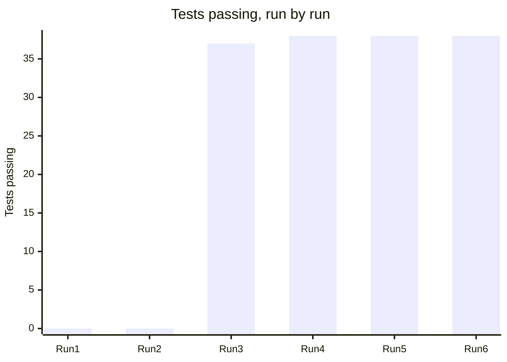

# BeautifulBeachPark Volunteers: Test Results Log

**Document:** d07-02 · **Step:** 7, Test Creation (continued in Steps 8 and 9) · **Version:** 1.2
· **Last updated:** 2027-01-15 · **Status:** Green: all tests pass
· **Owner:** SDET (Test Creation chat); runs added by the Software Engineer (Implementation chat) and the DevOps Engineer

> **Sample document.** The dates and people are made up, but the runs are
> real: the tests in `tests/` and the code in `src/` produced these
> results. Run 1 is the end of Step 7, when nothing was built. Runs 2 to 4
> are Step 8: Claude Code wrote the whole app in one session, and the runs
> found two problems in the **tests**, not the code (Section 6). Runs 5
> and 6 are the same tests on Parks IT's servers in Step 9.

## 1. Overview

| Item | Details |
|---|---|
| Product | BeautifulBeachPark Volunteers |
| Test Plan | d07-01 v1.1 |
| Test environment | Local (made-up data only), d06-01 v1.1 Section 4 |
| Total tests | 38 |
| Latest run | Run 6, 2027-01-15, on Parks IT's servers (Run 4, 2026-12-08, locally) |
| Latest result | 38 pass, 0 fail, 0 blocked |

## 2. What the Results Mean

| Result | Meaning |
|---|---|
| **Pass** | The test ran and the expected result happened. |
| **Fail** | The test ran and the expected result did not happen. In Step 7, this is correct: the feature isn't built yet. |
| **Blocked** | The test could not run at all, e.g., the local database wasn't running. Not the same as Fail. |
| **Fail (wrong reason)** | The test failed, but not because the feature is missing, e.g., a typo in the test. The test must be fixed by the SDET. |

## 3. Run History

| Run | Date | Run by | Changed since last run | Pass | Fail | Blocked |
|---|---|---|---|---|---|---|
| 1 | 2026-10-15 | SDET chat | Tests written; nothing built. All 36 that could run failed for the right reason ("No module named bbpv": the app doesn't exist yet). | 0 | 36 | 2 |
| 2 | 2026-12-07 | Implementation chat | The whole app written in one session (d08-01 B-1 to B-10) | 0 | 38 | 0 |
| 3 | 2026-12-07 | Implementation chat | TC-1: the SDET corrected how the tests open the app (Section 6). Monkey tests shortened for a quick check. | 37 | 1 | 0 |
| 4 | 2026-12-08 | Implementation chat | TC-2: the SDET corrected three false alarms in T-MK-01 (Section 6), then ran it with several random seeds. Full length: 1,000 inputs per field; 5 minutes of random taps. | 38 | 0 | 0 |
| 5 | 2027-01-12 | DevOps chat, with Parks IT | Moved to Parks IT's servers after the demo approval (Step 9); run against a test database there | 38 | 0 | 0 |
| 6 | 2027-01-15 | DevOps chat, with Parks IT | Shared database connections (d06-01 v1.2) | 38 | 0 | 0 |

## 4. Results by Test (Latest Run)

| Test ID | Use case | Type | Latest result | First passed in run | Step 7 check | Notes |
|---|---|---|---|---|---|---|
| T-01-01 | UC-1 | HP | Pass | 3 | Failed for the right reason | |
| T-01-02 | UC-1 | EF | Pass | 3 | Failed for the right reason | |
| T-01-03 | UC-1 | BC | Pass | 3 | Failed for the right reason | |
| T-01-04 | UC-1 | BC | Pass | 3 | Failed for the right reason | |
| T-01-05 | UC-1 | EF | Pass | 3 | Failed for the right reason | |
| T-02-01 | UC-2 | HP | Pass | 3 | Failed for the right reason | |
| T-02-02 | UC-2 | EF | Pass | 3 | Failed for the right reason | |
| T-02-03 | UC-2 | BC | Pass | 3 | Failed for the right reason | |
| T-02-04 | UC-2 | EF | Pass | 3 | Failed for the right reason | |
| T-02-05 | UC-2 | EF | Pass | 3 | Failed for the right reason | |
| T-03-01 | UC-3 | HP | Pass | 3 | Failed for the right reason | |
| T-03-02 | UC-3 | BC | Pass | 3 | Failed for the right reason | |
| T-03-03 | UC-3 | EF | Pass | 3 | Failed for the right reason | |
| T-03-04 | UC-3 | BC | Pass | 3 | Failed for the right reason | |
| T-03-05 | UC-3 | EF | Pass | 3 | Failed for the right reason | |
| T-03-06 | UC-3 | EF | Pass | 3 | Failed for the right reason | |
| T-03-07 | UC-3 | HP | Pass | 3 | Failed for the right reason | |
| T-04-01 | UC-4 | HP | Pass | 3 | Failed for the right reason | |
| T-04-02 | UC-4 | EF | Pass | 3 | Failed for the right reason | |
| T-04-03 | UC-4 | EF | Pass | 3 | Failed for the right reason | |
| T-05-01 | UC-5 | HP | Pass | 3 | Failed for the right reason | |
| T-05-02 | UC-5 | BC | Pass | 3 | Failed for the right reason | |
| T-05-03 | UC-5 | EF | Pass | 3 | Failed for the right reason | |
| T-05-04 | UC-5 | HP | Pass | 3 | Failed for the right reason | |
| T-06-01 | UC-6 | HP | Pass | 3 | Failed for the right reason | |
| T-06-02 | UC-6 | BC | Pass | 3 | Failed for the right reason | |
| T-07-01 | UC-7 | HP | Pass | 3 | Failed for the right reason | |
| T-07-02 | UC-7 | EF | Pass | 3 | Failed for the right reason | |
| T-07-03 | UC-7 | HP | Pass | 3 | Failed for the right reason | |
| T-SEC-01 | Security | EF | Pass | 3 | Failed for the right reason | Checks every screen each role can reach by following links |
| T-SEC-02 | Security | EF | Pass | 3 | Failed for the right reason | |
| T-SEC-03 | Security | EF | Pass | 3 | Failed for the right reason | |
| T-SEC-04 | Security | EF | Pass | 3 | Failed for the right reason | |
| T-SEC-05 | Security | EF | Pass | 3 | Failed for the right reason | |
| T-QR-01 | Quality | QR | Pass | 3 | Blocked in Run 1: Playwright not installed on that computer; installed before Step 8 | |
| T-QR-02 | Quality | QR | Pass | 3 | Blocked in Run 1: Playwright not installed on that computer; installed before Step 8 | |
| T-MK-01 | Monkey | MK | Pass | 4 | Failed for the right reason | False alarm in Run 3, a problem in the test (TC-2, Section 6) |
| T-MK-02 | Monkey | MK | Pass | 3 | Failed for the right reason | |

## 5. Summary by Use Case (Latest Run)

| Use case | Tests | Pass | Fail | Blocked |
|---|---|---|---|---|
| UC-1: Post a task | 5 | 5 | 0 | 0 |
| UC-2: Create an account | 5 | 5 | 0 | 0 |
| UC-3: Sign up for a slot | 7 | 7 | 0 | 0 |
| UC-4: Cancel a sign-up | 3 | 3 | 0 | 0 |
| UC-5: View a roster | 4 | 4 | 0 | 0 |
| UC-6: Message a volunteer | 2 | 2 | 0 | 0 |
| UC-7: Block a volunteer | 3 | 3 | 0 | 0 |
| Security (T-SEC) | 5 | 5 | 0 | 0 |
| Quality (T-QR) | 2 | 2 | 0 | 0 |
| Monkey (T-MK) | 2 | 2 | 0 | 0 |
| **Total** | **38** | **38** | **0** | **0** |

## 6. Problems Found

| Date | Test ID | Problem | Sent to | Outcome |
|---|---|---|---|---|
| 2026-12-07 | All | Run 2: every test failed for the **wrong reason**. The tests opened the app over plain HTTP, so the app correctly sent every request to HTTPS (Spec 11.1) and the tests never reached a screen. | SDET chat (d08-01 TC-1) | **Test wrong, code right.** The shared test setup (`tests/conftest.py`) now opens the app at its `https://` address; T-SEC-02 still checks plain HTTP on purpose. No test's expected result changed (d07-01 v1.1). |
| 2026-12-07 | T-MK-01 | Run 3: reported a volunteer's email "shown" on My Tasks. A random task title happened to be `test_vol_01@example.test`, and the coordinator saw their own earlier title again. The test also counted `&lt;` as four characters when checking title lengths, and, with another random seed, flagged the username " 1YY1", which the app saves as `1YY1` after trimming the spaces. | SDET chat (d08-01 TC-2) | **Test wrong, code right.** Text a coordinator typed earlier may reappear, titles are measured as people read them, and usernames are checked as saved. The rules are unchanged: no one else's email may appear, and nothing saved may break a rule (d07-01 v1.1). |

## 7. Change Log

| Version | Date | Change | Reason | Approved by |
|---|---|---|---|---|
| 1.0 | 2026-10-15 | First version, with Run 1 | — | Park Manager (D11, 2026-10-16) |
| 1.1 | 2026-12-08 | Added Runs 2 to 4 from Step 8; status Green | Implementation complete | Park Manager (D12, 2026-12-11) |
| 1.2 | 2027-01-15 | Added Runs 5 and 6 on Parks IT's servers (Step 9) | The same tests prove the move worked | Park Manager (D16, 2027-01-21) |
