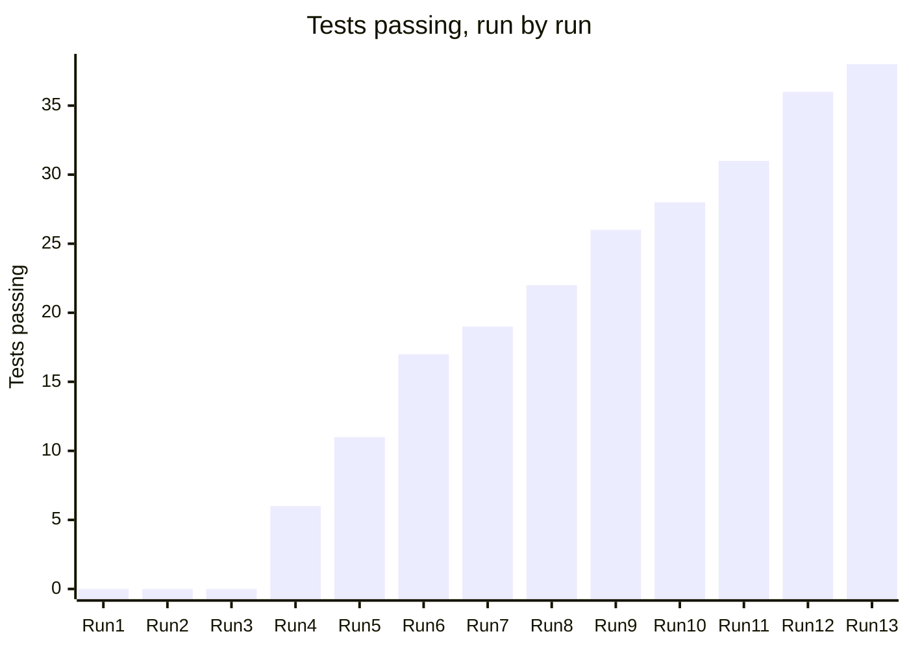

# BeautifulBeachPark Volunteers: Test Results Log

**Document:** d07-02 · **Step:** 7, Test Creation (continued in Step 8) · **Version:** 1.1
· **Last updated:** 2026-12-09 · **Status:** Green: all tests pass
· **Owner:** SDET (Test Creation chat); runs added by the Software Engineer (Implementation chat)

> **Sample document.** This log shows the whole journey: Runs 1 and 2 at
> the end of Step 7, when nothing was built and every test failed, and
> Runs 3 to 13 in Step 8, as each piece was built, until all 38 pass. The
> build plan for each run is in d08-01.

## 1. Overview

| Item | Details |
|---|---|
| Product | BeautifulBeachPark Volunteers |
| Test Plan | d07-01 v1.0 |
| Test environment | Test (made-up data only), d06-01 v1.1 Section 4 |
| Total tests | 38 |
| Latest run | Run 13, 2026-12-09 |
| Latest result | 38 pass, 0 fail, 0 blocked |

## 2. What the Results Mean

| Result | Meaning |
|---|---|
| **Pass** | The test ran and the expected result happened. |
| **Fail** | The test ran and the expected result did not happen. In Step 7, this is correct: the feature isn't built yet. |
| **Blocked** | The test could not run at all, e.g., the test environment was down. Not the same as Fail. |
| **Fail (wrong reason)** | The test failed, but not because the feature is missing, e.g., a typo in the test. The test must be fixed by the SDET. |

## 3. Run History

| Run | Date | Run by | Changed since last run | Pass | Fail | Blocked |
|---|---|---|---|---|---|---|
| 1 | 2026-10-15 | SDET chat | Tests written; nothing built | 0 | 38 | 0 |
| 2 | 2026-10-15 | SDET chat | Fixed two tests that failed for the wrong reason (Section 6) | 0 | 38 | 0 |
| 3 | 2026-10-21 | Implementation chat | B-1: project setup and database tables | 0 | 38 | 0 |
| 4 | 2026-10-28 | Implementation chat | B-2: sign-in and accounts | 6 | 32 | 0 |
| 5 | 2026-11-04 | Implementation chat | B-3: post a task | 11 | 27 | 0 |
| 6 | 2026-11-12 | Implementation chat | B-4: open slots and sign-up; T-03-04 failing (Section 6) | 17 | 21 | 0 |
| 7 | 2026-11-13 | Implementation chat | B-4 fixed (single-step sign-up); B-5: reminder job | 19 | 19 | 0 |
| 8 | 2026-11-20 | Implementation chat | B-6: my sign-ups and cancel | 22 | 16 | 0 |
| 9 | 2026-11-25 | Implementation chat | B-7: my tasks and rosters | 26 | 12 | 0 |
| 10 | 2026-12-01 | Implementation chat | B-8: messages | 28 | 10 | 0 |
| 11 | 2026-12-04 | Implementation chat | B-9: block a volunteer | 31 | 7 | 0 |
| 12 | 2026-12-08 | Implementation chat | B-10: whole-app checks; T-QR-01 and T-MK-02 failing (Section 6) | 36 | 2 | 0 |
| 13 | 2026-12-09 | Implementation chat | Faster slot list; double-tap handled | 38 | 0 | 0 |

## 4. Results by Test (Latest Run)

| Test ID | Use case | Type | Latest result | First passed in run | Step 7 check | Notes |
|---|---|---|---|---|---|---|
| T-01-01 | UC-1 | HP | Pass | 5 | Failed for the right reason | |
| T-01-02 | UC-1 | EF | Pass | 5 | Failed for the right reason | |
| T-01-03 | UC-1 | BC | Pass | 5 | Failed for the right reason | |
| T-01-04 | UC-1 | BC | Pass | 5 | Failed for the right reason | |
| T-01-05 | UC-1 | EF | Pass | 5 | Failed for the right reason | |
| T-02-01 | UC-2 | HP | Pass | 4 | Failed for the right reason | |
| T-02-02 | UC-2 | EF | Pass | 4 | Failed for the right reason | |
| T-02-03 | UC-2 | BC | Pass | 4 | Failed for the right reason | Wrong reason in Run 1; see Section 6 |
| T-02-04 | UC-2 | EF | Pass | 4 | Failed for the right reason | |
| T-02-05 | UC-2 | EF | Pass | 4 | Failed for the right reason | |
| T-03-01 | UC-3 | HP | Pass | 6 | Failed for the right reason | |
| T-03-02 | UC-3 | BC | Pass | 6 | Failed for the right reason | |
| T-03-03 | UC-3 | EF | Pass | 6 | Failed for the right reason | |
| T-03-04 | UC-3 | BC | Pass | 7 | Failed for the right reason | Failed 1 of 50 in Run 6; code fixed, test unchanged (Section 6) |
| T-03-05 | UC-3 | EF | Pass | 6 | Failed for the right reason | |
| T-03-06 | UC-3 | EF | Pass | 6 | Failed for the right reason | |
| T-03-07 | UC-3 | HP | Pass | 7 | Failed for the right reason | Wrong reason in Run 1; see Section 6 |
| T-04-01 | UC-4 | HP | Pass | 8 | Failed for the right reason | |
| T-04-02 | UC-4 | EF | Pass | 8 | Failed for the right reason | |
| T-04-03 | UC-4 | EF | Pass | 8 | Failed for the right reason | |
| T-05-01 | UC-5 | HP | Pass | 9 | Failed for the right reason | |
| T-05-02 | UC-5 | BC | Pass | 9 | Failed for the right reason | |
| T-05-03 | UC-5 | EF | Pass | 9 | Failed for the right reason | |
| T-05-04 | UC-5 | HP | Pass | 9 | Failed for the right reason | |
| T-06-01 | UC-6 | HP | Pass | 10 | Failed for the right reason | |
| T-06-02 | UC-6 | BC | Pass | 10 | Failed for the right reason | |
| T-07-01 | UC-7 | HP | Pass | 11 | Failed for the right reason | |
| T-07-02 | UC-7 | EF | Pass | 11 | Failed for the right reason | |
| T-07-03 | UC-7 | HP | Pass | 11 | Failed for the right reason | |
| T-SEC-01 | Security | EF | Pass | 12 | Failed for the right reason | Checked on all ten screens |
| T-SEC-02 | Security | EF | Pass | 6 | Failed for the right reason | |
| T-SEC-03 | Security | EF | Pass | 12 | Failed for the right reason | |
| T-SEC-04 | Security | EF | Pass | 12 | Failed for the right reason | |
| T-SEC-05 | Security | EF | Pass | 4 | Failed for the right reason | |
| T-QR-01 | Quality | QR | Pass | 13 | Failed for the right reason | Too slow in Run 12; fixed (Section 6) |
| T-QR-02 | Quality | QR | Pass | 12 | Failed for the right reason | |
| T-MK-01 | Monkey | MK | Pass | 12 | Failed for the right reason | |
| T-MK-02 | Monkey | MK | Pass | 13 | Failed for the right reason | Error page on double tap in Run 12; fixed (Section 6) |

## 5. Summary by Use Case (Latest Run)

| Use case | Tests | Pass | Fail | Blocked |
|---|---|---|---|---|
| UC-1: Post a task | 5 | 5 | 0 | 0 |
| UC-2: Create an account | 5 | 5 | 0 | 0 |
| UC-3: Sign up for a slot | 7 | 7 | 0 | 0 |
| UC-4: Cancel a sign-up | 3 | 3 | 0 | 0 |
| UC-5: View a roster | 4 | 4 | 0 | 0 |
| UC-6: Message a volunteer | 2 | 2 | 0 | 0 |
| UC-7: Block a volunteer | 3 | 3 | 0 | 0 |
| Security (T-SEC) | 5 | 5 | 0 | 0 |
| Quality (T-QR) | 2 | 2 | 0 | 0 |
| Monkey (T-MK) | 2 | 2 | 0 | 0 |
| **Total** | **38** | **38** | **0** | **0** |

## 6. Problems Found

| Date | Test ID | Problem | Sent to | Outcome |
|---|---|---|---|---|
| 2026-10-15 | T-02-03 | Run 1: failed because its file of sample usernames was missing, not because sign-up isn't built (Fail, wrong reason) | SDET chat | Test data file added; Run 2 fails for the right reason |
| 2026-10-15 | T-03-07 | Run 1: failed because the test looked for the test inbox at the wrong address, not because the reminder job isn't built (Fail, wrong reason) | SDET chat | Address corrected from d06-01 v1.1; Run 2 fails for the right reason |
| 2026-11-12 | T-03-04 | Run 6: passed 49 of 50 times; the Implementation chat asked to run it fewer times (d08-01 TC-1) | SDET chat | Code wrong, not the test: sign-up was not a single database step (Spec DD-5). Code fixed; passed 50 of 50 in Run 7; test unchanged |
| 2026-12-08 | T-QR-01 | Run 12: Open Slots took about 3 seconds on a phone-sized screen | Implementation chat | Only slots with places left now fetched, with a database index; under 1 second in Run 13 |
| 2026-12-08 | T-MK-02 | Run 12: a fast double tap on "Sign up" showed an error page | Implementation chat | Second tap now shows "You're already signed up for this slot"; passes in Run 13 |

## 7. Change Log

| Version | Date | Change | Reason | Approved by |
|---|---|---|---|---|
| 1.0 | 2026-10-15 | First version, with Runs 1 and 2 | — | Park Manager (D11, 2026-10-16) |
| 1.1 | 2026-12-09 | Added Runs 3 to 13 from Step 8; status Green | Implementation complete | Park Manager (D12, 2026-12-11) |
