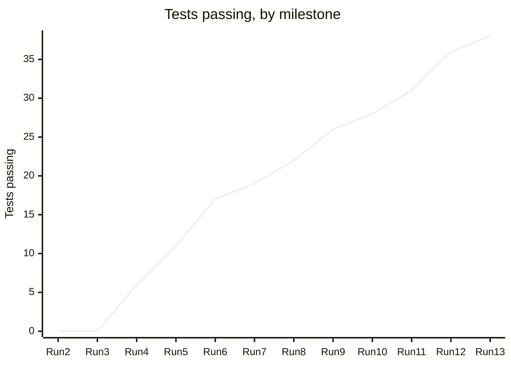

# BeautifulBeachPark Volunteers: Implementation Record

**Document:** d08-01 · **Step:** 8, Implementation · **Version:** 1.0
· **Last updated:** 2026-12-11 · **Status:** Approved
· **Owner:** Software Engineer (Implementation chat)

> **Sample document.** BeautifulBeachPark, its people, "SampleCloud," and
> "SampleMail" are made up. Section 8 shows one request to change a test
> that the SDET turned down, because the code, not the test, was wrong.
> Every run is recorded in full in the Test Results Log (d07-02 v1.1);
> Section 5 below summarizes them.

## 1. Overview

| Item | Details |
|---|---|
| Product | BeautifulBeachPark Volunteers |
| Source PRD | d03-01 v1.1, 2026-09-18 |
| Source Spec | d04-01 v1.1, 2026-09-30 |
| Source UI/UX Document and Style Guide | d05-01 v1.1, 2026-10-13; d05-02 v1.0 |
| Source System Infrastructure Document | d06-01 v1.1, 2026-10-13 |
| Source Test Plan | d07-01 v1.0, 2026-10-16; runs recorded in d07-02 v1.1 |
| Test sign-off | D11, 2026-10-16 |
| Phase covered | Phase 1: UC-1 to UC-7, email reminders |
| Where the code lives | `src/` |
| Built with | Claude Code, working in the project folder, using the test environment only |
| Latest test result | 38 of 38 pass (Run 13, 2026-12-09) |
| Build in one sentence | Built one use case at a time, sign-in first, with whole-app privacy, speed, and random-input checks last, until all 38 tests passed. |

## 2. Inputs

| Input | Source | Notes |
|---|---|---|
| Product Requirements Document | d03-01 v1.1 | UC-1 to UC-7 |
| Software Design Specification | d04-01 v1.1 | Python web service, PostgreSQL, email service (Section 5); requests (Section 7); DD-5 single-step sign-up (Section 13); Security & Compliance (Section 11) |
| UI/UX Document | d05-01 v1.1 | Screens S-1 to S-10; exact wording (Section 9) |
| Style Guide and design files | d05-02 v1.0; `assets/design-tokens.json`; `assets/mockups/` | Colors, fonts, spacing, and the HTML mockups |
| System Infrastructure Document | d06-01 v1.1 | Test environment with test inbox; secrets in SampleCloud's secret store |
| Test Plan and tests | d07-01 v1.0; `tests/` | 38 tests, all failing at the start |
| Other | Volunteer Program Manager, 2026-10-19 | Confirmed that a volunteer software developer would do the person's code review |

## 3. Build Plan

| Piece | What is built | Use cases | Screens | Tests it must pass | Status |
|---|---|---|---|---|---|
| B-1 | Project setup, database tables, wording file | — | — | None; the tests can now reach the app | Done |
| B-2 | Sign-in links and account creation, including the block-list check | UC-2 | S-1, S-2 | T-02-01 to T-02-05, T-SEC-05 | Done |
| B-3 | Posting a task with one-hour slots | UC-1 | S-7 | T-01-01 to T-01-05 | Done |
| B-4 | Open slots and signing up, in a single database step (DD-5) | UC-3 | S-3, S-4 | T-03-01 to T-03-06, T-SEC-02 | Done |
| B-5 | Daily reminder job | UC-3 | — | T-03-07 | Done |
| B-6 | My sign-ups and canceling | UC-4 | S-5 | T-04-01 to T-04-03 | Done |
| B-7 | My tasks and rosters | UC-5 | S-6, S-8 | T-05-01 to T-05-04 | Done |
| B-8 | Messaging a volunteer through the server | UC-6 | S-9 | T-06-01, T-06-02 | Done |
| B-9 | Blocking and undoing a block | UC-7 | S-10 | T-07-01 to T-07-03 | Done |
| B-10 | Whole-app checks: privacy on every screen, forms, speed, accessibility, random input | All | All | T-SEC-01, T-SEC-03, T-SEC-04, T-QR-01, T-QR-02, T-MK-01, T-MK-02 | Done |

**Coverage check:** All 38 tests in d07-01 appear in exactly one piece.

## 4. Tools, Languages, and Libraries

| Item | Chosen | Spec section | Why |
|---|---|---|---|
| Programming language | Python | d04-01 Section 5 | Named in the Spec for the application server |
| Framework | Flask | d04-01 Section 5 | The Spec's example; small and well known |
| Database | PostgreSQL (SampleCloud managed) | d04-01 Section 5; d06-01 Section 5 | Named in the Spec; set up in Step 6 |
| Web pages | HTML, CSS, and a little JavaScript | d04-01 Section 5 | Built from the HTML mockups and design tokens |
| Test framework | pytest, with Playwright driving a real browser | d07-01 Section 4 | Chosen with the SDET in Step 7 |
| Coding tool | Claude Code | — | Can run the tests itself after every change |

## 5. Progress

| Run | Date | Piece finished | Tests passing |
|---|---|---|---|
| 1–2 | 2026-10-15 | Step 7 first runs: nothing built | 0 of 38 |
| 3 | 2026-10-21 | B-1: Project setup | 0 of 38 |
| 4 | 2026-10-28 | B-2: Sign-in and accounts | 6 of 38 |
| 5 | 2026-11-04 | B-3: Post a task | 11 of 38 |
| 6 | 2026-11-12 | B-4: Open slots and sign-up (T-03-04 failing; see Section 8) | 17 of 38 |
| 7 | 2026-11-13 | B-4 fixed; B-5: Reminder job | 19 of 38 |
| 8 | 2026-11-20 | B-6: My sign-ups and cancel | 22 of 38 |
| 9 | 2026-11-25 | B-7: My tasks and rosters | 26 of 38 |
| 10 | 2026-12-01 | B-8: Messages | 28 of 38 |
| 11 | 2026-12-04 | B-9: Block a volunteer | 31 of 38 |
| 12 | 2026-12-08 | B-10: Whole-app checks (T-QR-01 and T-MK-02 failing) | 36 of 38 |
| 13 | 2026-12-09 | B-10 fixed (see below) | 38 of 38 |

**What Run 12 found:**

- **T-QR-01 (speed):** the Open Slots page took about 3 seconds on a
  phone-sized screen, over the 2-second limit. The first version fetched
  every slot and hid the full ones in the browser. Fixed by asking the
  database for only the slots with places left (as Spec Section 10 says),
  with a database index on the slot date. Now under 1 second.
- **T-MK-02 (random taps):** tapping "Sign up" twice very quickly showed an
  error page. The slot was still filled correctly, but the second tap was
  not handled. Fixed so a second tap shows "You're already signed up for
  this slot," the message already in d05-01.

## 6. Screens Built

| Screen | Name | Built from | Matches the mockup? | Checked by and date |
|---|---|---|---|---|
| S-1 | Sign In | d05-01; `s-1-sign-in.html` | Yes | Volunteer Program Manager, 2026-12-10 |
| S-2 | Create Account | d05-01; `s-2-create-account.html` | Yes | Volunteer Program Manager, 2026-12-10 |
| S-3 | Open Slots | d05-01; `s-3-open-slots.html` | Yes | Volunteer Program Manager, 2026-12-10 |
| S-4 | Confirm Sign-Up | d05-01; `s-4-confirm-sign-up.html` | Yes | Volunteer Program Manager, 2026-12-10 |
| S-5 | My Sign-Ups | d05-01; `s-5-my-sign-ups.html` | Yes | Volunteer Program Manager, 2026-12-10 |
| S-6 | My Tasks | d05-01; `s-6-my-tasks.html` | Yes | Two coordinators, 2026-12-10 |
| S-7 | Post a Task | d05-01; `s-7-post-a-task.html` | Yes | Two coordinators, 2026-12-10 |
| S-8 | Roster | d05-01; `s-8-roster.html` | Yes | Two coordinators, 2026-12-10 |
| S-9 | Message | d05-01; `s-9-message.html` | Yes | Two coordinators, 2026-12-10 |
| S-10 | Blocked Volunteers | d05-01; `s-10-blocked-volunteers.html` | Yes | Volunteer Program Manager, 2026-12-10 |

**Differences from the mockups:** None.

## 7. Reviews

| Review | What was checked | Result | By and date |
|---|---|---|---|
| Security and privacy | Every Spec Section 11 item; emails encrypted and never sent to a browser; no secrets in the code (all read from SampleCloud's secret store) | Pass | Software Engineer chat, 2026-12-09; confirmed in the person's review |
| Speed and cost | Only needed data sent to each page; index on slot date; reminder job runs once a day, not every minute | Pass, after the Run 12 fix | Software Engineer chat, 2026-12-09 |
| Licenses | Every library in d08-02 Section 7 | Pass: all open-source licenses that allow this use | Volunteer Program Manager, 2026-12-10 |
| Person's code review | A volunteer software developer read all of `src/` | Pass, with two small wording fixes in code comments | Volunteer developer, 2026-12-10 |

## 8. Requests to Change a Test

| Request | Test ID | Reason | SDET's answer | Outcome |
|---|---|---|---|---|
| TC-1 | T-03-04 | In Run 6, the "two volunteers take the last place at the same moment" test passed 49 times out of 50. The Implementation chat suggested running it 10 times instead of 50. | **Code wrong, test unchanged.** One failure in 50 means a slot can be over-filled. The code checked for a free place and then saved it in two steps; Spec DD-5 requires a single database step. | Code fixed to take the place in one step; T-03-04 passed 50 of 50 in Run 7. d07-01 unchanged. |

## 9. Requests Sent Back

None.

## 10. Risks, Assumptions, and Open Questions

**Risks:**

| Risk | Likelihood | Impact | What we will do |
|---|---|---|---|
| Only one volunteer developer can review code | Medium | Medium | The Volunteer Program Manager will recruit a second reviewer before Phase 2 |
| A library stops being updated | Low | Medium | Libraries are checked for updates in Step 10 |

**Assumptions:**

- Real email delivery into real inboxes works the same as the test inbox.
  To be checked by hand in Step 9 (d07-01 Section 3).

**Open questions:**

- None. (The second cloud account owner, I2 in the Tracking Checklist, is
  still open, but it is needed before Step 9, not for this hand-off.)

## 11. Change Log

| Version | Date | Change | Reason | Approved by |
|---|---|---|---|---|
| 1.0 | 2026-12-11 | First version | — | Park Manager (D12, 2026-12-11) |
