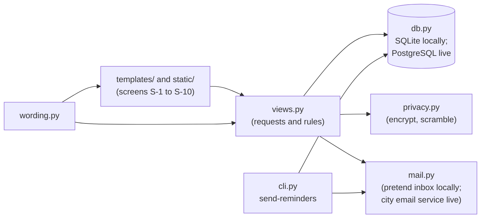

# BeautifulBeachPark Volunteers: Developer Guide

**Document:** d08-02 · **Step:** 8, Implementation · **Version:** 1.0
· **Last updated:** 2026-12-11 · **Status:** Approved
· **Owner:** Software Engineer (Implementation chat)

> **Sample document.** BeautifulBeachPark, its city, and Parks IT are made
> up. The code is real: this guide describes the working app in `src/`.

## 1. Overview

| Item | Details |
|---|---|
| Product | BeautifulBeachPark Volunteers |
| Software version | 1.0 |
| What the code does, in one sentence | A Python web service and web pages that let coordinators post one-hour volunteer slots and volunteers sign up with only a username, without ever showing anyone's email. |
| Where the code lives | `src/` |
| Where the tests live | `tests/` |
| Related documents | d04-01 Spec, d06-01 System Infrastructure Document, d07-01 Test Plan, d08-01 Implementation Record |

## 2. How the Code Is Organized

| Folder or file | What it holds | Spec component |
|---|---|---|
| `src/bbpv/__init__.py` | Builds the app and reads every setting from the environment; turns plain HTTP away | Application server |
| `src/bbpv/views.py` | Screens S-1 to S-10 and every request behind them, each checking who is asking | Application server, Client |
| `src/bbpv/templates/` | The page layouts for S-1 to S-10, built from `assets/mockups/` | Client |
| `src/bbpv/static/style.css` | Colors, fonts, and spacing, taken from `assets/design-tokens.json` | Client |
| `src/bbpv/wording.py` | Every message people see, in one place, so other languages can be added later (Spec Section 10) | Client and Application server |
| `src/bbpv/cli.py` | Commands: create and delete accounts, the daily reminder job, demo data | Reminder job; System Administrator |
| `src/bbpv/db.py` | The database tables | Database |
| `src/bbpv/privacy.py` | Email encryption, the scrambled copies, and the standardized email (Spec Section 6) | Application server |
| `src/bbpv/mail.py` | Sending email: the test inbox, the pretend inbox, or the city email service | Email service |
| `src/infrastructure/setup_local.py` | Sets up the local environment | — |
| `src/requirements.txt` | The outside libraries (see Section 7) | — |

**The one rule to remember:** email addresses are decrypted in exactly one
place, `send_email()` in `views.py`, and only to send an email. No page in
`templates/` ever receives one (Spec Section 11). T-SEC-01 and T-SEC-03
check this.

## 3. Setting Up

1. Install **Python** (version 3.10 or newer) from python.org.
2. Install **Visual Studio Code**, and from its **Extensions** panel (the
   icon of four squares in the left sidebar), add the **Python**
   extension.
3. Copy the project to your computer from the park's GitHub repository:
   on GitHub, choose the green **Code** button, then **Download ZIP**, and
   unzip it. (Or use GitHub Desktop's **File | Clone Repository...**, or
   ask Claude Code to copy it for you.)
4. In Visual Studio Code, choose **File**, then **Open Folder**, and open
   the project folder.
5. Set up a **virtual environment** (a private copy of Python for this
   project, in a `.venv` folder that Git ignores). Ask Claude Code to
   "create a .venv virtual environment, install `src/requirements.txt`
   and `tests/requirements.txt`, and install Playwright's Chromium," or
   in Visual Studio Code choose **View**, then **Command Palette...**, type
   **Python: Create Environment**, choose **Venv**, and tick both
   requirements files. A plain `pip install` without one fails on Python
   from Homebrew with an "externally-managed-environment" error.
   Visual Studio Code then uses `.venv` automatically; if not, click the
   Python version in the status bar at the bottom of the window and pick
   the one marked `.venv`.
6. Ask Claude Code to "set up the local environment" (it runs
   `python infrastructure/setup_local.py` in the `src/` folder). This
   writes `src/.env` with made-up keys, a local database, and a pretend
   inbox that catches every email. You never need the live servers'
   settings to work on the code.

## 4. Running the App and the Tests

| Task | How |
|---|---|
| Add made-up accounts and tasks | In the `src/` folder: `flask --app bbpv seed-demo` |
| Run the app on your own computer | In the `src/` folder: `flask --app bbpv run`, then open <http://localhost:5000>. Sign in as `sandyhelps@example.test` (volunteer), `democoordinator@example.test`, or `demoadmin@example.test`, and find the sign-in link in the **pretend inbox** (linked from the sign-in page). This is also how the stakeholder demo is run in Step 9. |
| Send tomorrow's reminders by hand | `flask --app bbpv send-reminders` (they appear in the pretend inbox) |
| Run every test | In Visual Studio Code, choose the **Testing** icon (a beaker) in the left sidebar, then **Run Tests**. Or, in the project folder, run `pytest`. Or ask Claude Code to "run all the tests." The tests use a throwaway database and never send email. |
| Run the quick tests while working | `pytest -m "not monkey and not browser"`: 34 tests in a few seconds |
| Run one test | In the **Testing** panel, find the test by its ID (for example, `test_t_03_02`) and choose its run button. |
| Where results go | Add a Run History row to `docs/d07-02-test-results.md` after every full run. |

## 5. Settings and Secrets

Every setting comes from an **environment variable**, so the same code
runs on your computer and on Parks IT's servers; only the values change.

| Setting | What it controls | Locally | On Parks IT's servers |
|---|---|---|---|
| `DATABASE_URL` | Which database the app uses | The local test database | Parks IT's secret store (d06-01 Section 7.2) |
| `EMAIL_ENCRYPTION_KEY` | Encrypts volunteer emails | A made-up key in the local settings file | Parks IT's secret store |
| `EMAIL_SERVICE` | Where emails go | `pretend`: the pretend inbox | `smtp`: the city email service |
| `BASE_URL` | The web address used in emailed links | `http://localhost:5000` | The app's `volunteers.` address |
| `SECRET_KEY` | Signs sessions | A made-up value | Parks IT's secret store |
| `FORCE_HTTPS` | Sends plain HTTP to HTTPS (Spec 11.1) | `false` (the laptop has no certificate) | `true` (the default) |
| `TRUST_PROXY` | Trusts Parks IT's web server to say the visitor used HTTPS | Not set | `true` |
| `DB_POOL_SIZE` | Database connections each copy of the app may keep | Not needed | `4`: Parks IT runs 4 copies, and allows 20 connections in all (d06-01 v1.2) |
| `EMAIL_FROM`, `SMTP_HOST`, `SMTP_PORT`, `SMTP_USER`, `SMTP_PASSWORD` | The sending address and the city email service | Not needed | From Parks IT; the password in their secret store |

The local settings file is listed in `.gitignore`, so it never goes to
GitHub. Never copy any real value into the code, a document, or a chat.

### 5.1 Installing on the Live Servers

Parks IT follows these steps in Step 9, after the stakeholders approve the
demo, on a Tuesday evening (d06-01 Section 5.1):

1. Install the tagged version (for example, `v1.0`) from the park's GitHub
   repository, with Python 3.12, and install `src/requirements.txt` plus
   `psycopg[binary]` (for PostgreSQL).
2. Create the app's database on the PostgreSQL 16 server, and set the
   environment variables above from Parks IT's secret store.
3. Start the app as a service behind Parks IT's web server, with HTTPS.
   It creates its database tables the first time it starts.
4. Add a daily 6 p.m. job to Parks IT's scheduler that runs
   `flask --app bbpv send-reminders`.
5. Run the full test suite against the live servers, using a test
   database, and record the run in `docs/d07-02-test-results.md`.
6. Create the System Administrator's account with
   `flask --app bbpv create-account <username> <email> --role admin`.

## 6. Making a Change

1. **Write or ask for a test first.** A new feature or a bug fix starts
   with a failing test, written or approved through the SDET chat.
2. **Change the code** until the new test, and every old test, passes.
3. **Record the run** in d07-02.
4. **Have a person review** the change before it goes live.
5. **Put new wording in `src/bbpv/wording.py`**, never directly in a page,
   and use the exact words from the UI/UX Document.
6. **Never send an email address to a page.** T-SEC-01 will catch it, but
   don't rely on the test alone.

## 7. Libraries and Licenses

| Library | What it is used for | Version | License | May we use it? |
|---|---|---|---|---|
| Flask | The web framework for the application server | See `src/requirements.txt` | BSD-3-Clause | Yes |
| SQLAlchemy | Talks to the database (SQLite or PostgreSQL) | See `src/requirements.txt` | MIT | Yes |
| cryptography | Encrypts volunteer emails | See `src/requirements.txt` | Apache-2.0 or BSD-3-Clause | Yes |
| python-dotenv | Reads `src/.env` in the local environment | See `src/requirements.txt` | BSD-3-Clause | Yes |
| psycopg | Talks to PostgreSQL on Parks IT's servers | 3.1 or newer | LGPL-3.0 | Yes, used unchanged as a library |
| pytest | Runs the tests | See `tests/requirements.txt` | MIT | Yes |
| Playwright for Python | Drives a real browser in T-QR-01 and T-QR-02 | Latest | Apache-2.0 | Yes |

## 8. Known Limits and Troubleshooting

| Problem | Likely cause | What to do |
|---|---|---|
| Tests show **Blocked** | The local database isn't running | Ask Claude Code to "start the local environment" (d06-01, ongoing DevOps support) |
| Email tests fail, other tests pass | `EMAIL_SERVICE` isn't set to the pretend inbox | Check the local settings file |
| Slot pages are slow | A missing database index after a database change | Check `src/bbpv/db.py`; T-QR-01 measures this |
| A new screen looks "off" | Styles written by hand instead of from the design tokens | Use `src/bbpv/static/style.css`, built from `assets/design-tokens.json` |

## 9. Change Log

| Version | Date | Change | Reason | Approved by |
|---|---|---|---|---|
| 1.0 | 2026-12-11 | First version | — | Park Manager (D12, 2026-12-11) |
