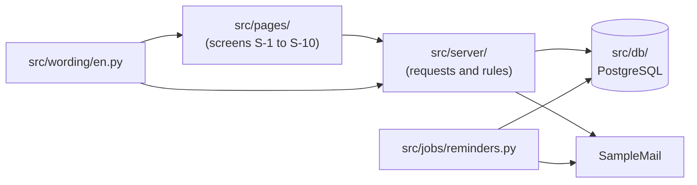

# BeautifulBeachPark Volunteers: Developer Guide

**Document:** d08-02 · **Step:** 8, Implementation · **Version:** 1.0
· **Last updated:** 2026-12-11 · **Status:** Approved
· **Owner:** Software Engineer (Implementation chat)

> **Sample document.** BeautifulBeachPark, "SampleCloud," and "SampleMail"
> are made up. The sample project's `src/` folder holds only a README; this
> guide shows what the guide for the finished code would look like.

## 1. Overview

| Item | Details |
|---|---|
| Product | BeautifulBeachPark Volunteers |
| Software version | 1.0 |
| What the code does, in one sentence | A Python web service and web pages that let coordinators post one-hour volunteer slots and volunteers sign up with only a username, without ever showing anyone's email. |
| Where the code lives | `src/` |
| Where the tests live | `tests/` |
| Related documents | d04-01 Spec, d06-01 System Infrastructure Document, d07-01 Test Plan, d08-01 Implementation Record |

## 2. How the Code Is Organized

| Folder or file | What it holds | Spec component |
|---|---|---|
| `src/server/` | One file per group of requests (accounts, tasks, sign-ups, rosters, messages, blocks), each checking every rule | Application server |
| `src/pages/` | The page layouts and styles for screens S-1 to S-10 | Client |
| `src/pages/style.css` | Colors, fonts, and spacing, taken from `assets/design-tokens.json` | Client |
| `src/wording/en.py` | Every message people see, in one place, so other languages can be added later (Spec Section 10) | Client and Application server |
| `src/jobs/reminders.py` | The daily reminder job | Reminder job |
| `src/db/` | The database tables, and the steps that create or update them | Database |
| `src/requirements.txt` | The list of outside libraries and their versions (see Section 7) | — |

**The one rule to remember:** email addresses are read only inside
`src/server/` and `src/jobs/`, and only to send an email or check the
block list. No page in `src/pages/` ever receives one (Spec Section 11).

## 3. Setting Up

1. Install **Python** (version 3.12 or newer) from python.org.
2. Install **Visual Studio Code**, and from its **Extensions** panel (the
   icon of four squares in the left sidebar), add the **Python**
   extension.
3. Copy the project to your computer from the park's GitHub repository:
   on GitHub, choose the green **Code** button, then **Download ZIP**, and
   unzip it. (Or ask Claude Code to copy it for you.)
4. In Visual Studio Code, choose **File**, then **Open Folder**, and open
   the project folder.
5. Ask Claude Code to "set up the Python environment and install
   `src/requirements.txt`," or follow the Python extension's prompt to
   create an environment.
6. Ask the Volunteer Program Manager for access to the **test
   environment** settings. You never need the production settings to work
   on the code.

## 4. Running the App and the Tests

| Task | How |
|---|---|
| Run the app on your own computer | Ask Claude Code to "start the app against the test environment," then open the address it shows in a browser. |
| Run every test | In Visual Studio Code, choose the **Testing** icon (a beaker) in the left sidebar, then **Run Tests**. Or ask Claude Code to "run all the tests." The tests use the test environment only. |
| Run one test | In the **Testing** panel, find the test by its ID (for example, `T-03-02`) and choose its run button. |
| Where results go | Add a Run History row to `docs/d07-02-test-results.md` after every full run. |

## 5. Settings and Secrets

| Setting | What it controls | Where it is kept |
|---|---|---|
| Database address and password | Which database the app uses | SampleCloud's secret store (d06-01 Section 7.2) |
| Encryption key | Encrypts volunteer emails | SampleCloud's secret store |
| SampleMail key | Lets the app send email | SampleCloud's secret store |
| Test inbox address | Where test emails go | Test environment settings (d06-01 v1.1 Section 4) |
| Reminder time | When the daily job runs (6 p.m. park time) | SampleCloud scheduler (d06-01 Section 5) |

Never copy any of these values into the code, a document, or a chat.

## 6. Making a Change

1. **Write or ask for a test first.** A new feature or a bug fix starts
   with a failing test, written or approved through the SDET chat.
2. **Change the code** until the new test, and every old test, passes.
3. **Record the run** in d07-02.
4. **Have a person review** the change before it goes live.
5. **Put new wording in `src/wording/en.py`**, never directly in a page,
   and use the exact words from the UI/UX Document.
6. **Never send an email address to a page.** T-SEC-01 will catch it, but
   don't rely on the test alone.

## 7. Libraries and Licenses

| Library | What it is used for | Version | License | May we use it? |
|---|---|---|---|---|
| Flask | The web framework for the application server | See `src/requirements.txt` | BSD-3-Clause | Yes |
| psycopg | Talks to the PostgreSQL database | See `src/requirements.txt` | LGPL-3.0 | Yes, used unchanged as a library |
| cryptography | Encrypts volunteer emails | See `src/requirements.txt` | Apache-2.0 or BSD-3-Clause | Yes |
| pytest | Runs the tests | See `src/requirements.txt` | MIT | Yes |
| Playwright for Python | Drives a real browser in the tests | See `src/requirements.txt` | Apache-2.0 | Yes |

## 8. Known Limits and Troubleshooting

| Problem | Likely cause | What to do |
|---|---|---|
| Tests show **Blocked** | The test environment is down | Ask the DevOps Engineer (d06-01, ongoing DevOps support) |
| Email tests fail, other tests pass | The test inbox address changed | Check the test environment settings |
| Slot pages are slow | A missing database index after a database change | Check `src/db/`; T-QR-01 measures this |
| A new screen looks "off" | Styles written by hand instead of from the design tokens | Use `src/pages/style.css`, built from `assets/design-tokens.json` |

## 9. Change Log

| Version | Date | Change | Reason | Approved by |
|---|---|---|---|---|
| 1.0 | 2026-12-11 | First version | — | Park Manager (D12, 2026-12-11) |
