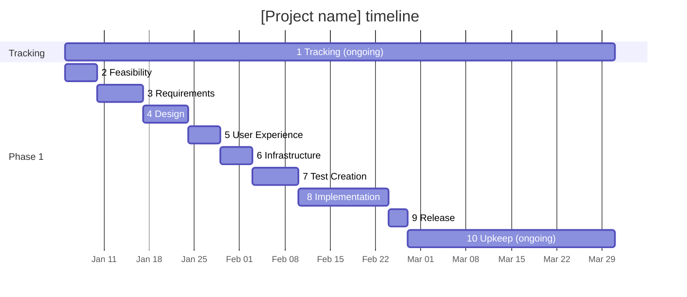

# [Project name]: Timeline

<!-- Template d01-02, for large or phased projects. Replace every
[placeholder] and the sample dates and durations. Delete all hint comments.
Keep every heading, in this order. -->

**Document:** d01-02 · **Step:** 1, Tracking · **Last updated:** [YYYY-MM-DD]

Dates marked "estimate" may change. The [Tracking Checklist](d01-01-checklist.md)
is the source of truth for status and decisions.

## Timeline

<!-- Tracking spans the whole project. Steps 2 to 10 run in order.
Mark finished steps "done," and the current step "active."
For phased projects, add one section per phase (e.g., "section Phase 2")
and repeat the steps that phase needs. -->

## Key Dates

| Milestone | Date | Firm or estimate |
|---|---|---|
| [e.g., Feasibility sign-off] | [YYYY-MM-DD] | [Estimate] |
