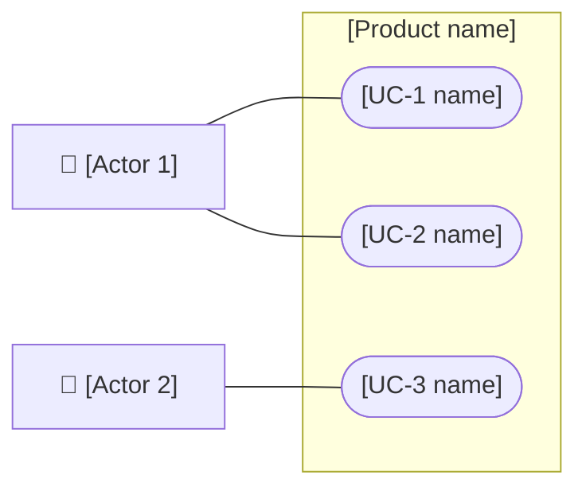

# [Project name]: Product Requirements Document (PRD)

<!-- Template d03-01. Replace every [placeholder]. Delete all hint comments
like this one. Keep every heading, in this order.
A PRD says WHAT the product does and for WHOM, never HOW it is built.
Leave technology, databases, and screen layouts to the Spec (Step 4) and
the UI/UX Document (Step 5). -->

**Document:** d03-01 · **Step:** 3, Requirements · **Version:** [1.0]
· **Last updated:** [YYYY-MM-DD] · **Status:** [Draft / Awaiting sign-off / Approved / Sent back]
· **Owner:** Product Manager (Requirements chat)

**Diagrams included:** UML Use Case Diagram (required).
[Activity Diagram for UC-[N], because it has real branching / No situational diagrams.]

<!-- See the UML Diagram Guide in the RC Park Tour case study. Name any
situational diagram you added and why, or say none were needed. -->

## 1. Overview

| Item | Details |
|---|---|
| Product | [Name] |
| Problem | [One or two sentences: the problem, and who has it] |
| Proposed solution | [One or two sentences, in the users' terms] |
| Source documents | [d02-01 one-pager / d02-02 feasibility study, with dates] |
| Go decision | [Decision ID and date from the Tracking Checklist, e.g., D2, YYYY-MM-DD] |
| Conditions from stakeholders | [e.g., "Phase 1 only," budget cap, or "none"] |

## 2. Goals and Success Measures

<!-- Carry these over from Feasibility. Each measure must be checkable. -->

| Goal | How success is measured | Target |
|---|---|---|
| [e.g., Visitors can book without calling] | [e.g., Share of bookings made online] | [e.g., 80% within 3 months] |

## 3. Users

<!-- List every actor: anyone or anything that interacts with the system.
Types: Primary (the product is built for them), Secondary (they keep it
running or benefit indirectly), External system (other software). -->

| Actor | Type | Who they are | What they want to get done | What could get in their way |
|---|---|---|---|---|
| [e.g., Visitor] | [Primary] | [e.g., First-time visitor on a phone] | [Goal] | [e.g., Weak signal outdoors] |
| [e.g., Staff member] | [Secondary] | [Description] | [Goal] | [Obstacle] |
| [e.g., Payment service] | [External system] | [What it provides] | — | — |

## 4. Use Case Diagram

<!-- Required. One oval per use case in Section 5, one figure per actor in
Section 3. Everything inside the box is in scope. Mermaid has no true use
case diagram, so this flowchart approximates one; PlantUML can be used
instead for official UML shapes. -->

## 5. Use Cases

<!-- Copy this block once per use case. Name each with a short verb phrase.
Priority: Must have / Should have / Nice to have. Acceptance criteria
become automated tests in Step 7, so make each one specific and checkable:
"within 1 minute," not "quickly." -->

### UC-1: [Verb phrase, e.g., Book a tour]

| Item | Details |
|---|---|
| Actor(s) | [Primary actor, plus any others involved] |
| Goal | [What the actor has when it's done] |
| Priority | [Must have / Should have / Nice to have] |
| Phase | [1, or "all"] |
| Starts when | [Trigger, e.g., "Visitor selects a tour"] |
| Before it starts | [Anything that must already be true, or "nothing"] |

**Main flow:**

1. [Actor does something.]
2. [System responds.]
3. [Continue until the goal is reached.]

**Alternate flows:**

- **[2a. Condition, e.g., the tour is full]:** [What happens instead.]

**Acceptance criteria:**

- [ ] [Specific, checkable statement.]
- [ ] [Another.]

## 6. Quality Requirements

<!-- Also called non-functional requirements: how well the product must
work, not what it does. Write "Not required" rather than deleting a row. -->

| Area | Requirement |
|---|---|
| Speed | [e.g., Pages load in under 2 seconds on a phone] |
| Reliability | [e.g., Available 99% of the time during opening hours] |
| Accessibility | [e.g., Usable with a screen reader] |
| Devices and browsers | [e.g., Current iPhone, Android, and desktop browsers] |
| Languages | [e.g., English only in Phase 1] |
| Privacy and data | [What personal data is collected, and why] |

## 7. Constraints

<!-- Limits the product must work within: laws, company policy, budget,
deadlines, platforms, copyright of any content used. -->

- [Constraint, and where it comes from]

## 8. Scope and Phases

**In scope:** [Use case IDs, e.g., UC-1 to UC-4]

**Out of scope:** <!-- What the product deliberately will NOT do. -->

- [Feature or request, and why it's excluded or deferred]

| Phase | Use cases | Goal of the phase |
|---|---|---|
| [1] | [UC-1, UC-2] | [e.g., Proof of concept] |

<!-- Unphased projects: replace the table with "Single phase." -->

## 9. Assumptions

- [Something believed true but not yet confirmed, and how to confirm it]

## 10. Open Questions

<!-- Write "None" if empty. Nothing should be sent to Design with open
questions that affect a Must-have use case. -->

- [Question, and who can answer it]

## 11. Change Log

<!-- Newest at the bottom. Add a row for every revision, including ones
sent back from Design. Never delete rows. -->

| Version | Date | Change | Reason | Approved by |
|---|---|---|---|---|
| 1.0 | [YYYY-MM-DD] | First version | — | [Name] |
