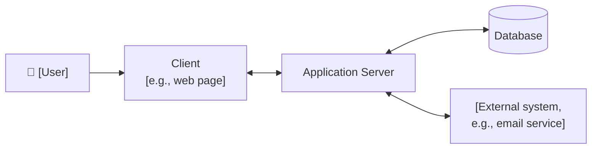
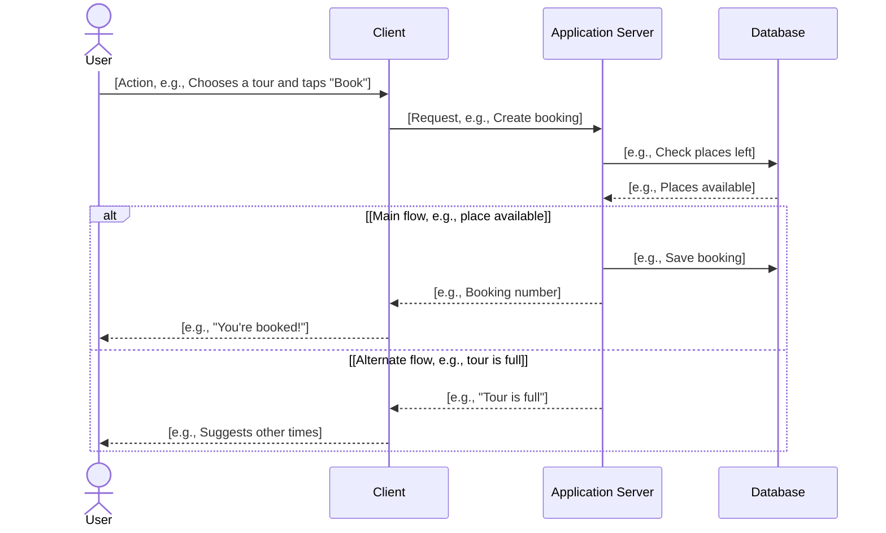

# [Project name]: Software Design Specification (Spec)

<!-- Template d04-01. Replace every [placeholder]. Delete all hint comments
like this one. Keep every heading, in this order.
A Spec says HOW the product will be built. Every part of it must trace back
to a use case or requirement in the PRD (d03-01). Leave screen layouts to
the UI/UX Document (Step 5), and exact servers, cloud accounts, and costs to
the System Infrastructure Document (Step 6). -->

**Document:** d04-01 · **Step:** 4, Design · **Version:** [1.0]
· **Last updated:** [YYYY-MM-DD] · **Status:** [Draft / Awaiting sign-off / Approved / Sent back]
· **Owner:** Software Architect (Design chat)

**Diagrams included:** System Overview; UML Sequence Diagram for every use
case (required). [Class Diagram, because the data has several related
entities / State Machine Diagram for [entity], because [reason] / No
situational diagrams.]

<!-- See the UML Diagram Guide (docs/a09-uml-diagram-guide.md). Name any
situational diagram you added and why, or say none were needed. -->

## 1. Overview

| Item | Details |
|---|---|
| Product | [Name] |
| Source PRD | [d03-01, version, date] |
| PRD sign-off | [Decision ID and date from the Tracking Checklist, e.g., D3, YYYY-MM-DD] |
| Phase covered | [e.g., Phase 1: UC-1 to UC-3, or "all"] |
| Application type | [e.g., Web app / App-store app / Both / Desktop program] |
| Design in one sentence | [e.g., "A web app whose server saves bookings in a database and sends confirmations by email."] |

## 2. Inputs

<!-- Everything this Spec was built from. Anything not listed here was not
used. -->

| Input | Source | Notes |
|---|---|---|
| Product Requirements Document | [d03-01, version] | [Main input] |
| Constraints | [PRD Section 7] | [e.g., budget cap, privacy law] |
| Quality requirements | [PRD Section 6] | [e.g., loads in under 2 seconds on a phone] |
| Existing technology | [Who told you] | [Tools or services the company already uses, or "none"] |
| Feasibility findings | [d02-01 / d02-02] | [Technical risks found in Step 2, or "none"] |
| Other | [Source] | [e.g., interview notes, vendor documents] |

## 3. Design Approach

<!-- The biggest decision in the Spec: what type of application this is.
Record the choice AND the reasons, so no one has to guess later. If you
compared options in detail, attach d04-02 and summarize it here. -->

**Chosen approach:** [e.g., Web app that works on phones and desktops]

**Options considered:**

| Option | Main advantage | Main drawback | Chosen? |
|---|---|---|---|
| [e.g., Web app] | [e.g., Nothing to install; one version for all devices] | [e.g., Needs an internet connection] | [Yes] |
| [e.g., App-store app] | [e.g., Works offline; full access to GPS] | [e.g., Separate iPhone and Android versions] | [No] |

**Why:** [Two or three sentences linking the choice to specific users, use
cases, quality requirements, and constraints in the PRD.]

## 4. System Overview

<!-- A plain picture of the main parts and how they connect. Show the
client, the application server, the database, and every external system
from the PRD's Users section. This is not the Deployment Diagram; the
DevOps Engineer draws that in Step 6. -->

## 5. Components

<!-- One row per main part of the system. "Type of technology" means the
kind of tool (e.g., "relational database"), plus a suggested product if
the choice matters. The DevOps Engineer confirms the exact setup. -->

| Component | What it is responsible for | Type of technology | Use cases it serves |
|---|---|---|---|
| Client | [e.g., Shows tours, collects booking details] | [e.g., Web page (HTML, CSS, JavaScript)] | [UC-1, UC-2] |
| Application server | [e.g., Checks availability, saves bookings] | [e.g., Python web service] | [UC-1 to UC-3] |
| Database | [e.g., Stores tours and bookings] | [e.g., Relational database] | [UC-1 to UC-3] |
| [External system] | [e.g., Sends confirmation emails] | [e.g., Email service] | [UC-1] |

## 6. Data

<!-- What information the system keeps, and why. Mark personal
information, which Section 11 must protect. -->

| Item (entity) | What it holds | Personal information? | Kept for how long | Use cases |
|---|---|---|---|---|
| [e.g., Tour] | [e.g., Name, date, time, places left] | [No] | [e.g., Until the tour is removed] | [UC-1] |
| [e.g., Booking] | [e.g., Tour, visitor name, email] | [Yes: name, email] | [e.g., 90 days after the tour] | [UC-1, UC-2] |

## 7. Client–Server Interface

<!-- Every message the client and server send each other. The sequence
diagrams in Section 9 use these same names. Also called the API
(Application Programming Interface). -->

| Request | From → To | Sends | Returns when it works | Returns when it fails | Use cases |
|---|---|---|---|---|---|
| [e.g., Get tours] | [Client → Server] | [e.g., Date] | [e.g., List of tours] | [e.g., "No tours found"] | [UC-1] |
| [e.g., Create booking] | [Client → Server] | [e.g., Tour, name, email] | [e.g., Booking number] | [e.g., "Tour is full"] | [UC-1] |

## 8. Use Case Coverage

<!-- Traceability: every use case in the PRD's scope must appear here.
Flag any use case with no design, and any design with no use case. -->

| Use case (PRD) | Priority | Sequence diagram | Components involved | Requests used |
|---|---|---|---|---|
| [UC-1: Book a tour] | [Must have] | [Section 9, UC-1] | [Client, Server, Database, Email service] | [Get tours, Create booking] |

## 9. Sequence Diagrams

<!-- Required. Copy this block once per use case in Section 8. Follow the
use case's main flow from the PRD, top to bottom: user → client →
application server → database → back again. Show at least one alternate
flow per use case with an "alt" block. -->

### UC-1: [Verb phrase, e.g., Book a tour]

**Notes:** [Anything the diagram doesn't show, e.g., "Email is sent after
the reply, so a slow email service doesn't delay the visitor."]

## 10. Quality Requirements: How They Are Met

<!-- One row per row of PRD Section 6. Write "Not required" where the PRD
does. -->

| Area | PRD requirement | How the design meets it |
|---|---|---|
| Speed | [From PRD] | [e.g., Tour list is cached on the server] |
| Reliability | [From PRD] | [e.g., Database is backed up daily] |
| Accessibility | [From PRD] | [e.g., Client follows WCAG 2.1 AA; detail in Step 5] |
| Devices and browsers | [From PRD] | [e.g., Web app tested in current phone and desktop browsers] |
| Languages | [From PRD] | [Design approach] |
| Privacy and data | [From PRD] | [See Section 11] |

## 11. Security & Compliance

<!-- Required. In an AI-assisted SDLC, confidentiality leaks and copyright
problems are easy to introduce without anyone noticing. Cover at least
every item below. The DevOps Engineer reviews the infrastructure side in
Step 6. -->

### 11.1 Protecting Information

| Information | Who may see or change it | How it is protected |
|---|---|---|
| [e.g., Visitor email] | [e.g., The visitor and staff only] | [e.g., Sent only over secure connections (HTTPS); stored encrypted] |

**Sign-in and permissions:** [Who must sign in, how, and what each kind of
user may do, or "No sign-in required, because ..."]

### 11.2 Copyright and Data Sources

<!-- Every outside source of content or data: where it comes from, whether
we may use it, and what we must do (credit, license fee, limits). Include
content made by AI tools. -->

| Content or data | Source | May we use it? | Conditions |
|---|---|---|---|
| [e.g., Park map] | [e.g., City website] | [Yes / No / TBD] | [e.g., Credit required] |

### 11.3 Laws and Rules

| Law, rule, or policy | What it requires | How the design complies |
|---|---|---|
| [e.g., Privacy law from PRD Section 7] | [Requirement] | [Design response] |

### 11.4 AI-Related Risks

- [e.g., "No confidential data is pasted into AI tools during building,"
  or "Content written by AI is reviewed by a person before it goes live."]

## 12. Situational Diagrams

<!-- Only the diagrams named in the "Diagrams included" line. Delete this
section's contents and write "None" if there are none. -->

[Class / Component / Activity / State Machine Diagram, in Mermaid]

## 13. Design Decisions

<!-- Every important "how" choice, including the one in Section 3. Newest
at the bottom. Never delete rows; mark replaced decisions as "Replaced by
DD-[N]". -->

| ID | Decision | Options considered | Reason | Date |
|---|---|---|---|---|
| DD-1 | [e.g., Build a web app] | [Web app, app-store app] | [Short reason] | [YYYY-MM-DD] |

## 14. Risks

| Risk | Likelihood | Impact | What we'll do about it |
|---|---|---|---|
| [e.g., Email service goes down] | [Low / Medium / High] | [Low / Medium / High] | [e.g., Retry later; booking is still saved] |

## 15. Assumptions and Open Questions

**Assumptions:**

- [Something believed true but not yet confirmed, and how to confirm it]

**Open questions:** <!-- Write "None" if empty. An open question that
affects a Must-have use case blocks the hand-off. -->

- [Question, and who can answer it]

## 16. Requests Sent Back to the PRD

<!-- Changes the Architect asked the Product Manager to make, such as
splitting use cases into phases. Write "None" if there were none. -->

| Request | Reason | PRD version that answered it |
|---|---|---|
| [e.g., Move UC-4 to Phase 2] | [e.g., Needs a payment service not yet approved] | [e.g., d03-01 v1.1] |

## 17. Change Log

<!-- Newest at the bottom. Add a row for every revision. Never delete
rows. -->

| Version | Date | Change | Reason | Approved by |
|---|---|---|---|---|
| 1.0 | [YYYY-MM-DD] | First version | — | [Name] |
