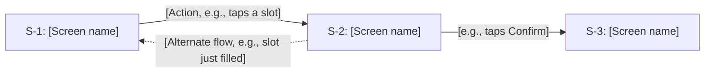

# [Project name]: UI/UX Document

<!-- Template d05-01. Replace every [placeholder]. Delete all hint comments
like this one. Keep every heading, in this order.
The UI/UX Document says WHAT people will see and HOW using the product will
feel. Every screen must trace back to a use case in the PRD (d03-01), and
every screen must send and receive only the requests in the Spec (d04-01).
Colors, fonts, and reusable parts such as buttons go in the Style Guide
(d05-02). Exact servers and cloud services are left to the System
Infrastructure Document (Step 6). -->

**Document:** d05-01 · **Step:** 5, User Experience · **Version:** [1.0]
· **Last updated:** [YYYY-MM-DD] · **Status:** [Draft / Awaiting sign-off / Approved / Sent back]
· **Owner:** UI/UX Designer (User Experience chat)

**Screens included:** [Number] screens covering [Number] use cases. User flow
for every use case (required); wireframe and mockup for every screen
(required).

## 1. Overview

| Item | Details |
|---|---|
| Product | [Name] |
| Source PRD | [d03-01, version, date] |
| Source Spec | [d04-01, version, date] |
| Spec sign-off | [Decision ID and date from the Tracking Checklist, e.g., D4, YYYY-MM-DD] |
| Phase covered | [e.g., Phase 1: UC-1 to UC-7, or "all"] |
| Application type | [From Spec Section 3, e.g., Web app used on phones and desktops] |
| Style source | [e.g., The organization's website, www.example.org, and logo files; see d05-02] |
| Design in one sentence | [e.g., "A calm, beach-colored web app where a volunteer can find an open slot and sign up in three taps."] |

## 2. Inputs

<!-- Everything this document was built from. Anything not listed here was
not used. -->

| Input | Source | Notes |
|---|---|---|
| Product Requirements Document | [d03-01, version] | [Users, use cases, quality requirements] |
| Software Design Specification | [d04-01, version] | [Application type, requests, data, Security & Compliance] |
| Style Guide | [d05-02, version] | [Colors, fonts, components] |
| Existing website or brand | [Web address, screenshots, or logo files] | [Who provided them, and whether we may use them] |
| Other | [Source] | [e.g., apps the users already like, accessibility rules] |

## 3. Design Goals

<!-- Three to five goals, each tied to the users in the PRD. These guide
every screen decision below. -->

| Goal | Why (from the PRD) |
|---|---|
| [e.g., Sign up in three taps or fewer] | [e.g., Volunteers use phones outdoors, often in a hurry (PRD Section 3)] |
| [e.g., Never show another person's email] | [e.g., Privacy requirement (PRD Section 6)] |

## 4. Users and Their Situations

<!-- One row per actor in the PRD who sees a screen. External systems have
no screens; leave them out. -->

| Actor | Device and setting | What they know already | Design response |
|---|---|---|---|
| [e.g., Volunteer] | [e.g., Phone, outdoors, bright sun] | [e.g., Familiar with phone apps; new to this park] | [e.g., Large text, high contrast, big buttons] |
| [e.g., Coordinator] | [e.g., Desktop computer, in the office] | [Description] | [e.g., Tables that show a whole day at once] |

## 5. Screen Inventory

<!-- Every screen in the product. Screen IDs (S-1, S-2, ...) are used in
the flows, wireframes, mockups, and coverage table below. "Requests" are
the request names from Spec Section 7. -->

| Screen | Name | Purpose | Seen by | Use cases | Requests it uses |
|---|---|---|---|---|---|
| S-1 | [e.g., Open Slots] | [e.g., Browse tasks and open slots] | [Volunteer] | [UC-3] | [e.g., Get open slots] |
| S-2 | [e.g., Sign-Up Confirmation] | [e.g., Confirm a sign-up] | [Volunteer] | [UC-3] | [e.g., Create sign-up] |

## 6. User Flows

<!-- Required. Copy this block once per use case in the PRD's scope. Show
the path from screen to screen, following the use case's main flow, and at
least one alternate flow. Use screen IDs from Section 5. -->

### UC-1: [Verb phrase, e.g., Sign up for a shift]



**Steps:** [Number of taps or clicks to finish the main flow]

## 7. Wireframes

<!-- Required. Copy this block once per screen in Section 5. A wireframe
is a plain black-and-white sketch showing WHERE things go, with no colors
or pictures yet. A text sketch like the one below is enough. -->

### S-1: [Screen name]

```text
┌─────────────────────────────┐
│  [Header or title]          │
│                             │
│  [Main content]             │
│                             │
│  [ Main button ]            │
└─────────────────────────────┘
```

**Notes:** [What's on the screen and why, e.g., "The next open slot is shown
first, because most volunteers want the soonest one."]

## 8. Mockups

<!-- Required. One row per screen. A mockup is a full-color picture of the
screen as it will look, following the Style Guide (d05-02). Every screen
also needs its other states: what it looks like while loading, when there
is nothing to show, and when something goes wrong. -->

| Screen | Mockup file | Loading | Empty | Error | Notes |
|---|---|---|---|---|---|
| S-1: [Name] | [e.g., `assets/mockups/s-1-open-slots.html`] | [e.g., Spinner over the list] | [e.g., "No open slots this week"] | [e.g., "Can't load slots. Try again."] | [ ] |

## 9. Messages and Wording

<!-- Every piece of text the user reads that isn't a label: confirmations,
errors, empty screens, help text, and notices. Write them in the voice set
in the Style Guide. Error messages say what happened and what to do next. -->

| Where | Situation | Exact wording |
|---|---|---|
| [S-2] | [e.g., Sign-up saved] | [e.g., "You're signed up! We'll email you a reminder the day before."] |
| [S-2] | [e.g., Slot filled by someone else first] | [e.g., "Someone just took that slot. Here are the next open ones."] |
| [Sign-up screen] | [e.g., Privacy notice] | [e.g., "Other volunteers and coordinators see only your username."] |

## 10. Accessibility

<!-- How the design works for people with disabilities. The SDET turns
each row into a test in Step 7. -->

| Area | Requirement | How the design meets it |
|---|---|---|
| Color contrast | [e.g., WCAG 2.1 AA: at least 4.5 to 1 for normal text] | [e.g., All text colors checked in d05-02] |
| Screen readers | [e.g., Every button and image has a text label] | [Design response] |
| Touch targets | [e.g., Buttons at least 44 by 44 pixels] | [Design response] |
| Keyboard use | [e.g., Every action works without a mouse] | [Design response] |
| Text size | [e.g., Still usable when text is enlarged to 200%] | [Design response] |
| Color alone | [e.g., Status never shown by color alone] | [e.g., "Full" is written, not just shown in gray] |

## 11. Privacy on Screen

<!-- What each kind of user can see, from Spec Section 11. A screen must
never show information the Spec doesn't allow that user to see. -->

| Information | Shown to | Never shown to | Screens |
|---|---|---|---|
| [e.g., Username] | [e.g., Everyone] | — | [S-1, S-5] |
| [e.g., Email address] | [e.g., The volunteer themself] | [e.g., Other volunteers, coordinators] | [e.g., S-7 My Account] |

## 12. Design Files

<!-- Files other tools can open or import, such as mockup web pages,
Figma files, images, or design tokens. Say how the Software Engineer
(Step 8) should use each one. Write "None" if there are none. -->

| File | Format | Made with | Contains | How to use it |
|---|---|---|---|---|
| [e.g., `assets/mockups/`] | [e.g., HTML pages] | [e.g., Claude] | [e.g., One page per screen] | [e.g., Open in a browser; match layout and spacing] |
| [e.g., `assets/design-tokens.json`] | [JSON] | [e.g., Claude, from d05-02] | [Colors, fonts, spacing] | [e.g., Import into the code as the single source of style values] |

## 13. Use Case Coverage

<!-- Traceability: every use case in the PRD's scope must appear here.
Flag any use case with no screen, and any screen with no use case. -->

| Use case (PRD) | Priority | User flow | Screens | Acceptance criteria shown on screen |
|---|---|---|---|---|
| [UC-1: Sign up for a shift] | [Must have] | [Section 6, UC-1] | [S-1, S-2] | [e.g., Confirmation appears within 2 seconds] |

## 14. Design Decisions

<!-- Every important design choice. Newest at the bottom. Never delete
rows; mark replaced decisions as "Replaced by UX-[N]". -->

| ID | Decision | Options considered | Reason | Date |
|---|---|---|---|---|
| UX-1 | [e.g., Show slots as a list, not a calendar] | [List, calendar grid] | [e.g., Easier to read on a phone] | [YYYY-MM-DD] |

## 15. Assumptions and Open Questions

**Assumptions:**

- [Something believed true but not yet confirmed, and how to confirm it,
  e.g., "Volunteers can read English; confirm with the coordinators."]

**Open questions:** <!-- Write "None" if empty. An open question that
affects a Must-have use case blocks the hand-off. -->

- [Question, and who can answer it]

## 16. Requests Sent Back

<!-- Changes the Designer asked the Product Manager (PRD) or Architect
(Spec) to make, such as a missing "forgot password" use case or a request
a screen needs. Write "None" if there were none. -->

| Request | Sent to | Reason | Version that answered it |
|---|---|---|---|
| [e.g., Add a "cancel sign-up" request] | [Architect: Spec] | [e.g., UC-4 needs it, but Spec Section 7 has none] | [e.g., d04-01 v1.1] |

## 17. Change Log

<!-- Newest at the bottom. Add a row for every revision. Never delete
rows. -->

| Version | Date | Change | Reason | Approved by |
|---|---|---|---|---|
| 1.0 | [YYYY-MM-DD] | First version | — | [Name] |
