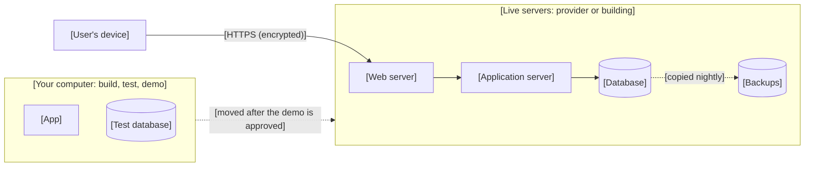

# [Project name]: System Infrastructure Document

<!-- Template d06-01. Replace every [placeholder]. Delete all hint comments
like this one. Keep every heading, in this order.
The System Infrastructure Document says WHERE the software runs: first on
a local environment (your own computer) for building, testing, and the
stakeholder demo, then on the live servers, which are often the
organization's existing servers. It covers the computers, storage, and
online services underneath it, how they connect, how they are protected,
and the rules of the live servers that the code must fit. Every piece must
trace back to a component in the Spec (d04-01). The options that were
compared, and their costs, go in the Infrastructure Options and Cost
Analysis (d06-02). The spending that was approved goes in the Cost Sign-Off
Sheet (d06-03), which must be signed off BEFORE anything is set up. This
document is finished AFTER the local environment is set up, and updated in
Step 9 when the software moves to the live servers.
Never write passwords, secret keys, or account numbers in this document. -->

**Document:** d06-01 · **Step:** 6, Initial Infrastructure · **Version:** [1.0]
· **Last updated:** [YYYY-MM-DD] · **Status:** [Draft / Awaiting cost sign-off / Setting up / Awaiting sign-off / Approved / Sent back]
· **Owner:** DevOps Engineer (Initial Infrastructure chat)

**Diagrams included:** Deployment Diagram (required).

## 1. Overview

| Item | Details |
|---|---|
| Product | [Name] |
| Source PRD | [d03-01, version, date] |
| Source Spec | [d04-01, version, date] |
| Source UI/UX Document | [d05-01, version, date] |
| UI/UX sign-off | [Decision ID and date from the Tracking Checklist, e.g., D7, YYYY-MM-DD] |
| Phase covered | [e.g., Phase 1, or "all"] |
| Option chosen | [From d06-02 Section 7, e.g., "A: The organization's existing servers"] |
| Cost sign-off | [d06-03 version, Decision ID, and date, or "Not yet approved"] |
| Setup in one sentence | [e.g., "Built and demonstrated on a local environment, then moved to the organization's existing web and database servers, run by its IT team."] |

## 2. Inputs

<!-- Everything this document was built from. Anything not listed here was
not used. -->

| Input | Source | Notes |
|---|---|---|
| Product Requirements Document | [d03-01, version] | [Expected users, quality requirements, constraints] |
| Software Design Specification | [d04-01, version] | [Components, data, Security & Compliance] |
| UI/UX Document | [d05-01, version] | [e.g., photo sizes, screens that load the most data] |
| Infrastructure Options and Cost Analysis | [d06-02, version] | [Options compared and the chosen one] |
| Cost Sign-Off Sheet | [d06-03, version] | [Approved spending limit] |
| Existing infrastructure | [e.g., The organization's web and database servers, and who runs them] | [What can be reused] |
| Live servers' rules | [e.g., Answers from the organization's IT team, with date] | [Copied into Section 5.1] |
| Other | [Source] | [Notes] |

## 3. Infrastructure Needs

<!-- One row per piece of infrastructure the Spec needs. "Spec component"
is the component name from Spec Section 5. Mark whether it reuses
something that already exists, or must be added for this feature. -->

| Piece | What it is for | Spec component | Reuse or new |
|---|---|---|---|
| [e.g., Web server] | [e.g., Delivers the pages and photos] | [e.g., Client] | [e.g., Reuse the organization's existing web server] |
| [e.g., Application server] | [e.g., Runs the sign-up rules] | [e.g., Application Server] | [New] |
| [e.g., Database] | [e.g., Stores tasks, slots, and sign-ups] | [e.g., Database] | [New] |
| [e.g., Backups] | [e.g., Nightly copies of the database] | [e.g., From Spec Section 10, Reliability] | [New] |

## 4. Environments

<!-- An environment is a complete copy of the system used for one purpose.
Every project in this workflow has at least a local environment (set up in
Step 6 on your own computer, free, used for testing and the stakeholder
demo) and a production environment (the live servers, set up in Step 9
after the demo is approved). The local environment never holds real
people's information. -->

| Environment | Where | Used for | Used by | Data it holds | When it is needed |
|---|---|---|---|---|---|
| [Local] | [Your own computer] | [Building, testing, and the stakeholder demo] | [SDET, Software Engineer, stakeholders] | [Made-up sample data only; emails caught by a pretend inbox] | [Set up in Step 6] |
| [Production] | [e.g., The organization's existing servers] | [The live system real users see] | [Real users] | [Real information] | [Step 9, after the demo is approved] |

## 5. Chosen Setup

<!-- One row per piece from Section 3, as it will be on the live servers.
"Location" is the provider's region or the building where the computer
lives. Size is the plan or capacity chosen. Never include account
numbers, passwords, or keys. -->

| Piece | Provider or product | Location | Size or plan | Managed by |
|---|---|---|---|---|
| [e.g., Application server] | [e.g., The organization's existing app server] | [e.g., US West region] | [e.g., Shared server] | [e.g., The organization's IT team] |
| [e.g., Database] | [Provider and product] | [Region] | [Plan] | [Provider or our team] |

**Why this setup:** [Two or three sentences linking the choice to the
PRD's users, the Spec, and the budget. Point to d06-02 for the full
comparison.]

### 5.1 Live Server Requirements

<!-- The rules of the live servers that the code written in Step 8 must
fit, so moving it there in Step 9 needs settings, not rewriting. Ask the
people who run the servers, and mark each row confirmed (with who and
when) or TBD. A TBD that the code depends on is an open question. -->

| Requirement | Value | Confirmed by |
|---|---|---|
| [e.g., Language and version] | [e.g., Python 3.12] | [e.g., IT team, YYYY-MM-DD, or TBD] |
| [e.g., Database type and version] | [e.g., PostgreSQL 16] | [ ] |
| [e.g., How software is installed and started] | [e.g., From a Git repository; started as a service] | [ ] |
| [e.g., How settings and secrets are given to the app] | [e.g., Environment variables; secrets from IT's secret store] | [ ] |
| [e.g., How email is sent] | [e.g., The organization's email service, from a no-reply address] | [ ] |
| [e.g., Scheduled jobs] | [e.g., IT's scheduler runs a command daily] | [ ] |
| [e.g., Web address and HTTPS] | [e.g., A subdomain of the organization's website; IT provides the certificate] | [ ] |
| [e.g., Approval before going live] | [e.g., IT security review; about 2 weeks] | [ ] |

## 6. Deployment Diagram

<!-- Required. Show where each piece lives and how the pieces connect: the
local environment, the users' devices, each live server and database,
backups, and anyone with admin access. Label each connection, and mark
which ones are encrypted. Draw it in Mermaid so it displays on GitHub and
in Visual Studio Code. -->

**How to read it:** [One or two sentences in plain language.]

## 7. Network and Access

### 7.1 Connections

| From | To | How | Encrypted? |
|---|---|---|---|
| [e.g., User's browser] | [e.g., Web server] | [e.g., HTTPS over the internet] | [Yes] |
| [e.g., Application server] | [e.g., Database] | [e.g., Private network only] | [Yes] |

### 7.2 Who Can Change the Infrastructure

<!-- People and tools, including any AI tool, and the least access each
one needs. Name roles or people, never passwords. -->

| Person, role, or tool | Access to | Permission level | Why they need it |
|---|---|---|---|
| [e.g., Account owner] | [e.g., Cloud account and billing] | [e.g., Full] | [e.g., Pays the bills, receives alerts] |
| [e.g., Claude Code (DevOps chat)] | [e.g., Local environment only] | [e.g., Create and change; no delete] | [e.g., Runs the setup scripts after review] |
| [e.g., The organization's IT team] | [e.g., Live servers] | [e.g., Full] | [e.g., Runs the servers; installs the app in Step 9] |

**Where secrets are kept:** [e.g., "In the provider's secret store. Never in
the code, the documents, or a chat."]

## 8. Security Review

<!-- Required. Go through Spec Section 11 and show how the infrastructure
supports each item. Add backups and updates, which the Spec may not
cover. -->

| Spec requirement (Section 11) | How the infrastructure supports it | Checked by | Result |
|---|---|---|---|
| [e.g., Volunteer emails stored encrypted] | [e.g., Database encryption turned on] | [Name or chat] | [Pass / Fail / TBD] |
| [e.g., Data stays in the country] | [e.g., Region chosen: US West] | [Name] | [Pass] |

**Backups and recovery:** [How often, how long they are kept, where, and
how a restore is tested.]

**Updates:** [Who installs security updates, and how often, e.g., "The
provider, automatically (managed service)."]

## 9. Monitoring and Alerts

<!-- What is watched, when someone is warned, and WHO receives the
warning. An AI tool cannot receive alerts; name a person. -->

| What is watched | Warn when | Who is warned | How |
|---|---|---|---|
| [e.g., Site is reachable] | [e.g., Down for 5 minutes] | [Name or role] | [e.g., Email and text] |
| [e.g., Monthly spending] | [e.g., Reaches the alert level in d06-03] | [Account owner] | [e.g., Email] |
| [e.g., Database storage] | [e.g., 80% full] | [Name or role] | [Email] |

## 10. Costs

| Item | Amount | Source |
|---|---|---|
| Expected monthly cost | [$ amount] | [d06-03 Section 2] |
| Approved monthly limit | [$ amount] | [d06-03 Section 3] |
| Budget alert set at | [$ amount, or "Not needed: no new spending"] | [Confirmed in the provider's billing settings on YYYY-MM-DD] |
| First actual monthly cost | [$ amount, or "Not yet known"] | [Provider's bill] |

<!-- If expected or actual costs go over the approved limit, stop and ask
for a new Cost Sign-Off Sheet before more is spent. -->

## 11. Setup Record

<!-- How each environment was set up, so it can be set up again exactly.
The local rows are filled in during Step 6; the production rows in Step 9. -->

| Item | Details |
|---|---|
| Setup scripts | [e.g., `src/infrastructure/`, file names] |
| Preview reviewed | [Who reviewed the preview of changes, and when] |
| Local environment set up on | [YYYY-MM-DD, by whom] |
| How it was checked | [e.g., "Started the app; created a sample sign-up; the sign-in email arrived in the pretend inbox."] |
| How to set it up again | [One or two sentences, or a link to the steps] |
| Production set up on | [YYYY-MM-DD, by whom, or "Step 9"] |

## 12. Ongoing DevOps Support

<!-- Step 6 sets up the initial infrastructure. List the support planned
for the later steps, and log each request that comes back. -->

| Step | Planned support | Status |
|---|---|---|
| 7. Test Creation | [e.g., Local test environment with sample data] | [Planned / Done] |
| 8. Implementation | [e.g., Automatic build-and-test pipeline] | [Planned] |
| 9. Release | [e.g., After the demo is approved: move to the live servers with the IT team, and a way to undo a release] | [Planned] |
| 10. Maintenance | [e.g., Monitoring, backups, updates, cost reviews] | [Planned] |

**Requests from later steps:** <!-- Write "None yet" if empty. -->

| Date | From step | Request | Outcome | Version |
|---|---|---|---|---|
| [YYYY-MM-DD] | [e.g., 7 Test Creation] | [e.g., Second test database] | [Done / Declined, and why] | [e.g., 1.1] |

## 13. Infrastructure Decisions

<!-- Every important choice. Newest at the bottom. Never delete rows; mark
replaced decisions as "Replaced by INF-[N]". -->

| ID | Decision | Options considered | Reason | Date |
|---|---|---|---|---|
| INF-1 | [e.g., Use the organization's existing servers] | [Existing servers, new cloud hosting, on-premises] | [e.g., Already paid for and looked after; see d06-02] | [YYYY-MM-DD] |

## 14. Risks

| Risk | Likelihood | Impact | What we will do |
|---|---|---|---|
| [e.g., Costs grow faster than expected] | [Low / Medium / High] | [Low / Medium / High] | [e.g., Budget alert; new cost sign-off if over the limit] |

## 15. Assumptions and Open Questions

**Assumptions:**

- [Something believed true but not yet confirmed, and how to confirm it,
  e.g., "No more than 500 volunteers in the first year; confirm with the
  coordinators."]

**Open questions:** <!-- Write "None" if empty. An open question that
affects security or cost blocks the hand-off. -->

- [Question, and who can answer it]

## 16. Requests Sent Back

<!-- Changes the DevOps Engineer asked the Product Manager (PRD),
Architect (Spec), or Designer (UI/UX Document) to make. Write "None" if
there were none. -->

| Request | Sent to | Reason | Version that answered it |
|---|---|---|---|
| [e.g., Smaller photos] | [Designer: UI/UX Document] | [e.g., Large photos would double storage costs] | [e.g., d05-01 v1.1] |

## 17. Change Log

<!-- Newest at the bottom. Add a row for every revision, including changes
made for later steps. Never delete rows. -->

| Version | Date | Change | Reason | Approved by |
|---|---|---|---|---|
| 1.0 | [YYYY-MM-DD] | First version | — | [Name] |
