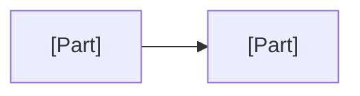

# [Project name]: Developer Guide

<!-- Template d08-02. Replace every [placeholder]. Delete all hint comments
like this one. Keep every heading, in this order.
The Developer Guide explains the CODE: how it is organized, and how to set
it up, run it, test it, and change it. It is written for the next person
or AI chat that works on the code, for example the SRE in Step 10. Write it
so someone who has never seen the project can get it running. Describe
menus and buttons rather than keyboard shortcuts. Never write passwords,
keys, or tokens here: say WHERE they are kept, never what they are. -->

**Document:** d08-02 · **Step:** 8, Implementation · **Version:** [1.0]
· **Last updated:** [YYYY-MM-DD] · **Status:** [Draft / Awaiting sign-off / Approved]
· **Owner:** Software Engineer (Implementation chat)

## 1. Overview

| Item | Details |
|---|---|
| Product | [Name] |
| Software version | [e.g., 1.0] |
| What the code does, in one sentence | [e.g., "A Python web service and web pages that let coordinators post slots and volunteers sign up."] |
| Where the code lives | [e.g., `src/`] |
| Where the tests live | [e.g., `tests/`] |
| Related documents | [d04-01 Spec, d06-01 infrastructure, d07-01 Test Plan, d08-01 Implementation Record] |

## 2. How the Code Is Organized

<!-- One row per main folder or file. Link each part back to the Spec
component it builds (d04-01 Section 5). -->

| Folder or file | What it holds | Spec component |
|---|---|---|
| [`src/...`] | [e.g., Web pages for every screen] | [e.g., Client] |
| [`src/...`] | [e.g., The rules for every request] | [e.g., Application server] |

<!-- A simple picture of how the main parts of the code connect. It should
match the Spec's System Overview. -->

## 3. Setting Up

<!-- Numbered steps someone new could follow on their own computer. Name
the tools to install, with versions where they matter. -->

1. [e.g., Install the programming language, version N or newer.]
2. [e.g., Copy the project to your computer.]
3. [e.g., Install the libraries listed in Section 7.]
4. [e.g., Ask the System Administrator for access to the settings; see
   Section 5.]

## 4. Running the App and the Tests

| Task | How |
|---|---|
| Run the app on your own computer | [Plain steps] |
| Run every test | [Plain steps; tests use the test environment only] |
| Run one test | [e.g., Give the test ID, such as T-03-02] |
| Where results go | [e.g., Add a Run History row to d07-02] |

## 5. Settings and Secrets

<!-- What can be configured, and where secret values are kept. Never the
values themselves. -->

| Setting | What it controls | Where it is kept |
|---|---|---|
| [e.g., Database address] | [What it does] | [e.g., The hosting service's settings page, d06-01 Section N] |

## 6. Making a Change

<!-- Plain rules for changing the code later. Keep the TDD rule. -->

1. **Write or ask for a test first.** A new feature or a bug fix starts
   with a test that fails, through the SDET chat.
2. **Change the code** until the new test, and every old test, passes.
3. **Record the run** in d07-02.
4. **Have a person review** the change before it goes live.
5. [Any project-specific rule, e.g., "All wording lives in one file so
   other languages can be added later."]

## 7. Libraries and Licenses

<!-- Required. Every outside library the code uses, so the licenses can be
checked (Spec Section 11.2). -->

| Library | What it is used for | Version | License | May we use it? |
|---|---|---|---|---|
| [Name] | [Purpose] | [N.N] | [e.g., MIT] | [Yes / Check with ...] |

## 8. Known Limits and Troubleshooting

| Problem | Likely cause | What to do |
|---|---|---|
| [e.g., Tests show Blocked] | [e.g., Test environment is down] | [e.g., Ask the DevOps Engineer] |

## 9. Change Log

<!-- Newest at the bottom. Never delete rows. -->

| Version | Date | Change | Reason | Approved by |
|---|---|---|---|---|
| 1.0 | [YYYY-MM-DD] | First version | — | [Name] |
